# ContextForge Template Usage Guide

**Authority**: Research-validated through comprehensive SME analysis (vibe-check-mcp, QSM-Workflow, powershell exemplars)
**Status**: Production-ready templates for instruction file creation
**Templates Available**: 3 tiers (CRITICAL, PHILOSOPHICAL, PROFESSIONAL)

---

## Purpose

This guide documents how to select, instantiate, and validate ContextForge instruction file templates based on **tier classification criteria**, **Work Codex integration**, and **authority hierarchy** principles.

---

## Tier Classification Decision Tree

### Two-Dimensional Classification Model

**Dimension 1: CONTENT CRITICALITY**
- Mission-critical domain (security, compliance, workflow integrity)
- High-impact consequences of non-compliance
- Cross-cutting concerns affecting entire codebase

**Dimension 2: TONE INTENSITY**
- **TIER 1 CRITICAL**: Imperative (MUST/MANDATORY/REQUIRED) OR Professional guidance
- **TIER 2 PHILOSOPHICAL**: Educational narrative (WHY principles matter)
- **TIER 3 PROFESSIONAL**: Instructional demonstration (SHOW with code examples)

### Visual Decision Flowchart

```mermaid
flowchart TD
    Start([New Instruction File Needed]) --> Q1{Critical risk if<br/>non-compliant?}

    Q1 -->|YES| Q2{Autonomous agent<br/>behavior enforcement?}
    Q1 -->|NO| Q3{Sacred Geometry/<br/>COF/UCL valuable?}

    Q2 -->|YES - Dramatic tone| T1A[TIER 1 CRITICAL<br/>Variant A: Dramatic<br/>vibe-check pattern]
    Q2 -->|NO - Professional tone| T1B[TIER 1 CRITICAL<br/>Variant B: Professional<br/>github-actions pattern]

    Q3 -->|YES| T2[TIER 2 PHILOSOPHICAL<br/>QSM-Workflow pattern<br/>Sacred Geometry + COF]
    Q3 -->|NO| Q4{Primary value in<br/>code examples?}

    Q4 -->|YES| T3[TIER 3 PROFESSIONAL<br/>powershell pattern<br/>Guidelines + Examples]
    Q4 -->|NO| Reconsider{Re-evaluate:<br/>Truly not critical?}

    Reconsider -->|Actually critical| Q2
    Reconsider -->|Need philosophy| T2

    T1A --> Validate1[✅ Validate:<br/>3-4% MUST/MANDATORY<br/>Emoji ⚡🚨📋✅<br/>YAML quality gates]
    T1B --> Validate1
    T2 --> Validate2[✅ Validate:<br/>5 Sacred Geometry patterns<br/>COF 13-dimensional<br/>11 Work Codex principles]
    T3 --> Validate3[✅ Validate:<br/>40% code examples<br/>Industry standards<br/>Code review checklist]

    Validate1 --> Complete([Instantiate Template])
    Validate2 --> Complete
    Validate3 --> Complete

    style T1A fill:#ff6b6b,stroke:#c92a2a,color:#fff
    style T1B fill:#ff8787,stroke:#e03131,color:#fff
    style T2 fill:#51cf66,stroke:#2f9e44,color:#fff
    style T3 fill:#339af0,stroke:#1c7ed6,color:#fff
    style Start fill:#868e96,stroke:#495057,color:#fff
    style Complete fill:#ffd43b,stroke:#fab005,color:#000
```



### Decision Matrix

```
┌─────────────────────┬──────────────────┬───────────────────┬─────────────────┐
│ Scenario            │ Content Critical │ Tone Required     │ Template Choice │
├─────────────────────┼──────────────────┼───────────────────┼─────────────────┤
│ Autonomous agent    │ YES              │ DRAMATIC          │ TIER 1 CRITICAL │
│ behavior mandate    │                  │ IMPERATIVE        │ (vibe-check)    │
├─────────────────────┼──────────────────┼───────────────────┼─────────────────┤
│ CI/CD pipeline      │ YES              │ PROFESSIONAL      │ TIER 1 CRITICAL │
│ best practices      │                  │ GUIDANCE          │ (github-actions)│
├─────────────────────┼──────────────────┼───────────────────┼─────────────────┤
│ Sacred Geometry     │ MEDIUM           │ EDUCATIONAL       │ TIER 2          │
│ workflow integration│                  │ NARRATIVE         │ PHILOSOPHICAL   │
├─────────────────────┼──────────────────┼───────────────────┼─────────────────┤
│ PowerShell cmdlet   │ MEDIUM           │ INSTRUCTIONAL     │ TIER 3          │
│ development standards│                 │ WITH EXAMPLES     │ PROFESSIONAL    │
└─────────────────────┴──────────────────┴───────────────────┴─────────────────┘
```

### Quick Selection Questions

1. **Does non-compliance create CRITICAL risk?** (security breach, data loss, system failure)
   - **YES** → Consider TIER 1 CRITICAL
   - **NO** → Consider TIER 2 or TIER 3

2. **Is the goal to ENFORCE behavior or EDUCATE on principles?**
   - **ENFORCE** → TIER 1 CRITICAL (Variant A: Dramatic, Variant B: Professional)
   - **EDUCATE** → TIER 2 PHILOSOPHICAL

3. **Is the primary value in CODE EXAMPLES?**
   - **YES** → TIER 3 PROFESSIONAL
   - **NO** → TIER 1 or TIER 2

4. **Does it require Sacred Geometry / COF / UCL integration?**
   - **YES** → TIER 2 PHILOSOPHICAL (comprehensive ContextForge integration)
   - **NO** → TIER 1 or TIER 3 depending on criticality

---

## Template Selection Guide

### TIER 1 CRITICAL - When to Use

**Use `_template-tier1-task-management.instructions.md` when**:
- Autonomous agent behavior MUST be enforced (vibe-check pattern)
- Non-compliance creates critical system risk
- Research validation evidence available (peer-reviewed, metrics)
- Dramatic imperative tone appropriate (MANDATORY, FORBIDDEN, CRITICAL)
- YAML quality gates required for enforcement
- Integration with existing critical workflows (QSE UTMW, tool hierarchies)

**Keyword Density Target**: 3-4% MUST/MANDATORY/REQUIRED instances
**Emoji Hierarchy**: ⚡ (mandatory) 🚨 (critical) 📋 (operational) ✅ (success)
**Front Matter Fields**: tier, emphasis, keywords_per_section

**Example Scenarios**:
- Metacognitive oversight requirements (vibe-check-mcp-integration.instructions.md)
- Security policy enforcement
- Compliance framework mandates
- Critical quality gate definitions

### TIER 1 CRITICAL (Professional Variant) - When to Use

**Use modified TIER 1 template with professional tone when**:
- Content is mission-critical but audience prefers professional guidance
- Domain requires detailed technical explanations (CI/CD pipelines)
- Imperative keywords would reduce credibility with expert audience
- Best practices need comprehensive rationale not just mandates

**Tone Modifications**:
- Replace "You MUST" with "Principle:" and "Guidance for Copilot:"
- Use "Pro Tip:" instead of "CRITICAL IMPORTANCE"
- Maintain YAML structures but with "Best Practice:" framing
- Include "Deeper Dive:" sections for technical depth

**Example Scenarios**:
- github-actions-ci-cd-best-practices.instructions.md
- Infrastructure-as-code standards
- API design guidelines for technical teams
- Performance optimization frameworks

### TIER 2 PHILOSOPHICAL - When to Use

**Use `_template-tier2-philosophical-integration.instructions.md` when**:
- Sacred Geometry principles apply to domain (Circle/Triangle/Spiral/φ/Fractal)
- COF 13-dimensional analysis provides value
- UCL compliance validation required
- Work Codex philosophies enhance understanding
- Goal is to explain WHY principles matter, not just WHAT to do
- Educational narrative strengthens adoption

**Keyword Density Target**: 2-3% mandatory/required instances (supporting narrative)
**Sacred Geometry**: Explicit definitions with operational application
**Front Matter Fields**: sacred_geometry, cof_dimensions, work_codex, ucl_compliance

**Example Scenarios**:
- QSM-Workflow.instructions.md (Universal Task Management)
- ContextForge framework integration guides
- Architectural philosophy documentation
- Workflow design with geometric principles

### TIER 3 PROFESSIONAL - When to Use

**Use `_template-tier3-professional-standards.instructions.md` when**:
- Primary value is in CODE EXAMPLES demonstrating proper patterns
- Industry standards provide authoritative guidance (PEP 8, Microsoft guidelines)
- Instructional tone with directive verbs (Use/Follow/Avoid/Ensure)
- Guidelines → Examples → Best Practices structure fits domain
- Linters/formatters/type checkers enforce standards
- Code review checklists provide practical validation

**Keyword Density Target**: 5-7% directive verb instances (Use/Follow/Ensure/Avoid)
**Code Example Ratio**: ~40% of content should be code blocks
**Front Matter Fields**: code_examples, industry_standards

**Example Scenarios**:
- powershell.instructions.md (Cmdlet development)
- Python code quality standards
- TypeScript best practices
- Testing framework patterns (pytest, Pester, Jest)

---

## Template Instantiation Workflow

### Visual Workflow Overview

```mermaid
flowchart LR
    A([Start: Need<br/>Instruction File]) --> B[Step 1:<br/>Select Template]
    B --> C[Step 2:<br/>Populate Front Matter]
    C --> D[Step 3:<br/>Replace Placeholders]
    D --> E[Step 4:<br/>Validate vs Exemplar]
    E --> F{Validation<br/>Passed?}
    F -->|NO| G[Review Exemplar<br/>Fix Issues]
    G --> D
    F -->|YES| H[Step 5:<br/>Cite Work Codex]
    H --> I[Step 6:<br/>Apply Authority<br/>Hierarchy]
    I --> J{Quality<br/>Checklist<br/>Complete?}
    J -->|NO| K[Address<br/>Missing Items]
    K --> E
    J -->|YES| L([✅ Production Ready<br/>Instruction File])

    style A fill:#868e96,stroke:#495057,color:#fff
    style B fill:#339af0,stroke:#1c7ed6,color:#fff
    style C fill:#339af0,stroke:#1c7ed6,color:#fff
    style D fill:#339af0,stroke:#1c7ed6,color:#fff
    style E fill:#51cf66,stroke:#2f9e44,color:#fff
    style F fill:#ffd43b,stroke:#fab005,color:#000
    style G fill:#ff8787,stroke:#e03131,color:#fff
    style H fill:#339af0,stroke:#1c7ed6,color:#fff
    style I fill:#339af0,stroke:#1c7ed6,color:#fff
    style J fill:#ffd43b,stroke:#fab005,color:#000
    style K fill:#ff8787,stroke:#e03131,color:#fff
    style L fill:#51cf66,stroke:#2f9e44,color:#fff,stroke-width:3px
```



### Sequential Workflow Steps

### Step 1: Select Template (Use Decision Tree Above)

```bash
# Copy template to new instruction file
cp .github/instructions/_template-tier[N]-*.instructions.md \
   .github/instructions/[domain-name].instructions.md
```

### Step 2: Populate Front Matter

```yaml
---
applyTo: "[Specific file pattern or '**' for universal]"
description: "[Domain-specific description with key concepts]"
tier: "[TIER_1_CRITICAL | TIER_2_PHILOSOPHICAL | TIER_3_PROFESSIONAL]"
emphasis: "[DRAMATIC_MANDATORY | EDUCATIONAL_NARRATIVE | INSTRUCTIONAL_GUIDANCE]"
# Additional fields per tier...
---
```

### Step 3: Replace ALL Bracketed Placeholders

**Search pattern**: `\[.*?\]` (regex for all bracketed fields)

**Replacement strategy**:
1. Read entire template first to understand context
2. Use Find & Replace with case-sensitive matching
3. Validate each replacement maintains grammatical flow
4. Ensure all sections have domain-specific content

**CRITICAL**: Bracketed placeholders `[like this]` MUST remain in template file - only replace in INSTANTIATED copies

### Step 4: Validate Against Exemplar

```mermaid
flowchart TD
    Validate([Validation Phase]) --> TierCheck{Which Tier?}

    TierCheck -->|TIER 1| T1Checks[TIER 1 Validation]
    TierCheck -->|TIER 2| T2Checks[TIER 2 Validation]
    TierCheck -->|TIER 3| T3Checks[TIER 3 Validation]

    T1Checks --> T1A[✅ Keyword Density<br/>3-4% MUST/MANDATORY/REQUIRED]
    T1A --> T1B[✅ 3-Field Header<br/>CRITICAL/Evidence/Status]
    T1B --> T1C[✅ YAML Quality Gates]
    T1C --> T1D[✅ Emoji Hierarchy<br/>⚡🚨📋✅]
    T1D --> T1Result{All Pass?}

    T2Checks --> T2A[✅ Sacred Geometry<br/>All 5 patterns defined]
    T2A --> T2B[✅ COF Analysis<br/>13-dimensional template]
    T2B --> T2C[✅ Work Codex<br/>All 11 philosophies]
    T2C --> T2D[✅ UCL Compliance<br/>Validation sections]
    T2D --> T2Result{All Pass?}

    T3Checks --> T3A[✅ Code Examples<br/>≥40% of content]
    T3A --> T3B[✅ Structure<br/>Guidelines→Examples→BP]
    T3B --> T3C[✅ Industry Standards<br/>References with URLs]
    T3C --> T3D[✅ Code Review<br/>Checklist ≥10 items]
    T3D --> T3Result{All Pass?}

    T1Result -->|YES| Success([✅ Validation<br/>Complete])
    T1Result -->|NO| Fix1[Review vibe-check-mcp<br/>exemplar]
    Fix1 --> Revise

    T2Result -->|YES| Success
    T2Result -->|NO| Fix2[Review QSM-Workflow<br/>exemplar]
    Fix2 --> Revise

    T3Result -->|YES| Success
    T3Result -->|NO| Fix3[Review powershell<br/>exemplar]
    Fix3 --> Revise

    Revise[Apply Corrections] --> Validate

    style Validate fill:#868e96,stroke:#495057,color:#fff
    style Success fill:#51cf66,stroke:#2f9e44,color:#fff,stroke-width:3px
    style T1Checks fill:#ff6b6b,stroke:#c92a2a,color:#fff
    style T2Checks fill:#51cf66,stroke:#2f9e44,color:#fff
    style T3Checks fill:#339af0,stroke:#1c7ed6,color:#fff
    style Fix1 fill:#ff8787,stroke:#e03131,color:#fff
    style Fix2 fill:#ff8787,stroke:#e03131,color:#fff
    style Fix3 fill:#ff8787,stroke:#e03131,color:#fff
    style Revise fill:#ffd43b,stroke:#fab005,color:#000
```



Compare your instantiated instruction file against appropriate exemplar:

**TIER 1**: Compare with `vibe-check-mcp-integration.instructions.md`
- Check keyword density (3-4% MUST/MANDATORY/REQUIRED)
- Verify 3-field header (CRITICAL IMPORTANCE/Evidence/Status)
- Validate YAML quality gate structures
- Confirm emoji hierarchy usage (⚡🚨📋✅)

**TIER 2**: Compare with `QSM-Workflow.instructions.md`
- Verify all 5 Sacred Geometry patterns defined
- Check COF 13-dimensional analysis template present
- Validate all 11 Work Codex philosophies cited
- Confirm UCL compliance validation sections

**TIER 3**: Compare with `powershell.instructions.md`
- Verify code examples comprise ~40% of content
- Check Guidelines → Examples → Best Practices structure
- Validate industry standard references included
- Confirm code review checklist present

### Step 5: Work Codex Citation

**When to cite Work Codex principles**:
- **TIER 1**: Cite principles violated by non-compliance (e.g., "Violates Core Philosophy #1: Trust Nothing, Verify Everything")
- **TIER 2**: Integrate ALL 11 philosophies with workflow mapping
- **TIER 3**: Cite principles in Best Practices sections when applicable

**Citation format**:
```markdown
**ContextForge Work Codex Reference**: Core Philosophy #[N]: "[Philosophy name]"
- **Application**: [How this principle applies to current domain]
- **Validation**: [How compliance is verified]
```

### Step 6: Authority Hierarchy Application

```mermaid
graph TD
    Question([Guidance Source<br/>Selection]) --> Level1{Research<br/>Validation<br/>Available?}

    Level1 -->|YES| Auth1[🥇 HIGHEST AUTHORITY<br/>Research Validation<br/>Peer-reviewed DOI + Metrics]
    Level1 -->|NO| Level2{Industry<br/>Standards<br/>Applicable?}

    Level2 -->|YES| Auth2[🥈 HIGH AUTHORITY<br/>Industry Standards<br/>Microsoft/PEP/W3C/IEEE]
    Level2 -->|NO| Level3{Community<br/>Best Practice<br/>Exists?}

    Level3 -->|YES| Auth3[🥉 MEDIUM AUTHORITY<br/>Community Best Practices<br/>Framework conventions]
    Level3 -->|NO| Auth4[📋 BASE AUTHORITY<br/>Team Preferences<br/>Project-specific]

    Auth1 --> Cite1[✅ Cite with DOI<br/>Include success metrics<br/>Link peer-reviewed source]
    Auth2 --> Cite2[✅ Reference official docs<br/>Include version/date<br/>Link authoritative source]
    Auth3 --> Cite3[✅ Document adoption rate<br/>Link community consensus<br/>Note framework/ecosystem]
    Auth4 --> Cite4[✅ Document rationale<br/>Note team decision<br/>Plan future standardization]

    Cite1 --> Complete([Authority<br/>Properly Cited])
    Cite2 --> Complete
    Cite3 --> Complete
    Cite4 --> Complete

    style Question fill:#868e96,stroke:#495057,color:#fff
    style Auth1 fill:#ffd43b,stroke:#fab005,color:#000,stroke-width:3px
    style Auth2 fill:#51cf66,stroke:#2f9e44,color:#fff
    style Auth3 fill:#339af0,stroke:#1c7ed6,color:#fff
    style Auth4 fill:#868e96,stroke:#495057,color:#fff
    style Complete fill:#51cf66,stroke:#2f9e44,color:#fff,stroke-width:3px
```



**Hierarchy (highest to lowest authority)**:
1. **Research Validation** (peer-reviewed studies with DOI, success metrics)
2. **Industry Standards** (Microsoft guidelines, PEPs, W3C specs, IEEE standards)
3. **Community Best Practices** (widely adopted patterns, framework conventions)
4. **Team Preferences** (project-specific conventions when no higher authority exists)

**Documentation requirement**:
- Always cite authoritative sources in instruction files
- Link to official documentation when referencing standards
- Include version/date for time-sensitive guidance
- Document rationale when deviating from higher authority

---

## Common Patterns and Examples

### Tier 1 Research Validation Section (When Applicable)

```markdown
## Research Validation Status

**[Framework/Tool Name] Effectiveness** ([Validation Type - e.g., "Peer-Reviewed"]):
- ✅ **[Metric Name]**: [Baseline] → [Improved] ([Description])
- ✅ **[Metric Name]**: [Baseline] → [Improved] ([Description])
- ✅ **[Adoption Metric]**: [Count/Status]
- ✅ **[Authority Reference]**: [Registry/Source]
- ✅ **[Status]**: [Production Ready/Beta/etc.]

**Reference**: [DOI or authoritative source URL]
```

### Tier 2 Sacred Geometry Pattern Definition

```markdown
### Geometric Philosophy (ContextForge Integration)

- **△ Triangle**: [Stability application specific to domain]
- **○ Circle**: [Completion application specific to domain]
- **🌀 Spiral**: [Progression application specific to domain]
- **φ Golden Ratio**: [Balance application specific to domain]
- **🔳 Fractal**: [Consistency application specific to domain]
```

### Tier 3 Code Example Format

```[language]
# ✅ GOOD - [Why this approach is correct]
[good_code_example_with_comments]

# ❌ BAD - [Why this approach fails]
[bad_code_example_showing_antipattern]

# ✅ BETTER - [How to improve further]
[optimal_code_example_with_enhancements]
```

---

## Quality Validation Checklist

Before considering an instruction file complete:

### All Tiers
- [ ] Front matter complete with all required fields
- [ ] ALL bracketed placeholders replaced with domain-specific content
- [ ] No grammatical errors or placeholder artifacts
- [ ] Authoritative sources cited where applicable
- [ ] Document maintenance section includes update triggers
- [ ] Last Updated, Document Version, Standards Compliance footer present

### TIER 1 CRITICAL Specific
- [ ] Keyword density 3-4% for MUST/MANDATORY/REQUIRED (use grep count / total lines)
- [ ] 3-field header present (CRITICAL IMPORTANCE/Evidence/Status)
- [ ] At least 3 MANDATORY requirement sections
- [ ] CRITICAL COMPLIANCE section with violation consequences
- [ ] YAML quality gate structures present
- [ ] Emoji hierarchy used consistently (⚡🚨📋✅)
- [ ] Definition of Done with ≥7 checkpoints

### TIER 2 PHILOSOPHICAL Specific
- [ ] All 5 Sacred Geometry patterns explicitly defined with operational application
- [ ] COF 13-dimensional analysis YAML template present
- [ ] All 11 Work Codex philosophies cited with workflow mapping
- [ ] UCL compliance validation sections present
- [ ] Educational narrative tone explaining WHY throughout
- [ ] Quality gates validate Sacred Geometry alignment, COF coverage, Work Codex compliance

### TIER 3 PROFESSIONAL Specific
- [ ] Code examples comprise ≥40% of content
- [ ] Guidelines → Examples → Best Practices structure throughout
- [ ] ✅ GOOD / ❌ BAD code comparison examples present
- [ ] Industry standard references with URLs
- [ ] Linter/formatter/type checker integration documented
- [ ] Code review checklist present with ≥10 items
- [ ] Testing standards section with framework-specific patterns

---

## Template Maintenance

### When to Update Templates
- New tier classification criteria discovered
- ContextForge framework enhancements (COF dimensions, UCL laws, Work Codex philosophies)
- Sacred Geometry pattern additions or refinements
- Research validation best practices evolve
- Industry standard references change

### Template Versioning
- Templates use semantic versioning (MAJOR.MINOR.PATCH)
- MAJOR: Breaking changes to structure or required sections
- MINOR: New optional sections or enhanced guidance
- PATCH: Clarifications, typo fixes, example improvements

### Contributing Template Improvements
1. Analyze 3+ exemplar files per tier to validate pattern
2. Use vibe_learn to document discovered patterns
3. Update template with research-validated enhancements
4. Update this usage guide with new guidance
5. Submit changes with comprehensive rationale and examples

---

## Troubleshooting

### Issue: Unclear which tier to select

**Solution**: Answer these questions in order:
1. Does non-compliance create critical risk? → TIER 1 CRITICAL
2. Is Sacred Geometry/COF/UCL integration valuable? → TIER 2 PHILOSOPHICAL
3. Are code examples the primary value? → TIER 3 PROFESSIONAL

If still unclear, default to TIER 3 and upgrade tier if enforcement or philosophy becomes necessary.

### Issue: Template feels too rigid for domain

**Solution**:
- Templates are starting points, not constraints
- Adapt sections to fit domain while maintaining tier characteristics
- Document rationale for deviations in front matter
- Ensure core tier patterns remain (keyword density, tone, structure)

### Issue: Mixing tier characteristics in one instruction file

**Solution**: This is ACCEPTABLE when justified:
- **Example**: CI/CD best practices (TIER 1 content + TIER 3 code examples)
- **Approach**: Select primary tier, incorporate secondary tier elements
- **Documentation**: Note in front matter which tiers are combined and why

---

## Additional Resources

### Exemplar Files for Reference
- **TIER 1 CRITICAL (Dramatic)**: `.github/instructions/vibe-check-mcp-integration.instructions.md`
- **TIER 1 CRITICAL (Professional)**: `.github/instructions/github-actions-ci-cd-best-practices.instructions.md`
- **TIER 2 PHILOSOPHICAL**: `.github/instructions/QSM-Workflow.instructions.md`
- **TIER 3 PROFESSIONAL**: `.github/instructions/powershell.instructions.md`

### ContextForge Framework References
- **Work Codex**: `.github/docs/Codex/ContextForge Work Codex — Professional Principles with Philosophy.md`
- **Template Files**:
  - `_template-tier1-task-management.instructions.md`
  - `_template-tier2-philosophical-integration.instructions.md`
  - `_template-tier3-professional-standards.instructions.md`

### Research and Validation
- **SME Research Findings**: Agent TODO item `phase2-sme-tier-research` ADR
- **Vibe Learn Patterns**: Session QSE-20251012-TEMPLATE-RESEARCH (7 Success patterns logged)
- **Template Validation**: Agent TODO item `phase2-template-validation` ADR

---

**Document Maintenance**: Update when:
- New tier classification criteria discovered through exemplar analysis
- Template structure changes require workflow updates
- ContextForge framework enhancements affect instantiation process
- Common issues emerge from template usage

**Last Updated**: 2025-10-12
**Document Version**: 1.0.0
**ContextForge Standards**: ✅ Compliant with Work Codex, COF, UCL, Sacred Geometry principles
