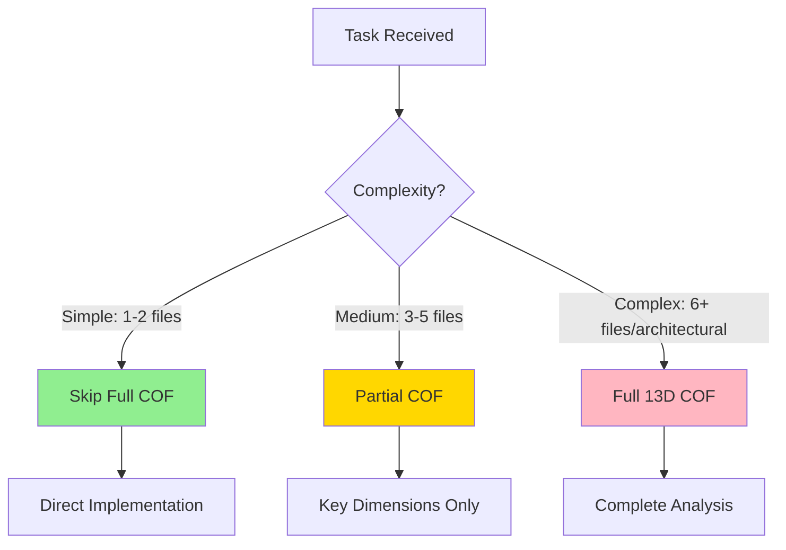
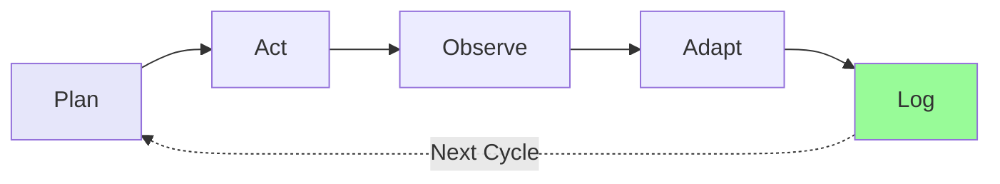
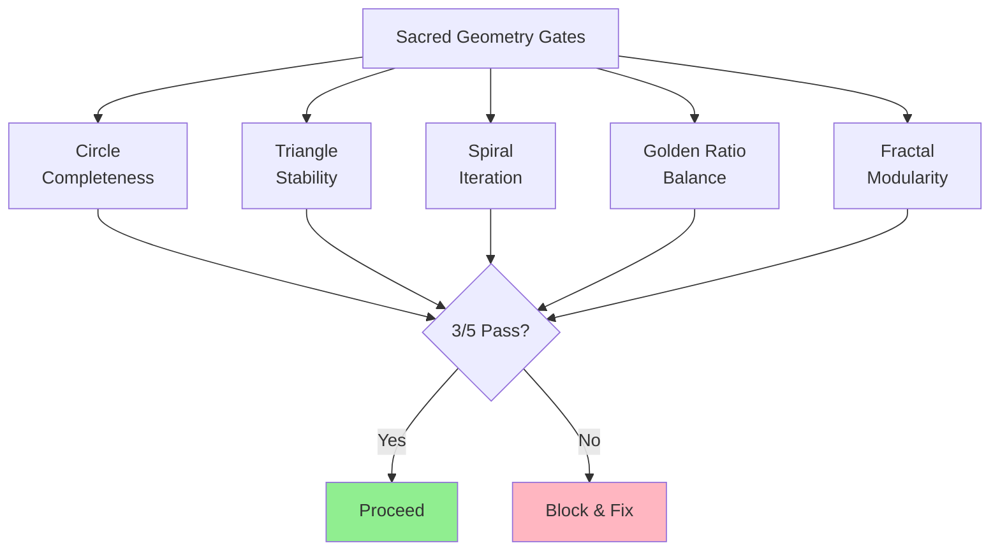
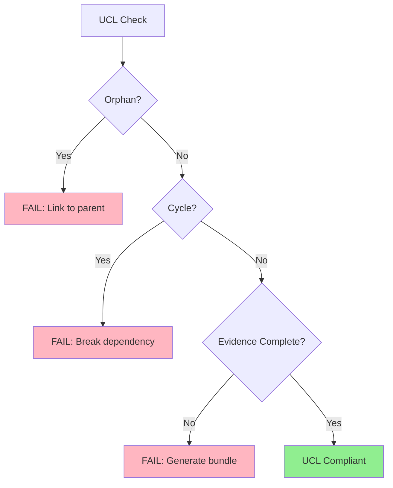
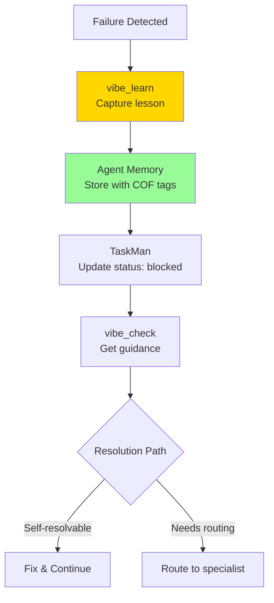

# ContextForge Task Workflow (QSM Unified)

**Authority**: ContextForge Work Codex | COF 13D | Sacred Geometry | UCL | Agent-Core MCP

> Consolidated quick-reference for task planning and implementation.

---

## When to Use Full COF Analysis



**Full COF Required**: Architectural decisions, cross-system integration, risk-heavy implementations.

**Skip For**: Bug fixes, minor documentation, simple feature additions.

---

## PAOAL Execution Cycle



| Phase | Actions | Tools |
|-------|---------|-------|
| **Plan** | COF analysis, tool selection, constraints | `sequential_thinking`, `vibe_check` |
| **Act** | Execute minimum next action, workspace-first | MCP tools, CF_CLI |
| **Observe** | Collect evidence, run tests, validate | Quality checks, .QSE/ |
| **Adapt** | Adjust based on outcomes, handle failures | `branched_thinking`, `vibe_learn` |
| **Log** | Record evidence, update TaskMan, store lessons | Agent memory, .QSE/ |

---

## COF 13-Dimensional Quick Reference

| # | Dimension | Key Questions |
|---|-----------|---------------|
| 1 | **Motivational** | Why? Business driver? Success criteria? |
| 2 | **Relational** | Dependencies? Downstream impacts? UCL parent? |
| 3 | **Situational** | What constraints/opportunities exist in the environment? |
| 4 | **Resource** | What time/skills/tools/budget are available? |
| 5 | **Narrative** | What’s the user journey / business case / communication frame? |
| 6 | **Recursive** | What feedback loops and learnings feed forward? |
| 7 | **Computational** | What algorithms/data models are involved? Performance constraints? |
| 8 | **Emergent** | What might emerge unexpectedly? Innovation potential? |
| 9 | **Temporal** | What timing/deadlines/sequencing constraints apply? |
| 10 | **Spatial** | Where does this live (teams, systems, topology)? |
| 11 | **Holistic** | How does this fit the whole system? Coherence/resonance? |
| 12 | **Validation** | How do we prove it works? What evidence closes the loop? |
| 13 | **Integration** | How does it reintegrate back into the whole (ops, docs, adoption)? |

**Depth Requirement**: Major decisions require 200+ words per dimension.

**Note**: Sacred Geometry is a separate validation lens (see below); it is not one of the COF 13 dimensions.

---

## Sacred Geometry Validation



| Pattern | Validation | Evidence Required |
|---------|------------|-------------------|
| **Circle** | All COF dimensions addressed, evidence complete | Full workflow docs |
| **Triangle** | Plan + Execute + Validate (3-point) | Tests + docs + approval |
| **Spiral** | Learning captured, retrospective conducted | AAR + agent memory |
| **Golden Ratio** | Cost-benefit balanced, right-sized solution | ROI analysis |
| **Fractal** | Pattern consistent across epic/feature/task | Architecture review |

**Minimum**: 3 of 5 patterns must pass to proceed.

---

## UCL Compliance (Mandatory)



| Requirement | Rule | Enforcement |
|-------------|------|-------------|
| **No Orphans** | Every context has parent linkage | Block if no parent |
| **No Cycles** | Dependencies flow toward resolution | Break circular refs |
| **Complete Evidence** | All claims backed by evidence | Generate before Done |

---

## Implementation Phases

### Phase 0: Session Foundation (Every Session)

1. **Constitution Check**: `vibe-check-mcp/constitution_check`
2. **Load Context**: Query agent memory for project history
3. **Verify Tools**: CF_CLI accessible, MCP servers healthy

### Phase 1: Planning (Complex Tasks)

1. **COF Analysis**: Complete 13D analysis for complex tasks
2. **Sacred Geometry**: Identify applicable patterns
3. **Tool Selection**: Choose MCP tools strategically
4. **Risk Assessment**: Use `vibe_check` at complexity inflection

### Phase 2: Execution (All Tasks)

1. **Bind to TaskMan**: Update status to `in_progress`
2. **Execute PAOAL**: Plan -> Act -> Observe -> Adapt -> Log
3. **Generate Evidence**: Create .QSE/ artifacts with each change
4. **Quality Gates**: Run tests, validate sacred geometry

### Phase 3: Completion

1. **Validate All Gates**: Standard + Sacred Geometry
2. **UCL Audit**: Verify no violations
3. **Generate AAR**: For significant work
4. **Store Lessons**: Agent memory with COF tags
5. **Commit .QSE/**: With code changes

---

## MCP Tool Selection Matrix

| Trigger | Primary Tool | Purpose |
|---------|--------------|---------|
| Every prompt | `constitution_check` | Session integrity |
| Phase transitions | `vibe_check` | Pattern interrupt, guidance |
| Complex reasoning | `sequential_thinking` | PAOAL with COF |
| Multiple approaches | `branched_thinking` | Compare alternatives |
| Any failure | `vibe_learn` | Capture lessons (mandatory) |
| Historical context | `agent-memory/query` | COF similarity matching |
| Store insights | `agent-memory/create` | Persist with COF tags |
| Task management | TaskMan MCP | 64-field schema |

---

## Evidence Bundle Structure

```yaml
evidence_bundle:
  metadata:
    task_id: T-001
    session_id: QSE-YYYYMMDD-HHMM-UUID
    timestamp: RFC3339

  cof_summary:
    dimensions_analyzed: 13/13
    key_impacts: [motivational, relational, holistic]

  sacred_geometry:
    gates_passed: 5/5
    primary_pattern: spiral

  ucl_compliance:
    parent_linkage: Sprint-2
    no_orphans: true
    no_cycles: true

  changes:
    - path: src/feature.py
      change: added
      summary: Implementation description

  validation:
    tests_passed: true
    coverage: 87%
    quality_gates: [pre-commit, pre-merge]
```

**Storage**: `projects/{project}/.QSE/evidence/`

---

## Failure Protocol



**Mandatory on ANY failure**: Execute `vibe_learn` + store in agent memory with COF context.

---

## Definition of Done

- [ ] COF analysis complete (if complex task)
- [ ] Sacred Geometry gates passed (3/5 minimum)
- [ ] UCL compliant (no orphans, cycles, or incomplete evidence)
- [ ] Quality gates passed (tests, coverage, linting)
- [ ] Evidence bundle generated with COF tags
- [ ] TaskMan updated with complete evidence
- [ ] .QSE/ artifacts committed with code
- [ ] Lessons stored in agent memory (if applicable)
- [ ] AAR generated (for significant work)

---

## Anti-Patterns

- Skipping constitution_check
- Incomplete COF analysis for complex tasks
- Ignoring Sacred Geometry validation
- UCL violations (orphans, cycles, incomplete evidence)
- Bypassing CF_CLI for domain workflows
- Failing without vibe_learn capture
- Missing .QSE/ artifact commits
- Not storing lessons in agent memory

---

**Consolidated from**: `QSM-Workflow.instructions.md`, `QSM-task-plan-implementation.instructions.md`

**Full Reference**: See archived files for complete YAML templates and PowerShell implementations.
