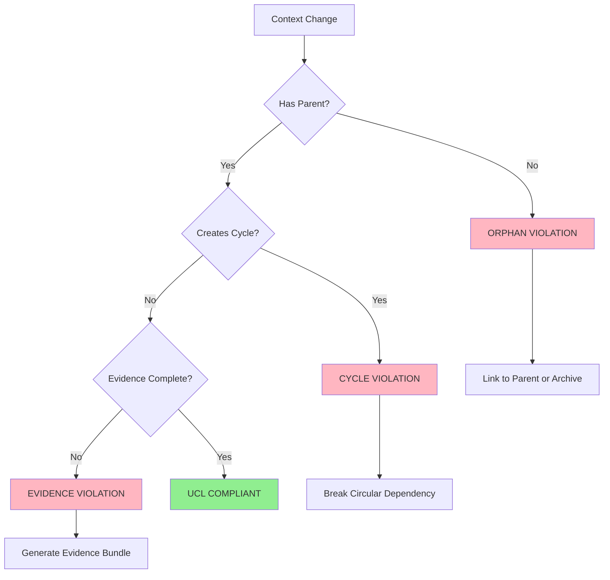
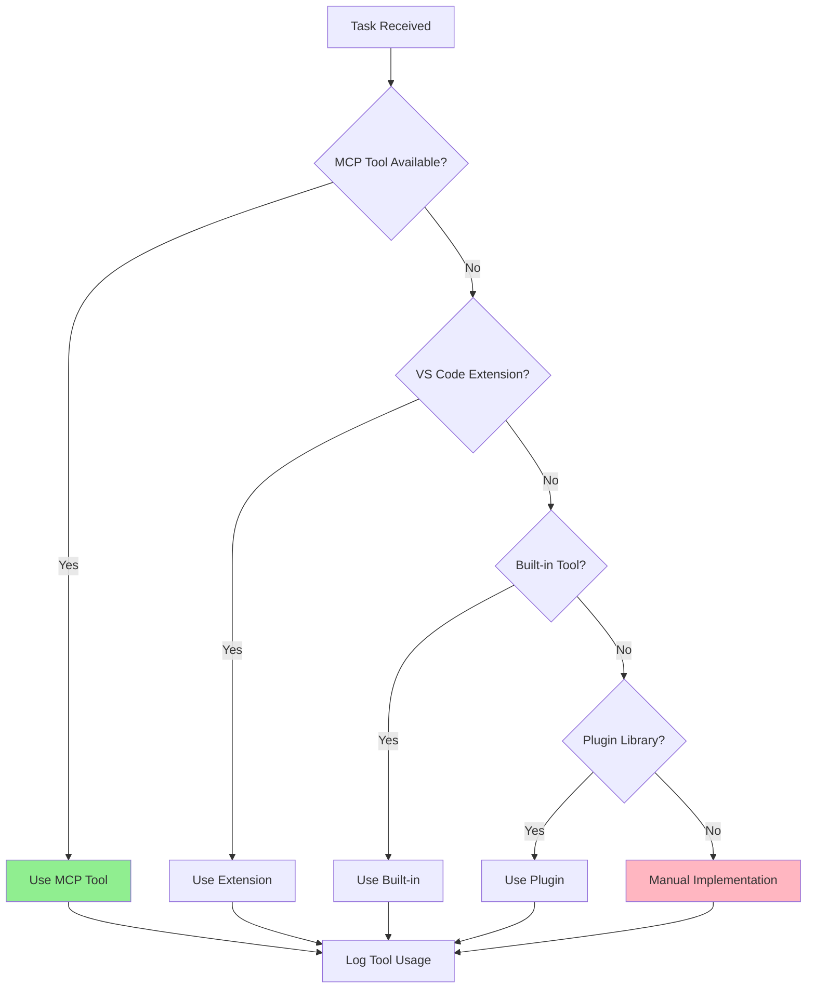
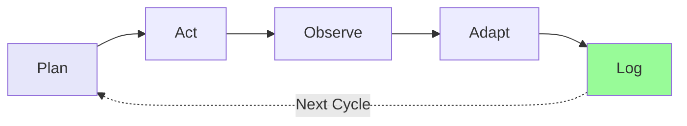

# ContextForge Core Framework

**Authority**: ContextForge Work Codex | QSE Universal Task Management Workflow

> This is a consolidated quick-reference. For full documentation, see linked files.

---

## Work Codex Principles (7 Core)

1. **Trust Nothing, Verify Everything** - Evidence closes the trust loop
2. **Workspace First** - Search existing content before creating
3. **Logs First** - Truth lives in records, not assumptions
4. **Leave Things Better** - Every action enriches the system
5. **Fix the Root, Not the Symptom** - Problems repeat until addressed at source
6. **Best Tool for the Context** - PowerShell for Windows, Python for orchestration
7. **Iteration is Sacred** - Progress spirals like fractals

---

## COF 13-Dimensional Analysis (Quick Reference)

| # | Dimension | Focus | Key Question |
|---|-----------|-------|--------------|
| 1 | **Motivational** | Purpose, drivers | Why does this exist? |
| 2 | **Relational** | Dependencies | What depends on/from this? |
| 3 | **Situational** | Environment | What constraints exist? |
| 4 | **Resource** | Time, skills, tools | What's available? |
| 5 | **Narrative** | Business case | How do we tell this story? |
| 6 | **Recursive** | Feedback cycles | What lessons feed forward? |
| 7 | **Computational** | Algorithms | What's the complexity? |
| 8 | **Emergent** | Novel outcomes | What might emerge? |
| 9 | **Temporal** | Timing, deadlines | When must this happen? |
| 10 | **Spatial** | Distribution | Where does this exist? |
| 11 | **Holistic** | System integration | How does this fit the whole? |
| 12 | **Validation** | Evidence | How do we prove it works? |
| 13 | **Integration** | Reintegration | How does it fit back? |

**When Required**: Major architectural decisions, system design, new projects, risk-heavy implementations.

**Not Required**: Routine bug fixes, minor documentation, trivial refactoring.

**Full Reference**: [03-Context-Ontology-Framework.md](../../docs/03-Context-Ontology-Framework.md)

---

## Universal Context Law (UCL)

> "No orphaned, cyclical, or incomplete context may persist in the system."

### Three Requirements

| Requirement | Rule | Fix |
|-------------|------|-----|
| **No Orphans** | Every context anchored to parent | Link to parent or archive |
| **No Cycles** | Relationships flow toward resolution | Break circular dependencies |
| **Complete Evidence** | Every context carries evidence bundles | Generate missing evidence |

### UCL Validation Flow



### UCL Validation Checklist

- [ ] Context has valid parent_id reference
- [ ] No context depends on its own descendants
- [ ] Evidence bundle exists with correlation ID, hash, timestamp

---

## MCP Tool Selection Matrix

| Trigger | Primary Tool | Fallback |
|---------|--------------|----------|
| Complex reasoning | `sequential_thinking` | Manual analysis |
| Multiple approaches | `branched_thinking` | Decision matrix |
| Historical context | `agent-memory/query` | Search codebase |
| Store insights | `agent-memory/create` | Documentation |
| Task management | `TaskMan/*` | Manual tracking |
| Library docs | `Context7/*` | Web search |
| Approach validation | `vibe_check` | Peer review |
| Pattern logging | `vibe_learn` | Session notes |

### Tool Preference Hierarchy



---

## Session Protocol

### Initialization

1. Query available MCP servers at session start
2. Build dynamic tool registry
3. Narrate discovered capabilities
4. Select persona(s) for task execution

### Execution Pattern



| Phase | Action |
|-------|--------|
| **Plan** | Define intent, constraints, completion criteria |
| **Act** | Execute minimum next action |
| **Observe** | Collect results, run tests, capture evidence |
| **Adapt** | Adjust based on outcomes |
| **Log** | Record evidence, update TaskMan |

### Session ID Format

`QSE-YYYYMMDD-HHMM-UUID`

---

## Terminal Wait Discipline (TWD)

**Lesson Learned**: 2025-12-24 AAR — False claims made by racing terminal output.

### Rules

1. **NEVER** make conclusions while terminal command is running
2. **ALWAYS** wait for command output to complete (isBackground: false)
3. **ALWAYS** create log file before making verification claims
4. **ALWAYS** use `read_file` tool on log files (reliable vs truncated terminal)

### Verification Workflow

```powershell
# 1. Run command → output to file
Get-ChildItem -Recurse -Filter "*.py" | Select-String "pattern" | Out-File "logs/check-{date}.txt"

# 2. Wait for completion (terminal finishes)

# 3. Read with read_file tool
# read_file("logs/check-{date}.txt", 1, 100)

# 4. THEN make claim with file citation
```

### Zero-Claim Challenge

When claiming "zero", "none", "clean":
1. Primary verification → log file 1
2. Secondary verification (different approach) → log file 2
3. Both must agree before assertion

---

## Logging Standards (Baseline Events)

### Mandatory Event Sequence

| Event | When | Required Fields |
|-------|------|-----------------|
| `session_start` | Session begins | session_id, project_id |
| `task_start` | Each task begins | task_id, task_name |
| `decision` | Any branching | decision_type, selected, rationale |
| `artifact_touch_batch` | Read operations | artifacts[], count |
| `artifact_emit` | Create/modify | path, type, hash, size_bytes |
| `warning` / `error` | Issues occur | type, message |
| `task_end` | Task completes | outcome, duration_seconds |
| `session_summary` | Session ends | tasks_completed, artifacts_created |

### Coverage Target

**>=90%** of execution paths must emit baseline events.

### Log Format

**JSONL** (JSON Lines) - one valid JSON object per line:

```jsonl
{"timestamp":"2025-12-15T10:00:00Z","level":"info","event":"session_start","session_id":"QSE-20251215-1000-abc123"}
```

### Credential Redaction

Automatically redacted: `password`, `token`, `api_key`, `secret`, `connectionString`, `authorization`

---

## Evidence Bundle Structure

```json
{
  "correlation_id": "QSE-...",
  "project_id": "P-...",
  "session_id": "QSE-...",
  "artifacts": [{"path": "...", "hash": "sha256:...", "size_bytes": ...}],
  "logs": [...],
  "decisions": [...],
  "validation": {"quality_gates_passed": [...], "ucl_compliance": true}
}
```

### Storage Location

```
.QSE/v2/Evidence/{projectId}/{sessionId}/
├── evidence-bundle-{timestamp}.jsonl
├── artifacts/
└── logs/
```

---

## Sacred Geometry Alignment

| Pattern | Meaning | Application |
|---------|---------|-------------|
| **Circle** | Completeness | Contexts flow toward resolution |
| **Triangle** | Stability | Three-point validation (build, evidence, coherence) |
| **Spiral** | Iteration | Upward progression with learning |
| **Golden Ratio** | Balance | Optimal effort allocation |
| **Fractal** | Modularity | Patterns consistent across scales |

---

## Anti-Patterns

- Executing without persona selection
- Silent execution (no narration)
- Manual implementation when tools exist
- Skipping session_start/session_summary
- Creating artifacts without artifact_emit logs
- Allowing orphaned or cyclic contexts

---

## Definition of Done

### Session Level

- [ ] At least one persona selected
- [ ] Narration provided throughout
- [ ] MCP tools used where appropriate
- [ ] Evidence bundles generated
- [ ] Session log finalized

### Logging Level

- [ ] All baseline events present
- [ ] >=90% path coverage
- [ ] No sensitive data in logs
- [ ] JSONL format validated

### UCL Level

- [ ] No orphaned contexts
- [ ] No circular dependencies
- [ ] Evidence bundles complete

---

**Consolidated from**: `cof-ucl.instructions.md`, `agent-core.instructions.md`, `logging.instructions.md`

**Full Documentation**:
- [03-Context-Ontology-Framework.md](../../docs/03-Context-Ontology-Framework.md)
- [09-Development-Guidelines.md](../../docs/09-Development-Guidelines.md)
