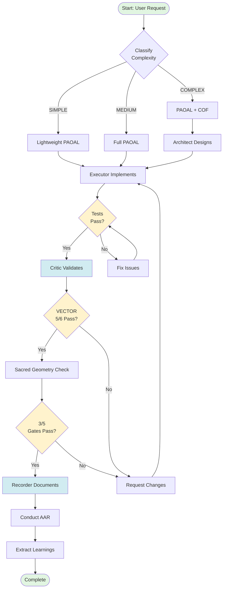
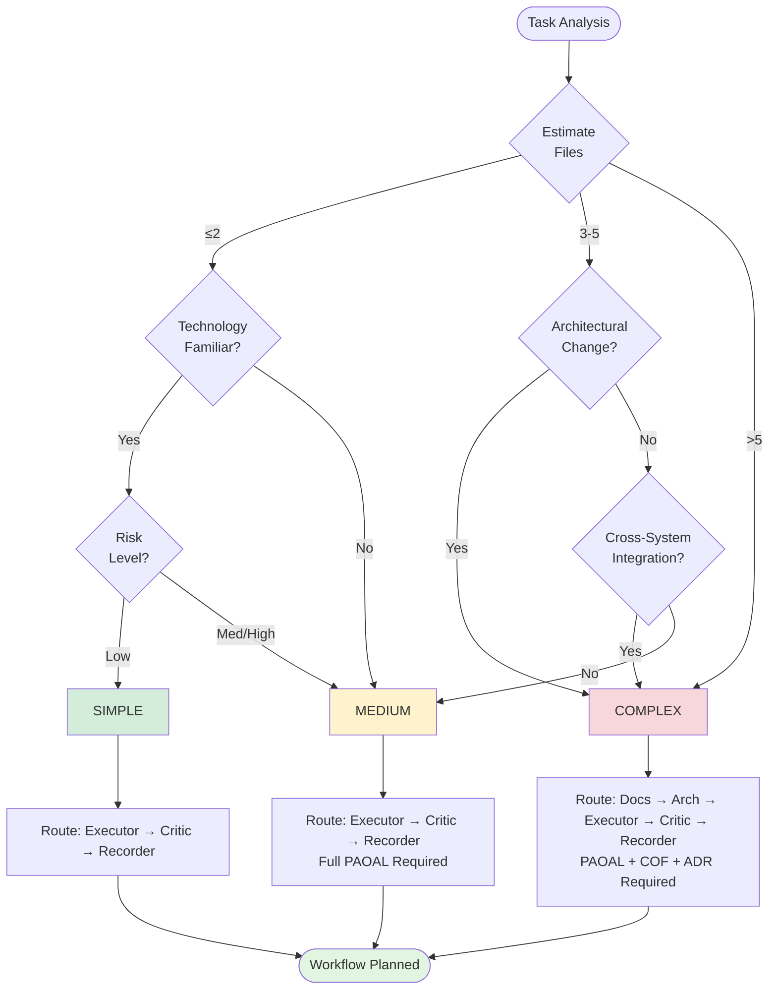
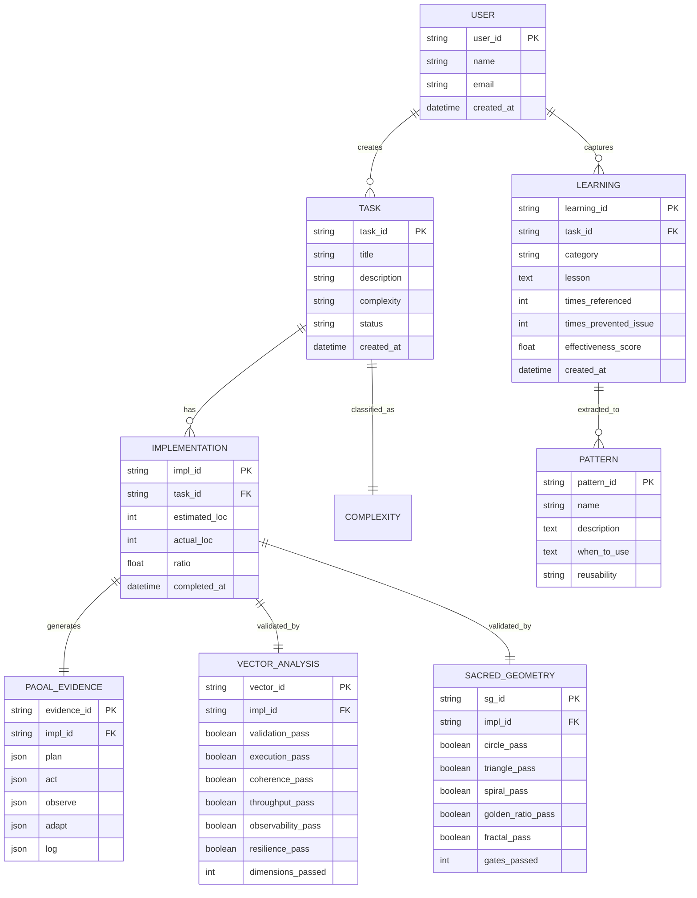
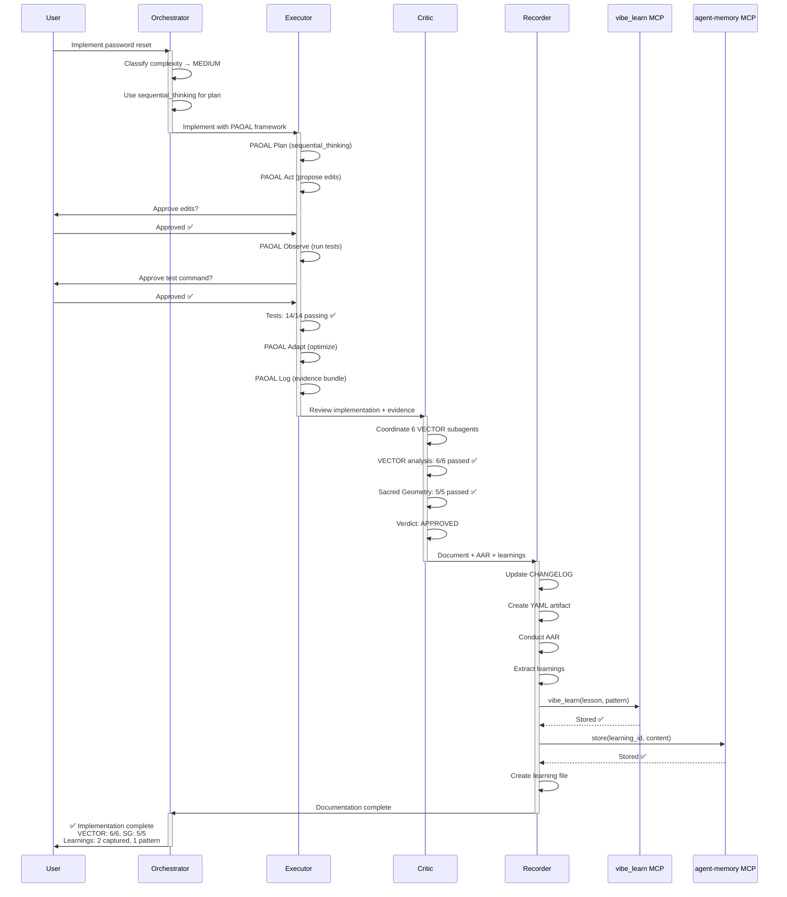
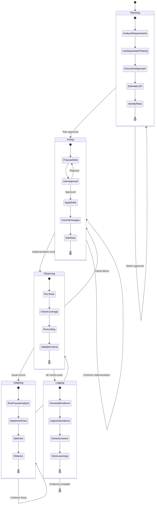
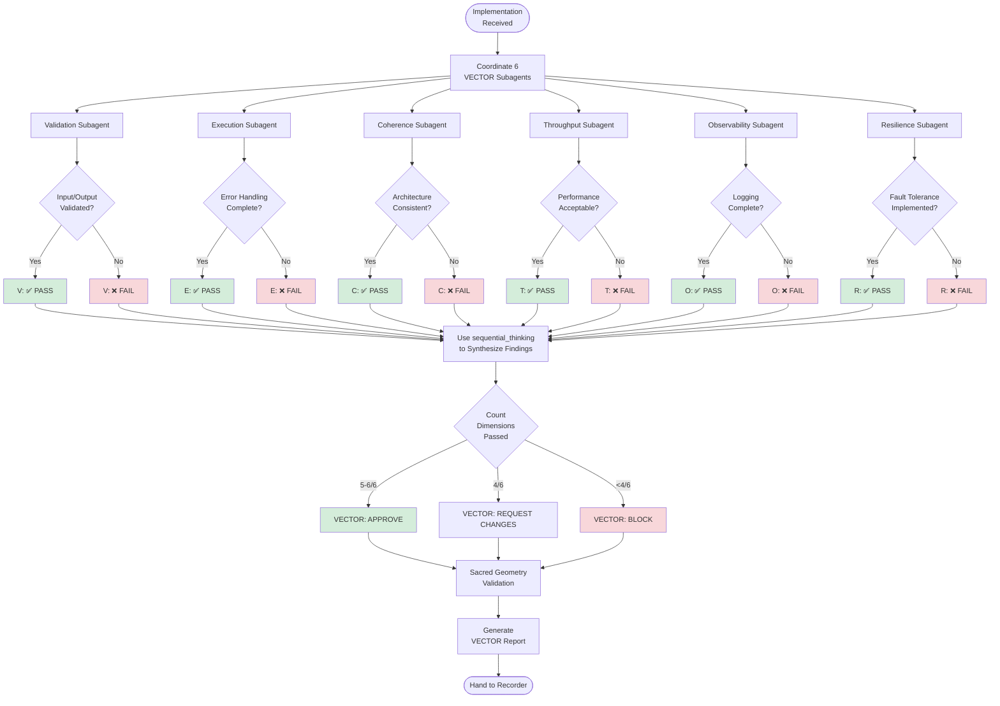
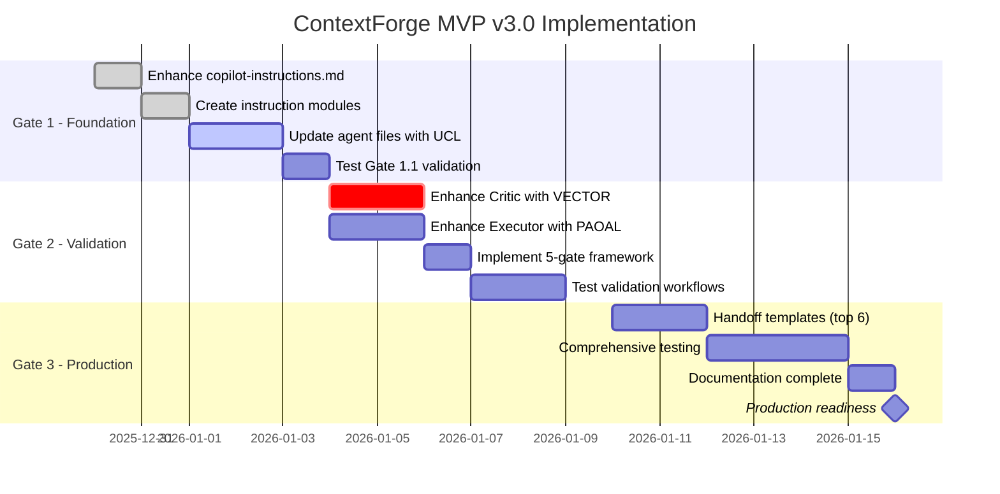
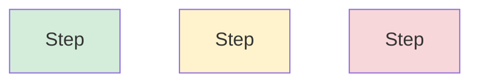
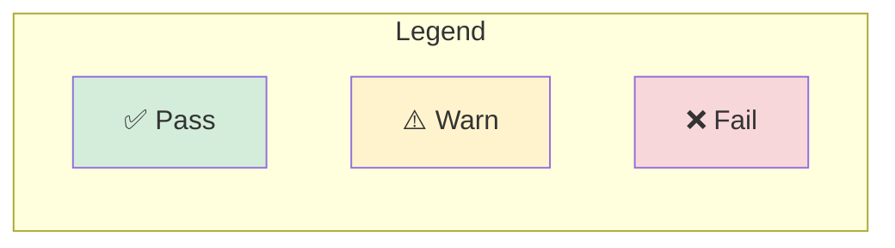

```mermaid
flowchart TD
    Start([VECTOR Analysis<br/>Complete]) --> Circle{Circle Gate<br/>Completeness<br/>4/4?}
    
    Circle -->|Yes| CirclePass[Circle: ✅]
    Circle -->|No| CircleFail[Circle: ❌]
    
    CirclePass --> Triangle
    CircleFail --> Triangle
    
    Triangle{Triangle Gate<br/>Stability<br/>3/3?}
    
    Triangle -->|Yes| TrianglePass[Triangle: ✅]
    Triangle -->|No| TriangleFail[Triangle: ❌]
    
    TrianglePass --> Spiral
    TriangleFail --> Spiral
    
    Spiral{Spiral Gate<br/>Learning<br/>2/3?}
    
    Spiral -->|Yes| SpiralPass[Spiral: ✅]
    Spiral -->|No| SpiralWarn[Spiral: ⚠️]
    
    SpiralPass --> GoldenRatio
    SpiralWarn --> GoldenRatio
    
    GoldenRatio{Golden Ratio Gate<br/>Balance<br/>3/3?}
    
    GoldenRatio -->|Yes| GoldenPass[Golden Ratio: ✅]
    GoldenRatio -->|No| GoldenFail[Golden Ratio: ❌]
    
    GoldenPass --> Fractal
    GoldenFail --> Fractal
    
    Fractal{Fractal Gate<br/>Consistency<br/>3/3?}
    
    Fractal -->|Yes| FractalPass[Fractal: ✅]
    Fractal -->|No| FractalFail[Fractal: ❌]
    
    FractalPass --> Count
    FractalFail --> Count
    
    Count[Count Gates Passed] --> Minimum{≥3 Gates<br/>Passed?}
    
    Minimum -->|Yes| Pass[Sacred Geometry:<br/>PASS]
    Minimum -->|No| Fail[Sacred Geometry:<br/>FAIL]
    
    Pass --> Report[Generate SG Report]
    Fail --> Report
    
    Report --> CombineVerdict{Combine<br/>VECTOR + SG}
    
    CombineVerdict --> FinalVerdict[Final Verdict:<br/>APPROVE/CHANGES/BLOCK]
    
    FinalVerdict --> End([Hand to Recorder])
    
    style CirclePass fill:#d4edda
    style TrianglePass fill:#d4edda
    style SpiralPass fill:#d4edda
    style GoldenPass fill:#d4edda
    style FractalPass fill:#d4edda
    style Pass fill:#d4edda
    style CircleFail fill:#f8d7da
    style TriangleFail fill:#f8d7da
    style GoldenFail fill:#f8d7da
    style FractalFail fill:#f8d7da
    style Fail fill:#f8d7da
    style SpiralWarn fill:#fff3cd
```

# ContextForge Mermaid Diagram Guide

**Purpose**: Visual communication for workflows, decisions, data models, and processes

**Tool**: vscode.mermaid-chat-features/renderMermaidDiagram (available in orchestrator)

---

## When to Create Diagrams

### ALWAYS Create Diagrams For:
- [ ] COMPLEX workflow routing (6+ steps or multiple decision points)
- [ ] Data model design (3+ entities with relationships)
- [ ] Multi-agent handoff sequences
- [ ] PAOAL phase transitions (state diagrams)
- [ ] Complexity classification logic (decision trees)
- [ ] VECTOR analysis workflow
- [ ] Sacred Geometry validation flow

### OPTIONAL Diagrams For:
- [ ] SIMPLE workflows (can describe in text)
- [ ] Binary decisions (yes/no)
- [ ] Single-agent operations

---

## Diagram Types & Templates

### 1. Flowchart - Process Workflows

**When to Use**: PAOAL execution, agent workflows, implementation processes

**Template**:


**Usage**:
```markdown
**@orchestrator creates workflow diagram**:

Here's the complete workflow for this MEDIUM complexity task:

[Insert Mermaid flowchart above]

This shows: User → Classify → Executor → Critic (VECTOR + SG) → Recorder → Complete
```

---

### 2. Decision Matrix - Complexity Classification

**When to Use**: Routing decisions, complexity analysis, multi-factor decisions

**Template**:


**Usage**:
```markdown
**@orchestrator uses decision matrix for classification**:

Analyzing task complexity using decision matrix:

[Insert decision matrix diagram]

Result: 
- Files: 4 (3-5 range)
- Architectural: No
- Integration: No
→ Classification: MEDIUM
→ Route: Executor → Critic → Recorder with full PAOAL
```

---

### 3. Entity Relationship Diagram - Data Models

**When to Use**: Database design, data model documentation, relationship mapping

**Template**:


**Usage**:
```markdown
**@recorder documents data model**:

Here's the complete data model for ContextForge implementation tracking:

[Insert ERD diagram]

Key relationships:
- USER creates many TASKS
- TASK has one IMPLEMENTATION
- IMPLEMENTATION generates PAOAL_EVIDENCE, VECTOR_ANALYSIS, SACRED_GEOMETRY
- IMPLEMENTATION may generate LEARNINGS
- LEARNINGS may be extracted to PATTERNS
```

---

### 4. Sequence Diagram - Agent Handoffs

**When to Use**: Multi-agent interactions, handoff protocols, communication flows

**Template**:


**Usage**:
```markdown
**@orchestrator visualizes agent handoff sequence**:

Here's the complete agent interaction flow for this implementation:

[Insert sequence diagram]

This shows:
1. Orchestrator classifies and plans
2. Executor implements with PAOAL (user approvals at gates)
3. Critic validates with VECTOR + Sacred Geometry
4. Recorder documents with AAR + triple storage
5. Orchestrator confirms completion
```

---

### 5. State Diagram - PAOAL Phases

**When to Use**: State transitions, phase workflows, status tracking

**Template**:


**Usage**:
```markdown
**@executor shows PAOAL state transitions**:

Here's the PAOAL execution flow with state transitions:

[Insert state diagram]

Current state: Acting → Observing
Next: Run tests, check coverage, validate criteria
```

---

### 6. Flowchart - VECTOR Analysis Workflow

**When to Use**: VECTOR validation process, dimensional analysis flow

**Template**:


**Usage**:
```markdown
**@critic shows VECTOR analysis workflow**:

Here's the systematic VECTOR validation process:

[Insert VECTOR flowchart]

Current status:
- V: ✅ PASS (all inputs validated)
- E: ✅ PASS (error handling complete)
- C: ✅ PASS (architecture consistent)
- T: ✅ PASS (performance acceptable)
- O: ⚠️ WARN (missing state logging)
- R: ✅ PASS (fault tolerance implemented)

Result: 5/6 passed → APPROVE (with logging recommendation)
```

---

### 7. Flowchart - Sacred Geometry Validation

**When to Use**: 5-gate validation process

**Template**:


**Usage**:
```markdown
**@critic shows Sacred Geometry validation flow**:

Here's the 5-gate Sacred Geometry validation:

[Insert SG flowchart]

Results:
- Circle: ✅ (4/4 complete)
- Triangle: ✅ (3/3 stable)
- Spiral: ✅ (2/3 learning captured)
- Golden Ratio: ✅ (3/3 balanced)
- Fractal: ✅ (3/3 consistent)

Gates passed: 5/5 ✅ (exceeds minimum 3/5)
Sacred Geometry: PASS
```

---

### 8. Gantt Chart - Project Timeline

**When to Use**: Sprint planning, milestone tracking, phase scheduling

**Template**:


**Usage**:
```markdown
**@orchestrator shows project timeline**:

Here's the complete implementation timeline for MVP v3.0:

[Insert Gantt chart]

Current status: Gate 1.3 (update agent files) - Day 2 of 2
Next: Gate 1.4 (validation testing) starts tomorrow
```

---

## Integration with Agents

### Orchestrator
**Uses Mermaid for**:
- Complexity classification decision trees
- Workflow routing diagrams
- Project timelines (Gantt)
- Agent handoff sequences

### Executor
**Uses Mermaid for**:
- PAOAL state transitions
- Implementation workflow
- Data model ERDs (when designing)

### Critic
**Uses Mermaid for**:
- VECTOR analysis workflow
- Sacred Geometry validation flow
- Issue dependency graphs

### Recorder
**Uses Mermaid for**:
- AAR process flow
- Learning lifecycle
- Pattern extraction workflow
- Data model documentation (ERDs)

---

## Best Practices

### 1. Keep Diagrams Simple
- ❌ 20+ nodes (too complex)
- ✅ 5-15 nodes (optimal)
- If >15 nodes: Break into multiple diagrams

### 2. Use Consistent Styling


**Color Palette**:
- Green (#d4edda): Success, pass, complete
- Yellow (#fff3cd): Warning, partial, in-progress
- Red (#f8d7da): Error, fail, blocked
- Blue (#d1ecf1): Info, process, neutral
- Gray (#e9ecef): Background, inactive

### 3. Include Legend (if needed)


### 4. Progressive Disclosure
- High-level diagram first (workflow overview)
- Detailed diagrams on request (specific phase breakdown)

### 5. Embed in Documentation
- Always include text explanation before/after diagram
- Reference diagram in markdown artifacts
- Store diagram source in code blocks for reproducibility

---

## Quick Reference

### Diagram Selection Guide

| Need to Show | Diagram Type | Example |
|--------------|-------------|---------|
| Process flow | Flowchart | PAOAL execution, VECTOR analysis |
| Decision logic | Flowchart (diamond nodes) | Complexity classification |
| Agent interactions | Sequence diagram | Executor → Critic → Recorder |
| State transitions | State diagram | PAOAL phases, task status |
| Data relationships | ERD | Learning → Pattern, Task → Implementation |
| Timeline | Gantt chart | Sprint planning, milestone tracking |
| Hierarchy | Flowchart (tree structure) | Agent specialization, subagent coordination |

---

## Version

**Document**: ContextForge Mermaid Diagram Guide  
**Version**: 1.0  
**Last Updated**: 2025-12-31  
**Use**: Visual communication for all ContextForge agents
