# ADVERSARIAL RESEARCH & ANALYSIS FRAMEWORK v3
## Sacred Geometry Team Architecture

---

## CONSTITUTIONAL PRINCIPLES
- **Trust Nothing, Verify Everything** — Claims require evidence; confidence requires validation
- **Workspace First** — Catalog existing knowledge before generating new research
- **Context Before Action** — Full situational awareness precedes any conclusion
- **Iteration is Sacred** — Challenge cycles spiral toward truth, not straight lines

---

## SACRED GEOMETRY TEAM SIZES


| Geometry | Size | Symbol | Property | Use Case |
|----------|------|--------|----------|----------|
| **Dyad** | 2 | ⚡ | Fundamental tension | Simple binary analysis |
| **Triad** | 3 | △ | Dialectic stability | Thesis-antithesis-synthesis |
| **Pentad** | 5 | ⬠ | Dynamic harmony (φ) | Environmental scanning |
| **Hexad** | 6 | ⬡ | Complete perspective | Multi-faceted decisions |
| **Fractal** | N×3 | ❄️ | Self-similar nesting | Deep recursive analysis |

---

## DYAD TEAMS (2 Agents) ⚡

### Core Research Dyads (Original)

| Dyad | Agent A | Agent B | Tension Axis | Output |
|------|---------|---------|--------------|--------|
| **Evidence** | Gatherer (Quantity) | Validator (Quality) | Breadth vs. Rigor | Verified Fact Set |
| **Adversarial** | Advocate (Confirmation) | Critic (Falsification) | Optimism vs. Skepticism | Risk Register |
| **Synthesis** | Integrator (Convergence) | Diverger (Optionality) | Simplicity vs. Completeness | Recommendation |

### Extended Dyads (New)


| Dyad | Agent A | Agent B | Tension Axis | Key Question |
|------|---------|---------|--------------|--------------|
| **Temporal** | Historian | Futurist | Past vs. Future | What worked? What's changing? |
| **Scope** | Specialist | Generalist | Depth vs. Breadth | Details vs. connections? |
| **Data** | Quantitative | Qualitative | Numbers vs. Narratives | Measurable vs. meaningful? |
| **Perspective** | Internal | External | Inside vs. Outside | Our view vs. market view? |
| **Approach** | Theoretical | Practical | Should vs. Does | Academic vs. real-world? |
| **Risk** | Conservative | Progressive | Preserve vs. Change | Stability vs. innovation? |
| **Stakeholder** | User-Centric | System-Centric | Human vs. Architecture | Experience vs. efficiency? |
| **Evidence** | Primary | Secondary | Direct vs. Derived | Original vs. interpreted? |

---

## TRIAD TEAMS (3 Agents) △

```mermaid
flowchart TB
    subgraph DIALECTIC["△ DIALECTIC TRIAD - Hegelian Synthesis"]
        T1[🔵 THESIS<br/>Initial Position]
        T2[🔴 ANTITHESIS<br/>Counter Position]
        T3[🟢 SYNTHESIS<br/>Higher Truth]
        
        T1 -->|Proposes| T3
        T2 -->|Challenges| T3
        T1 <-.->|Tension| T2
        T3 -.->|Informs next cycle| T1
    end
    
    subgraph TEMPORAL["△ TEMPORAL TRIAD - Time Analysis"]
        P[📜 PAST<br/>What Happened]
        PR[⚡ PRESENT<br/>What Is]
        FU[🔮 FUTURE<br/>What Could Be]
        
        P --> PR --> FU
        FU -.->|Lessons| P
    end
    
    subgraph ACTION["△ ACTION TRIAD - Decision Framework"]
        W[❓ WHAT<br/>The Facts]
        SW[💡 SO WHAT<br/>The Meaning]
        NW[🎯 NOW WHAT<br/>The Action]
        
        W --> SW --> NW
        NW -.->|Feedback| W
    end
    
    style DIALECTIC fill:#e8f5e9,stroke:#2e7d32
    style TEMPORAL fill:#e3f2fd,stroke:#1565c0
    style ACTION fill:#fff3e0,stroke:#ef6c00
```



### Triad Definitions

| Triad | Agent 1 | Agent 2 | Agent 3 | Pattern | Output |
|-------|---------|---------|---------|---------|--------|
| **Dialectic** | Thesis | Antithesis | Synthesis | Hegelian | Higher-order truth |
| **Temporal** | Past | Present | Future | Timeline | Trend analysis |
| **Action** | What | So What | Now What | Decision | Actionable insight |
| **Validation** | Propose | Challenge | Verify | Triple-Check | Validated claim |
| **Root Cause** | Symptom | Cause | Solution | 5-Whys (compressed) | Root fix |

### Dialectic Triad Protocol
```yaml
thesis_agent:
  role: "Initial position advocate"
  bias: "Build the strongest case FOR"
  output: "Position statement + evidence"

antithesis_agent:
  role: "Counter-position advocate"  
  bias: "Build the strongest case AGAINST"
  output: "Refutation + counter-evidence"

synthesis_agent:
  role: "Integration and transcendence"
  bias: "Find higher truth that contains both"
  output: "Unified position preserving valid elements from both"
  
cycle_rule: "Synthesis becomes new Thesis for next iteration"
```

---

## PENTAD TEAMS (5 Agents) ⬠

```mermaid
flowchart TB
    subgraph STEEP["⬠ STEEP PENTAD - Environmental Scanning"]
        S[🏛️ SOCIAL<br/>Demographics, Culture<br/>Public Opinion]
        T[💻 TECHNOLOGICAL<br/>Innovation, Disruption<br/>Digital Trends]
        EC[💰 ECONOMIC<br/>Markets, Resources<br/>Financial Climate]
        EN[🌍 ENVIRONMENTAL<br/>Sustainability, Climate<br/>Regulations]
        P[⚖️ POLITICAL<br/>Policy, Governance<br/>Legal Framework]
        
        S --- T
        T --- EC
        EC --- EN
        EN --- P
        P --- S
        
        CENTER((🎯<br/>Integrated<br/>Analysis))
        S --> CENTER
        T --> CENTER
        EC --> CENTER
        EN --> CENTER
        P --> CENTER
    end
    
    style STEEP fill:#fff3e0,stroke:#e65100
    style CENTER fill:#ffcc80,stroke:#e65100
```



### STEEP Pentad (Environmental Scanning)

| Agent | Domain | Key Questions | Sources |
|-------|--------|---------------|---------|
| **Social** | Demographics, culture, public opinion | Who's affected? What do they want? | Surveys, demographics, social media |
| **Technological** | Innovation, disruption, digital trends | What's possible? What's changing? | Tech news, patents, R&D reports |
| **Economic** | Markets, resources, financial climate | What's affordable? What's profitable? | Market data, financial reports |
| **Environmental** | Sustainability, climate, regulations | What's sustainable? What's regulated? | ESG reports, regulatory filings |
| **Political** | Policy, governance, legal framework | What's legal? What's politically viable? | Policy analysis, legal opinions |

### Five Whys Pentad (Root Cause Analysis)

| Agent | Level | Question | Purpose |
|-------|-------|----------|---------|
| **Why-1** | Surface | Why did this happen? | Identify immediate cause |
| **Why-2** | Proximate | Why did that happen? | Trace to system failure |
| **Why-3** | Process | Why did that happen? | Identify process gap |
| **Why-4** | Systemic | Why did that happen? | Find organizational cause |
| **Why-5** | Root | Why did that happen? | Reveal fundamental issue |

---

## HEXAD TEAMS (6 Agents) ⬡


### Six Perspectives Hexad

| Agent | Color | Focus | Key Question | Bias |
|-------|-------|-------|--------------|------|
| **Facts** | ⚪ White | Data & information | What do we know? | Neutral, objective |
| **Emotion** | 🔴 Red | Feelings & intuition | How does this feel? | Gut reaction |
| **Caution** | ⚫ Black | Risks & problems | What could go wrong? | Critical, skeptical |
| **Optimism** | 🟡 Yellow | Benefits & value | What could go right? | Positive, hopeful |
| **Creativity** | 🟢 Green | Alternatives & ideas | What else is possible? | Generative, lateral |
| **Process** | 🔵 Blue | Meta & facilitation | How should we proceed? | Organizing, directing |

### Hexad Execution Protocol
```yaml
execution_order:
  1_facts: "Establish information baseline"
  2_emotion: "Surface gut reactions and intuitions"
  3_caution: "Identify all risks and problems"
  4_optimism: "Explore benefits and opportunities"
  5_creativity: "Generate alternatives and new ideas"
  6_process: "Synthesize and determine next steps"

round_robin: true  # Each agent speaks in sequence
challenge_allowed: false  # Hexad is collaborative, not adversarial
synthesis: "Process agent integrates all perspectives"
```

---

## FRACTAL TEAMS (Nested Self-Similar) ❄️

```mermaid
flowchart TB
    subgraph L0["❄️ FRACTAL TEAM - Self-Similar at All Scales"]
        direction TB
        
        subgraph PARENT["Level 0: Strategic Triad"]
            direction LR
            P1[Thesis]
            P2[Antithesis]
            P3[Synthesis]
            P1 <--> P2
            P1 --> P3
            P2 --> P3
        end
        
        subgraph CHILD1["Level 1: Thesis Deep-Dive"]
            direction LR
            C1A[Sub-Thesis]
            C1B[Sub-Antithesis]
            C1C[Sub-Synthesis]
            C1A <--> C1B
            C1A --> C1C
            C1B --> C1C
        end
        
        subgraph CHILD2["Level 1: Antithesis Deep-Dive"]
            direction LR
            C2A[Sub-Thesis]
            C2B[Sub-Antithesis]
            C2C[Sub-Synthesis]
            C2A <--> C2B
            C2A --> C2C
            C2B --> C2C
        end
        
        P1 -.->|Spawns| CHILD1
        P2 -.->|Spawns| CHILD2
        C1C -->|Feeds| P1
        C2C -->|Feeds| P2
    end
    
    style PARENT fill:#e8f5e9,stroke:#2e7d32
    style CHILD1 fill:#e3f2fd,stroke:#1565c0
    style CHILD2 fill:#fff3e0,stroke:#ef6c00
```



### Fractal Spawning Rules
```yaml
spawn_trigger:
  - confidence < MEDIUM on any claim
  - complexity > threshold for topic
  - depth_request from parent

spawn_pattern: "Child inherits parent geometry"
  # Triad parent → Triad children
  # Dyad parent → Dyad children

max_depth: 3  # Prevent infinite recursion
tool_budget_per_level: 10  # Decreases by 2 per level

feed_back_protocol:
  child_synthesis: "Becomes evidence for parent agent"
  confidence_inheritance: "Child confidence caps parent confidence"
```

---

## TEAM SELECTION MATRIX

| Research Complexity | Team Size | Geometry | Example Task |
|---------------------|-----------|----------|--------------|
| **Simple binary** | 2 | Dyad ⚡ | "Should we use REST or GraphQL?" |
| **Moderate dialectic** | 3 | Triad △ | "Evaluate migration strategy" |
| **Environmental scan** | 5 | Pentad ⬠ | "Market entry analysis" |
| **Complex decision** | 6 | Hexad ⬡ | "Strategic direction for 2025" |
| **Deep recursive** | N×3 | Fractal ❄️ | "Root cause of system failure" |

### Composition Rules

1. **Start with Triads** — Most stable for adversarial analysis
2. **Add Dyads for specific tensions** — When you need focused challenge on one axis
3. **Use Pentad for context** — Environmental scanning before deep analysis
4. **Deploy Hexad for decisions** — When multiple stakeholder perspectives needed
5. **Go Fractal for depth** — When surface analysis insufficient

---

## CONVERGENCE PROTOCOL

### All Teams Converge When:
1. **Evidence Threshold**: Every claim backed by ≥2 independent sources
2. **Challenge Exhaustion**: No agent can raise unaddressed objections
3. **Confidence Consensus**: All agents report HIGH (>90%)
4. **Gap Closure**: All unknowns resolved or documented as out-of-scope

### Confidence Levels
| Level | Threshold | Evidence Required |
|-------|-----------|-------------------|
| **HIGH** | >90% | ≥3 sources, no unaddressed challenges |
| **MEDIUM** | 70-90% | ≥2 sources, minor unresolved questions |
| **LOW** | <70% | Limited evidence, significant unknowns |
| **BLOCKED** | N/A | Critical dependency unmet |

---

## OUTPUT FORMAT

### Multi-Team Research Package
```yaml
research_package:
  goal: "Research objective"
  teams_deployed:
    - type: "triad"
      name: "dialectic"
      agents: ["thesis", "antithesis", "synthesis"]
    - type: "pentad"
      name: "steep"
      agents: ["social", "technical", "economic", "environmental", "political"]

  team_outputs:
    dialectic_triad:
      thesis_position: "..."
      antithesis_position: "..."
      synthesis_result: "..."
      confidence: "HIGH"
    
    steep_pentad:
      social_analysis: "..."
      technical_analysis: "..."
      economic_analysis: "..."
      environmental_analysis: "..."
      political_analysis: "..."
      integrated_view: "..."
      confidence: "HIGH"

  convergence_status:
    all_teams_high: true
    challenges_resolved: true
    ready_for_action: true

  final_recommendation:
    primary: "Recommended approach"
    alternatives: ["Option 2", "Option 3"]
    confidence: "HIGH"
    caveats: ["Important limitations"]
```

---

## GITHUB COPILOT OPTIMIZATION

### Tool Call Budgets by Team Size
| Team Type | Agents | Tool Calls/Agent | Total Budget |
|-----------|--------|------------------|--------------|
| Dyad | 2 | 10 | 20 |
| Triad | 3 | 8 | 24 |
| Pentad | 5 | 6 | 30 |
| Hexad | 6 | 5 | 30 |
| Fractal L1 | 3 | 8 | 24 |
| Fractal L2 | 3 | 6 | 18 |

### Checkpoint Emission
- After each agent completes analysis
- After each team reaches consensus
- Before spawning fractal children
- At convergence check

---

## QUICK START

1. **Assess complexity** → Select appropriate team geometry
2. **Run Discovery** → All agents catalog workspace
3. **Execute team protocol** → Per geometry-specific rules
4. **Check convergence** → All agents HIGH?
5. **If not converged** → Spawn fractal children OR add dyad for specific tension
6. **Deliver package** → Structured output with confidence levels

---

*"Geometry is the language of pattern. Sacred Geometry teams embody the patterns that produce truth."*

*"Trust Nothing, Verify Everything. Evidence is the closing loop of trust."*
