# Database Access Troubleshooting Flowchart

**Version**: 1.0 | **Date**: 2025-12-29 | **Database**: taskman_v2 (PostgreSQL)

---

## 🚨 Quick Diagnostic

```mermaid
flowchart TD
    Start([Database Access Issue]) --> Check1{Can you run<br/>docker ps?}

    Check1 -->|No| Docker[Install Docker Desktop]
    Check1 -->|Yes| Check2{Is taskman-postgres<br/>running?}

    Check2 -->|No| Restart[Run: docker start<br/>taskman-postgres]
    Check2 -->|Yes| Check3{Can you connect<br/>to port 5434?}

    Check3 -->|No| PortIssue[Port Conflict<br/>See Section 3]
    Check3 -->|Yes| Check4{Authentication<br/>working?}

    Check4 -->|No| AuthIssue[Credential Issue<br/>See Section 2]
    Check4 -->|Yes| Check5{Database exists?}

    Check5 -->|No| DBMissing[Initialize Database<br/>See Section 4]
    Check5 -->|Yes| QueryIssue[Query Problem<br/>See Section 5]

    Restart --> Verify1{Container<br/>started?}
    Verify1 -->|Yes| Success[✅ Fixed]
    Verify1 -->|No| DockerLogs[Check logs:<br/>docker logs taskman-postgres]

    Docker --> InstallDone{Installed?}
    InstallDone -->|Yes| Start

    PortIssue --> PortFix[Change port or<br/>kill conflicting process]
    PortFix --> Success

    AuthIssue --> AuthFix[Use credentials:<br/>contextforge/contextforge]
    AuthFix --> Success

    DBMissing --> DBFix[Run docker-compose<br/>to initialize]
    DBFix --> Success

    QueryIssue --> QueryFix[Check SQL syntax<br/>and permissions]
    QueryFix --> Success
```



---

## Section 1: Container Not Running

### Symptom
```bash
docker ps | grep taskman-postgres
# (no output)
```

### Diagnosis Flow


### Solution Steps

```bash
# Step 1: Check if container exists (running or stopped)
docker ps -a | grep taskman-postgres

# Step 2a: If exists but stopped - START IT
docker start taskman-postgres

# Step 2b: If never existed - CREATE IT
docker-compose up -d taskman-postgres

# Step 2c: If missing/corrupted - RECREATE IT
docker-compose down
docker-compose up -d taskman-postgres

# Step 3: Verify it's running
docker ps --filter name=taskman-postgres --format "table {{.Names}}\t{{.Status}}\t{{.Ports}}"

# Expected Output:
# NAMES              STATUS              PORTS
# taskman-postgres   Up 2 minutes        0.0.0.0:5434->5432/tcp
```

### Verification

```bash
# Test connection immediately
docker exec taskman-postgres psql -U contextforge -d taskman_v2 -c "SELECT 1;"

# Expected Output:
#  ?column?
# ----------
#         1
# (1 row)
```

---

## Section 2: Authentication Failed

### Symptom
```
FATAL: password authentication failed for user "contextforge"
```

### Diagnosis Flow


### Solution Steps

```bash
# Step 1: Verify you're using correct credentials
# Username: contextforge
# Password: contextforge
# Database: taskman_v2
# Port: 5434

# Step 2: Test with explicit credentials
docker exec taskman-postgres psql -U contextforge -d taskman_v2 -c "SELECT current_user;"

# Expected Output:
#  current_user
# --------------
#  contextforge
# (1 row)

# Step 3: If still failing, check container environment
docker inspect taskman-postgres | grep -A 10 "Env"

# Expected to see:
# "POSTGRES_USER=contextforge",
# "POSTGRES_PASSWORD=contextforge",
# "POSTGRES_DB=taskman_v2",

# Step 4: If environment is wrong, recreate container
docker-compose down taskman-postgres
docker-compose up -d taskman-postgres

# Step 5: Wait 5 seconds for startup, then test
sleep 5
docker exec taskman-postgres psql -U contextforge -d taskman_v2 -c "SELECT 1;"
```

### Common Mistakes

| ❌ Wrong | ✅ Correct | Note |
|---------|-----------|------|
| User: postgres | User: contextforge | Default user is different |
| Password: admin | Password: contextforge | Password must match username |
| Database: postgres | Database: taskman_v2 | Use the specific database |
| Port: 5432 | Port: 5434 | TaskMan-v2 uses 5434 |

---

## Section 3: Connection Refused / Port Conflict

### Symptom
```
could not connect to server: Connection refused
Is the server running on host "localhost" and accepting TCP/IP connections on port 5434?
```

### Diagnosis Flow


### Solution Steps

```bash
# Step 1: Check if port 5434 is listening
netstat -an | findstr 5434  # Windows
netstat -an | grep 5434     # Linux/Mac

# Expected Output:
# TCP    0.0.0.0:5434           0.0.0.0:0              LISTENING

# Step 2: If not listening, check container status
docker ps --filter name=taskman-postgres

# Step 3: If container running but port not exposed, check port mapping
docker port taskman-postgres

# Expected Output:
# 5432/tcp -> 0.0.0.0:5434

# Step 4: If wrong port mapping, fix docker-compose.yml
# Ensure this section exists:
# services:
#   taskman-postgres:
#     ports:
#       - "5434:5432"

# Step 5: Recreate container with correct ports
docker-compose down taskman-postgres
docker-compose up -d taskman-postgres

# Step 6: If port already in use by another process
# Windows - Find process using port
netstat -ano | findstr :5434
taskkill /PID <PID> /F

# Linux/Mac - Find and kill process
lsof -ti:5434 | xargs kill -9

# Step 7: Verify connection
docker exec taskman-postgres psql -U contextforge -d taskman_v2 -c "SELECT 1;"
```

### Port Reference

| Database | Host Port | Container Port | Container Name |
|----------|-----------|----------------|----------------|
| **TaskMan-v2** | 5434 | 5432 | taskman-postgres |
| ContextForge | 5433 | 5432 | contextforge-postgres |
| Sacred Context | 5432 | 5432 | sacred-context-db |

---

## Section 4: Database Does Not Exist

### Symptom
```
FATAL: database "taskman_v2" does not exist
```

### Diagnosis Flow


### Solution Steps

```bash
# Step 1: List all databases in container
docker exec taskman-postgres psql -U contextforge -d postgres -c "\l"

# Expected Output should include:
#                                List of databases
#     Name     |    Owner     | Encoding | Collate | Ctype |   Access privileges
# -------------+--------------+----------+---------+-------+-----------------------
#  taskman_v2  | contextforge | UTF8     | ...     | ...   |
#  postgres    | postgres     | UTF8     | ...     | ...   |

# Step 2: If taskman_v2 missing, check initialization logs
docker logs taskman-postgres 2>&1 | grep -i "database"

# Look for: "database system is ready to accept connections"

# Step 3: If never initialized, create database manually
docker exec taskman-postgres psql -U contextforge -d postgres -c "CREATE DATABASE taskman_v2 OWNER contextforge;"

# Step 4: Run initialization scripts (if you have schema.sql)
# docker exec -i taskman-postgres psql -U contextforge -d taskman_v2 < schema.sql

# Step 5: Verify tables exist
docker exec taskman-postgres psql -U contextforge -d taskman_v2 -c "\dt"

# Expected Output:
#              List of relations
#  Schema |     Name      | Type  |    Owner
# --------+---------------+-------+--------------
#  public | tasks         | table | contextforge
#  public | sprints       | table | contextforge
#  public | projects      | table | contextforge
# (9 rows)

# Step 6: If tables missing but database exists, restore from backup
# docker exec -i taskman-postgres psql -U contextforge -d taskman_v2 < backup.sql
```

---

## Section 5: Query Execution Problems

### Symptom
- Query returns empty results
- Syntax errors
- Permission denied
- Unexpected output

### Diagnosis Flow


### Common Query Issues

#### Issue 1: Table or column doesn't exist

```bash
# Error: relation "task" does not exist
# Solution: Check exact table name (case-sensitive in quotes)

# List all tables
docker exec taskman-postgres psql -U contextforge -d taskman_v2 -c "\dt"

# Describe specific table
docker exec taskman-postgres psql -U contextforge -d taskman_v2 -c "\d tasks"

# Expected Output:
#                         Table "public.tasks"
#    Column    |          Type          | Nullable |      Default
# -------------+------------------------+----------+-------------------
#  id          | uuid                   | not null | gen_random_uuid()
#  title       | character varying(255) | not null |
#  description | text                   |          |
#  status      | character varying(50)  | not null | 'new'::character varying
#  ...
```

#### Issue 2: Empty results when data exists

```bash
# Error: Query returns 0 rows but you expect data

# Step 1: Count total rows
docker exec taskman-postgres psql -U contextforge -d taskman_v2 -c "SELECT COUNT(*) FROM tasks;"

# Step 2: If count > 0 but your query returns nothing, check filters
# Bad: SELECT * FROM tasks WHERE status = 'New';  # Case-sensitive!
# Good: SELECT * FROM tasks WHERE status = 'new';

# Step 3: Use ILIKE for case-insensitive search
docker exec taskman-postgres psql -U contextforge -d taskman_v2 -c "SELECT * FROM tasks WHERE status ILIKE 'new';"
```

#### Issue 3: Permission denied

```bash
# Error: permission denied for table tasks

# Step 1: Check current user
docker exec taskman-postgres psql -U contextforge -d taskman_v2 -c "SELECT current_user;"

# Step 2: Check table owner
docker exec taskman-postgres psql -U contextforge -d taskman_v2 -c "SELECT tableowner FROM pg_tables WHERE tablename='tasks';"

# Step 3: If you're not the owner, request permissions
# (In production, contact DBA. In dev, use postgres superuser)
docker exec taskman-postgres psql -U postgres -d taskman_v2 -c "GRANT ALL ON tasks TO contextforge;"
```

#### Issue 4: Syntax errors

```bash
# Error: syntax error at or near "FROM"

# Common mistakes:
# ❌ SELECT FROM tasks;              # Missing column list
# ✅ SELECT * FROM tasks;

# ❌ SELECT * FROM tasks WHERE;      # Incomplete WHERE
# ✅ SELECT * FROM tasks WHERE status = 'new';

# ❌ SELECT * FROM tasks LIMIT;      # Missing limit value
# ✅ SELECT * FROM tasks LIMIT 10;

# Test queries in interactive mode for better error messages
docker exec -it taskman-postgres psql -U contextforge -d taskman_v2
```

---

## Section 6: Performance Issues

### Symptom
- Queries taking longer than expected (>1 second)
- High CPU usage
- Connection timeouts

### Diagnosis Flow


### Solution Steps

```bash
# Step 1: Use EXPLAIN to see query plan
docker exec taskman-postgres psql -U contextforge -d taskman_v2 -c \
  "EXPLAIN ANALYZE SELECT * FROM tasks WHERE status = 'new';"

# Look for:
# - Seq Scan (bad for large tables) vs Index Scan (good)
# - Execution time in milliseconds

# Step 2: Check existing indexes
docker exec taskman-postgres psql -U contextforge -d taskman_v2 -c \
  "SELECT indexname, indexdef FROM pg_indexes WHERE tablename = 'tasks';"

# Step 3: Create index if missing
docker exec taskman-postgres psql -U contextforge -d taskman_v2 -c \
  "CREATE INDEX IF NOT EXISTS idx_tasks_status ON tasks(status);"

# Step 4: Update statistics
docker exec taskman-postgres psql -U contextforge -d taskman_v2 -c "ANALYZE tasks;"

# Step 5: Re-run query and compare
docker exec taskman-postgres psql -U contextforge -d taskman_v2 -c \
  "EXPLAIN ANALYZE SELECT * FROM tasks WHERE status = 'new';"
```

---

## Emergency Recovery

### Complete Reset (Nuclear Option)

```bash
# ⚠️ WARNING: This deletes ALL data in taskman_v2 database!

# Step 1: Stop and remove container
docker stop taskman-postgres
docker rm taskman-postgres

# Step 2: Remove volume (if you want fresh data)
docker volume rm sccmscripts_postgres_taskman_data

# Step 3: Recreate from docker-compose
docker-compose up -d taskman-postgres

# Step 4: Wait for initialization (10 seconds)
sleep 10

# Step 5: Verify tables created
docker exec taskman-postgres psql -U contextforge -d taskman_v2 -c "\dt"

# Step 6: Test query
docker exec taskman-postgres psql -U contextforge -d taskman_v2 -c "SELECT COUNT(*) FROM tasks;"
```

### Backup Before Troubleshooting

```bash
# Always backup before major changes!

# Create backup
docker exec taskman-postgres pg_dump -U contextforge taskman_v2 > backup-$(date +%Y%m%d-%H%M%S).sql

# Restore backup
docker exec -i taskman-postgres psql -U contextforge -d taskman_v2 < backup-20251229-143000.sql
```

---

## Quick Reference Decision Matrix

| Symptom | Most Likely Cause | Quick Fix | Section |
|---------|------------------|-----------|---------|
| "Connection refused" | Container not running | `docker start taskman-postgres` | 1, 3 |
| "Authentication failed" | Wrong credentials | Use contextforge/contextforge | 2 |
| "Database does not exist" | Not initialized | Check `\l` and create if needed | 4 |
| "Table does not exist" | Wrong database or missing schema | Verify with `\dt` | 5 |
| Query returns 0 rows | Filter too restrictive or empty table | Check `COUNT(*)` without WHERE | 5 |
| "Permission denied" | User lacks privileges | Grant permissions | 5 |
| Very slow query (>10s) | Missing index or full scan | Add index with `CREATE INDEX` | 6 |
| Container won't start | Port conflict | Change port in docker-compose.yml | 3 |

---

## Getting Additional Help

### Collect Diagnostic Information

```bash
# Run this script to collect all relevant info for support:

echo "=== Docker Status ==="
docker ps --filter name=taskman-postgres

echo "=== Container Logs (last 50 lines) ==="
docker logs --tail 50 taskman-postgres

echo "=== Port Status ==="
netstat -an | findstr 5434  # Windows
# netstat -an | grep 5434   # Linux/Mac

echo "=== Database List ==="
docker exec taskman-postgres psql -U contextforge -d postgres -c "\l"

echo "=== Table List ==="
docker exec taskman-postgres psql -U contextforge -d taskman_v2 -c "\dt"

echo "=== Connection Test ==="
docker exec taskman-postgres psql -U contextforge -d taskman_v2 -c "SELECT current_user, current_database(), version();"
```

### Resources

- **Quick Reference**: [DATABASE-QUICK-REFERENCE.md](DATABASE-QUICK-REFERENCE.md)
- **Example Queries**: [DATABASE-EXAMPLE-QUERIES.md](DATABASE-EXAMPLE-QUERIES.md)
- **Comprehensive Guide**: [AGENT-DATABASE-ACCESS.md](AGENT-DATABASE-ACCESS.md)
- **Performance Analysis**: [DATABASE-PERFORMANCE-REPORT.md](DATABASE-PERFORMANCE-REPORT.md)

---

**Last Updated**: 2025-12-29 | **Tested Against**: PostgreSQL 14.x in Docker
