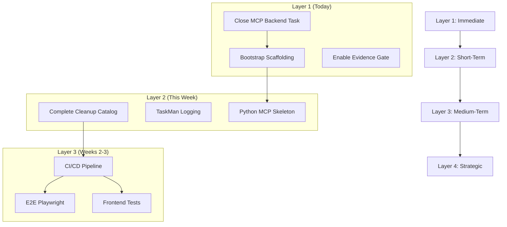

# Multi-Layered Next-Steps Plan

**Generated**: 2025-12-26
**Synthesis of**: Internal codebase research + External best practices research
**Planning Horizon**: 6 weeks (December 26, 2025 → February 6, 2026)

---

## Executive Summary

The ContextForge/TaskMan-v2 project is at a critical inflection point. **Cleanup work is 76% complete** (53/220 items remaining), the **TypeScript MCP server is production-ready** (24 tools), but **testing infrastructure gaps** (frontend/E2E minimal, Python MCP 0%) and **CI/CD deficiencies** (no TaskMan-specific tests) block confident iteration. The immediate priority is closing out in-progress work and enabling quality gates, followed by building out CI/CD infrastructure that unblocks PR #169. External research on FastAPI, Playwright, MCP, and GitHub Actions provides clear implementation patterns to accelerate these efforts.

---

## Layer 1: Immediate Actions (Today/Tomorrow)

**Goal**: Close out completed work, capture quick wins, establish momentum.

| # | Action | Est. Time | Files/Commands | Success Criteria |
|---|--------|-----------|----------------|------------------|
| ☐ | **1.1** Close `unblock-taskman-mcp-backend` | 30 min | Update MCP todos | Status → completed, ADR documents resolution |
| ☐ | **1.2** Execute `bootstrap-taskman-scaffolding` | 1-2h | TaskMan MCP tools | Validation project + roadmap project created, verified via list |
| ☐ | **1.3** Enable Evidence Coverage Gate (IV-003) | 1h | `.github/workflows/evidence-coverage.yml` | `--warn-only` removed, 80% threshold enforced |
| ☐ | **1.4** README Quick Start Update (IV-004) | 1h | `README.md` | New commands documented, PostgreSQL config updated |
| ☐ | **1.5** Run Ruff autofix pass (IV-001b) | 30 min | `ruff check . --fix --unsafe-fixes` | Auto-fixable issues resolved, commit pushed |

### Commands Reference

```powershell
# 1.3 - Evidence coverage gate
# Edit: .github/workflows/evidence-coverage.yml
# Remove: --warn-only flag from evidence-coverage command

# 1.5 - Ruff autofix
cd c:\Users\James\Documents\Github\GHrepos\SCCMScripts
.\.venv\Scripts\python.exe -m ruff check . --fix --statistics
git add -A && git commit -m "fix(lint): apply Ruff autofix pass"
```

---

## Layer 2: Short-Term Goals (This Week)

**Goal**: Complete Tier 1 items, address highest-impact improvements.

| # | Action | Est. Effort | Dependencies | Priority |
|---|--------|-------------|--------------|----------|
| ☐ | **2.1** Complete Cleanup Catalog (IV-001) | 5-8h | None | High |
| ☐ | **2.2** TaskMan Logging Enhancement (IV-002) | 3-4h | None | High |
| ☐ | **2.3** MCP Parity Analysis (ST-006) | 4-6h | None | Medium |
| ☐ | **2.4** Autofix Auto-Application (IV-005) | 3h | GH Actions write perms | Medium |
| ☐ | **2.5** API Documentation Generation (ST-003) | 6-8h | None | Medium |
| ☐ | **2.6** Python MCP Server Skeleton | 4h | None | High |
| ☐ | **2.7** Reconcile Cleanup Catalog (IV-001c) | 2h | IV-001 | Medium |

### 2.1 Complete Cleanup Catalog

**Focus**: 8 high-priority items in `CODEBASE-CLEANUP-CATALOG.yaml`

```yaml
# High priority remaining (8 items):
- Legacy import patterns in production code
- Deprecated file identification and archival
- Test file cleanup and organization
- Configuration file consolidation
```

**Success Criteria**:
- `remaining_issues.priority.high` → 0
- All archived files in `backup/orphaned-backups/`
- No broken imports in main codebase

### 2.2 TaskMan Logging Enhancement

**Files to modify**:
- `TaskMan-v2/backend-api/app/routers/*.py` (6 routers)
- `TaskMan-v2/backend-api/app/middleware/logging.py` (new)

**Pattern from External Research** (FastAPI best practices):
```python
# Apply middleware pattern
from fastapi import Request
import structlog

logger = structlog.get_logger()

@app.middleware("http")
async def logging_middleware(request: Request, call_next):
    request_id = request.headers.get("X-Request-ID", str(uuid.uuid4()))
    with structlog.contextvars.bind_contextvars(request_id=request_id):
        logger.info("request_started", path=request.url.path, method=request.method)
        response = await call_next(request)
        logger.info("request_completed", status_code=response.status_code)
        return response
```

### 2.6 Python MCP Server Skeleton

**Location**: `TaskMan-v2/mcp-server-py/`

**Apply MCP Best Practices**:
1. Capability negotiation in initialization
2. JSON schema validation for tool inputs
3. `isError` flag pattern for error responses
4. Match TypeScript MCP tool parity (24 tools)

---

## Layer 3: Medium-Term Milestones (Next 2 Weeks)

**Goal**: Build CI/CD infrastructure, establish testing maturity.

| # | Milestone | Est. Effort | Dependencies | Success Criteria |
|---|-----------|-------------|--------------|------------------|
| ☐ | **3.1** TaskMan CI/CD Pipeline (ST-001) | 12-16h | Layer 2 complete | PR #169 unblocked, automated tests on every push |
| ☐ | **3.2** E2E Playwright Tests (ST-005) | 10-12h | ST-001 | 5+ critical user journeys covered |
| ☐ | **3.3** Frontend Test Suite (ST-002) | 8-10h | ST-001 | 70%+ coverage, all components tested |
| ☐ | **3.4** Security Scanning (ST-007) | 4-5h | None | Trivy + pip-audit + npm audit + Semgrep integrated |
| ☐ | **3.5** DB Performance Monitoring (ST-004) | 6-8h | None | Slow query logging enabled, metrics dashboard |

### 3.1 TaskMan CI/CD Pipeline (P0 CRITICAL)

**Workflow File**: `.github/workflows/taskman-v2.yml`

**Apply GitHub Actions Best Practices**:
```yaml
name: TaskMan-v2 CI

on:
  push:
    paths:
      - 'TaskMan-v2/**'
  pull_request:
    paths:
      - 'TaskMan-v2/**'

jobs:
  backend:
    runs-on: ubuntu-latest
    strategy:
      matrix:
        python-version: ['3.11', '3.12']
    services:
      postgres:
        image: postgres:15
        env:
          POSTGRES_PASSWORD: postgres
        options: >-
          --health-cmd pg_isready
          --health-interval 10s
          --health-timeout 5s
          --health-retries 5
    steps:
      - uses: actions/checkout@v4
      - uses: actions/setup-python@v5
        with:
          python-version: ${{ matrix.python-version }}
          cache: 'pip'
          cache-dependency-path: 'TaskMan-v2/backend-api/requirements*.txt'
      - run: pip install -r requirements.txt -r requirements-dev.txt
        working-directory: TaskMan-v2/backend-api
      - run: pytest --cov --cov-report=xml
        working-directory: TaskMan-v2/backend-api

  frontend:
    runs-on: ubuntu-latest
    steps:
      - uses: actions/checkout@v4
      - uses: actions/setup-node@v4
        with:
          node-version: 20
          cache: 'npm'
          cache-dependency-path: 'TaskMan-v2/package-lock.json'
      - run: npm ci
        working-directory: TaskMan-v2
      - run: npm run lint
        working-directory: TaskMan-v2
      - run: npm run test:coverage
        working-directory: TaskMan-v2
```

### 3.2 E2E Playwright Tests

**Apply Playwright Best Practices**:
```typescript
// playwright.config.ts
import { defineConfig } from '@playwright/test';

export default defineConfig({
  webServer: [
    {
      command: 'npm run start:backend',
      url: 'http://localhost:8002/health',
      reuseExistingServer: !process.env.CI,
    },
    {
      command: 'npm run dev',
      url: 'http://localhost:5173',
      reuseExistingServer: !process.env.CI,
    },
  ],
  projects: [
    { name: 'setup', testMatch: /.*\.setup\.ts/ },
    {
      name: 'chromium',
      use: { ...devices['Desktop Chrome'] },
      dependencies: ['setup'],
    },
  ],
});
```

**Critical User Journeys to Test**:
1. Task creation and update workflow
2. Project management lifecycle
3. Sprint/cycle management
4. Action list operations
5. Search and filter functionality

---

## Layer 4: Strategic Initiatives (Next Month)

**Goal**: Enable advanced capabilities, establish long-term architecture.

| # | Initiative | Est. Effort | Business Value |
|---|------------|-------------|----------------|
| ☐ | **4.1** Constitutional Framework (SI-001) | 20-24h | Unique differentiator, architectural governance |
| ☐ | **4.2** Performance Infrastructure (SI-002) | 24-30h | Production readiness, scaling decisions |
| ☐ | **4.3** Developer Onboarding (SI-003) | 16-20h | Team scalability, reduced maintainer burden |

### 4.1 Constitutional Framework Reactivation

**Location**: Extract from `_python_archived/` or rebuild

**Components**:
- COF 13D validation decorator
- UCL compliance checker
- Evidence bundle generator
- Pydantic v2 models

**Value**: Enforces "No orphaned, cyclical, or incomplete context" principle across all operations.

### 4.2 Performance Monitoring Infrastructure

**Stack**:
- Prometheus (metrics collection)
- Grafana (visualization)
- OpenTelemetry (instrumentation)

**Dashboards**:
- API latency percentiles (p50, p95, p99)
- Database connection pool utilization
- Error rates by endpoint
- Circuit breaker state transitions

### 4.3 Developer Onboarding Automation

**Command**: `cf onboard`

**Features**:
- Interactive environment setup
- Database seeding with sample data
- Test verification
- VS Code extension recommendations
- Troubleshooting FAQ generation

---

## Risk Assessment

### Top 3 Risks and Mitigations

| Risk | Impact | Likelihood | Mitigation |
|------|--------|------------|------------|
| **Docker backend from different worktree** | Local edits don't reflect in running container | High | Rebuild container from main workspace: `docker-compose -f TaskMan-v2/docker-compose.taskman-v2.yml up --build` |
| **Python MCP at 0% coverage** | Technical debt accumulating, regressions undetected | Medium | Prioritize ST-006 (parity analysis) to scope minimal test surface |
| **CI/CD delay blocks PR #169** | Extended review cycle, merge conflicts | High | Fast-track ST-001, accept minimal viable pipeline first |

### Dependency Chain Visualization



---

## Recommended Memory Update

**Path**: `/memories/strategic-plan-2025-12-26.md`

```markdown
# Strategic Plan Summary - 2025-12-26

## Current State
- Cleanup: 76% complete (53/220 remaining, 8 high priority)
- TaskMan-v2: TypeScript MCP complete (24 tools), Python stub only
- Testing: Backend unit tests good, Frontend/E2E minimal, Python MCP 0%
- CI/CD: 32 workflows, no TaskMan-specific tests

## Priority Order
1. Close `unblock-taskman-mcp-backend` (functionally complete)
2. Execute `bootstrap-taskman-scaffolding` (now unblocked)
3. Enable evidence coverage gate (quick win)
4. Build TaskMan CI/CD pipeline (P0 CRITICAL for PR #169)

## Key External Patterns Applied
- FastAPI: middleware for structured logging
- Playwright: webServer config for frontend+backend
- MCP: capability negotiation, isError flag pattern
- GitHub Actions: matrix builds, hash-based caching

## Blockers Resolved
- MCP↔backend compatibility confirmed working
- Docker backend accessible at localhost:3001
- Health endpoints verified

## Total Roadmap: 143-181 hours across 22 items
```

---

## Appendix: Todo Status Updates

### Items to Mark Complete

```yaml
unblock-taskman-mcp-backend:
  old_status: in_progress
  new_status: completed
  evidence: |
    - Health checks pass (localhost:3001/health, /api/v1)
    - MCP tools successfully create/read objects
    - Backend client circuit breaker operational
```

### Items to Start

```yaml
bootstrap-taskman-scaffolding:
  old_status: pending
  new_status: in_progress
  action: Execute MCP tool sequence to create scaffolding
```

---

*Document generated by GitHub Copilot (Claude Opus 4.5) in Architect mode*
