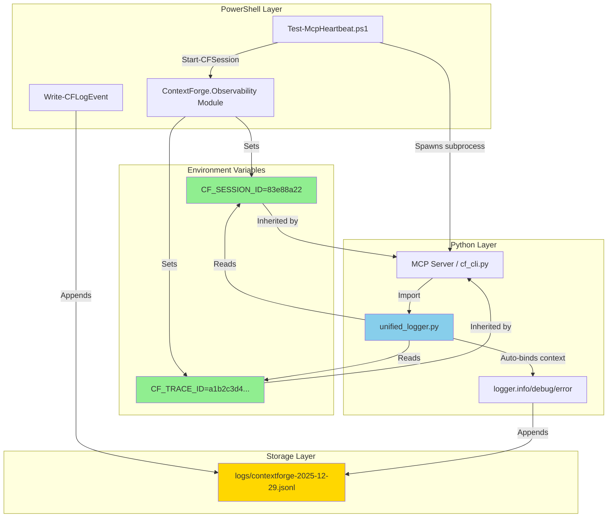
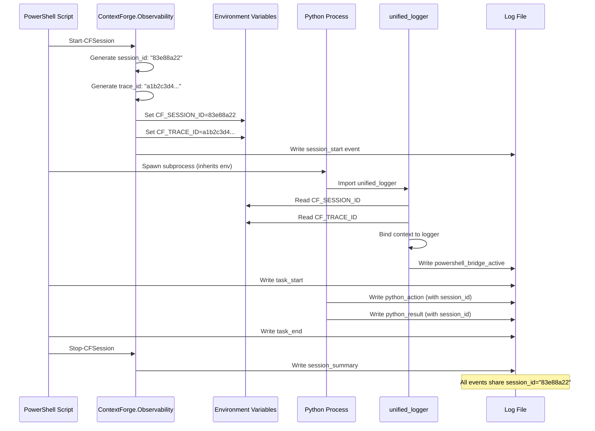
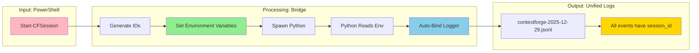
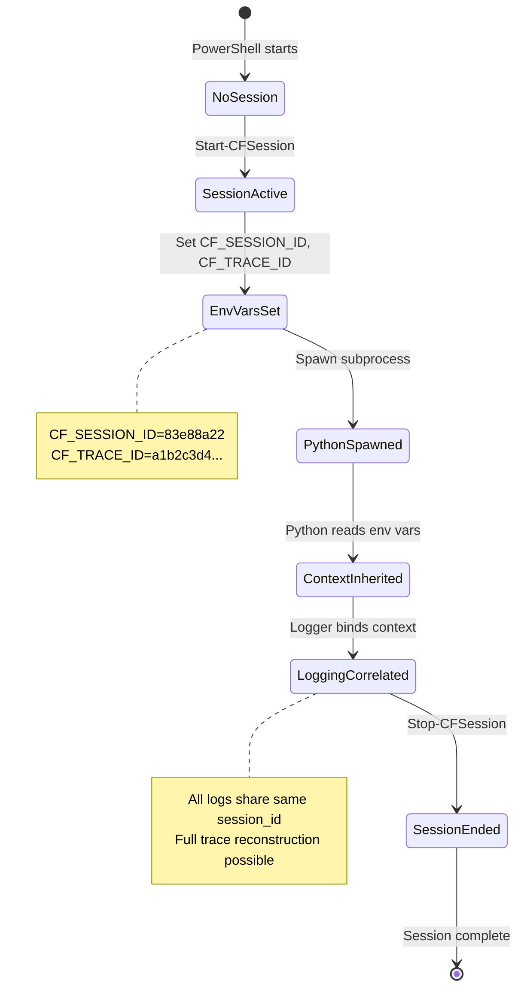
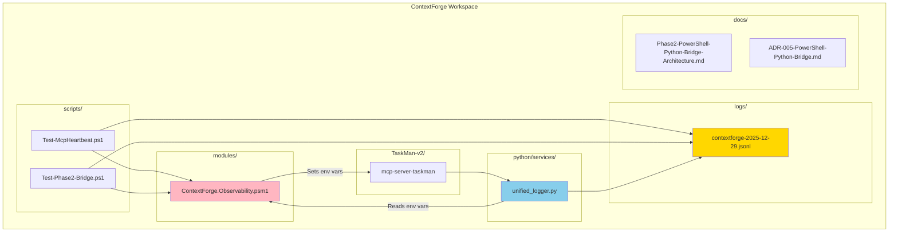

# Phase 2: Architecture Summary

## Component Diagram

## Sequence Diagram

## Data Flow Diagram

## State Diagram

## Deployment Diagram

---

## Key Metrics

| Metric | Value |
|--------|-------|
| **Lines of Code Changed** | ~20 (Python) + ~0 (PowerShell, already done) |
| **Files Modified** | 1 (`unified_logger.py`) |
| **Files Created** | 4 (docs, test script, ADR, quick ref) |
| **Breaking Changes** | 0 (backward compatible) |
| **Test Coverage** | End-to-end test script provided |
| **Implementation Time** | ~2 hours |
| **Complexity** | Low (environment variable pattern) |

---

## Success Criteria

- [✅] Python reads `CF_SESSION_ID` from environment
- [✅] Python reads `CF_TRACE_ID` from environment
- [✅] Logger auto-binds session context
- [✅] Logs write to unified daily file
- [✅] Bridge activation logged
- [✅] Backward compatible
- [ ] Test script passes
- [ ] Real MCP server validated
- [ ] Documentation complete

---

## Timeline

| Phase | Status | Date |
|-------|--------|------|
| **Design** | ✅ Complete | 2025-12-29 |
| **Python Implementation** | ✅ Complete | 2025-12-29 |
| **Test Script Creation** | ✅ Complete | 2025-12-29 |
| **Testing** | ⏳ In Progress | 2025-12-29 |
| **Validation** | ⏳ Pending | 2025-12-29 |
| **Production** | 🔄 Awaiting Tests | TBD |

---

*Architecture summary generated by Architect Agent*
*Last Updated: 2025-12-29*
