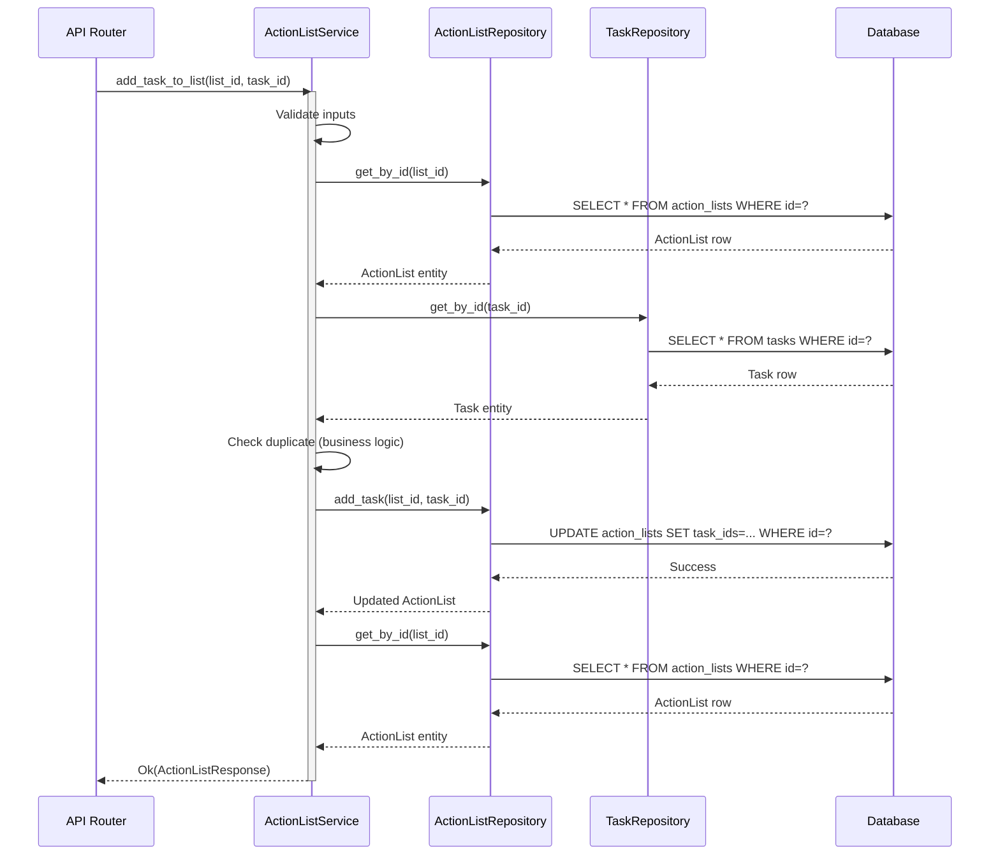
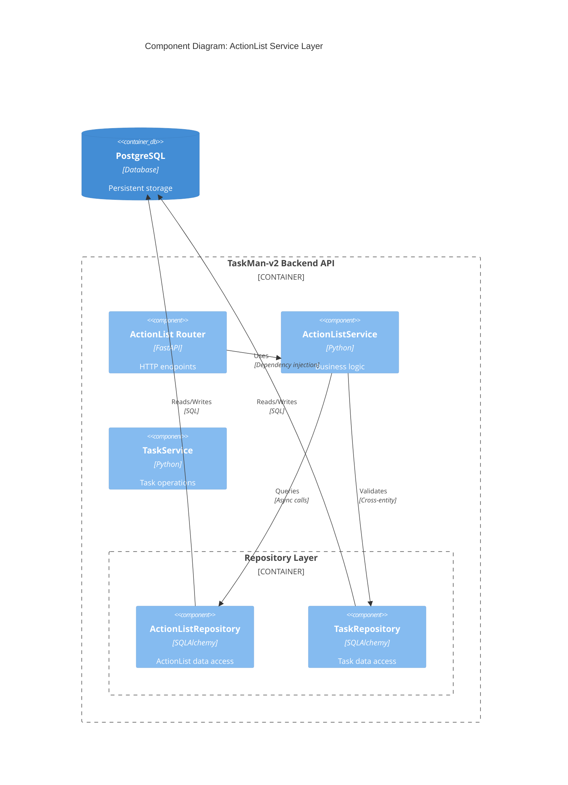

# ADR-018: ActionList Service Layer Architecture

## Status
**Accepted** | 2025-12-28

## Context

TaskMan-v2 backend-api implements a three-tier architecture with clear separation of concerns:

1. **API Layer** (FastAPI routers) — HTTP request/response handling, OpenAPI documentation
2. **Service Layer** — Business logic, orchestration, cross-entity operations
3. **Repository Layer** — Data access, query composition, transaction management

Phase 3 Task T5 requires implementing `action_list_service.py` to complete the ActionList feature stack. This ADR documents architectural decisions for the service layer, building upon established patterns from `task_service.py`, `sprint_service.py`, and `project_service.py`.

### Current State

**Existing Services**:
- **TaskService** (454 lines): Status transitions, sprint assignment, bulk operations, search
- **SprintService** (471 lines): Velocity calculations, burndown metrics, progress tracking
- **ProjectService** (332 lines): Metrics aggregation, health assessment, filtering
- **BaseService** (311 lines): Generic CRUD with Result monad, JSON serialization

**ActionList Requirements**:
- CRUD operations for ActionList entities
- Task relationship management (add/remove tasks from lists)
- Status-based filtering (active, archived, completed lists)
- Cross-entity queries (find lists containing specific tasks)
- Business rule enforcement (prevent duplicate tasks, validate status)
- Transaction coordination for multi-step operations

**Integration Points**:
- **API Router** → Receives HTTP requests, calls service methods
- **Repository** → Executes database queries, returns SQLAlchemy models
- **TaskService** → May need coordination for task validation
- **Result Monad** → Explicit error handling throughout call chain

### Architecture Drivers

**Functional Requirements**:
- Implement complete CRUD lifecycle for ActionList entities
- Manage bidirectional Task ↔ ActionList relationships
- Support advanced filtering (status, date range, task associations)
- Enable batch operations (bulk task addition/removal)
- Provide cross-cutting queries (lists by task, tasks by list)

**Quality Attributes**:
- **Maintainability**: Follow established service patterns, minimize cognitive load
- **Testability**: 100% method coverage with isolated unit tests
- **Performance**: Minimize N+1 queries, optimize relationship loading
- **Reliability**: Comprehensive error handling with Result monad
- **Extensibility**: Support future features (list templates, tags, priorities)

**Constraints**:
- Must use async/await throughout (TaskMan-v2 is fully async)
- Inherit from `BaseService[ActionList, ActionListCreateRequest, ActionListUpdateRequest, ActionListResponse]`
- Follow Result monad pattern (`Ok[T]` / `Err[E]`)
- Maintain compatibility with existing repository interface
- Session management via FastAPI dependency injection

## Decision Drivers

### Pattern Analysis: Service Complexity Spectrum

| Service | Lines | Business Logic | Cross-Entity | Metrics | Pattern |
|---------|-------|----------------|--------------|---------|---------|
| BaseService | 311 | ❌ Generic CRUD | ❌ | ❌ | Foundation |
| ProjectService | 332 | ✅ Search filters | ✅ Task metrics | ✅ Health | Rich |
| TaskService | 454 | ✅ Status validation | ✅ Sprint/Project | ❌ | Rich |
| SprintService | 471 | ✅ Lifecycle | ✅ Task aggregation | ✅ Velocity | Rich |
| **ActionListService** | ~350 | ✅ Task relationships | ✅ Task/List joins | ❌ | **Rich** |

### Options Considered

#### Option 1: Thin Service (Pass-Through)
```python
class ActionListService(BaseService[ActionList, ...]):
    """Minimal service - just delegates to repository."""

    async def add_task(self, list_id: str, task_id: str) -> Result[bool, AppError]:
        return await self.repository.add_task(list_id, task_id)
```

**Pros**: Simple, minimal code, direct repository access
**Cons**: No business logic layer, validation scattered across layers, harder to test
**Verdict**: ❌ Insufficient for complex Task ↔ ActionList relationships

#### Option 2: Rich Service with Business Logic ⭐ **(Recommended)**
```python
class ActionListService(BaseService[ActionList, ...]):
    """Rich service with orchestration and validation."""

    def __init__(self, session: AsyncSession):
        repository = ActionListRepository(session)
        super().__init__(repository, ActionList, ActionListResponse)
        self.action_list_repo = repository
        self.task_repo = TaskRepository(session)  # Dependency injection

    async def add_task_to_list(
        self,
        list_id: str,
        task_id: str
    ) -> Result[ActionListResponse, NotFoundError | ValidationError]:
        """Add task with validation and duplicate prevention."""
        # 1. Validate list exists
        list_result = await self.get(list_id)
        if isinstance(list_result, Err):
            return list_result

        # 2. Validate task exists
        task = await self.task_repo.get_by_id(task_id)
        if not task:
            return Err(NotFoundError(
                message=f"Task not found: {task_id}",
                entity_type="Task",
                entity_id=task_id,
            ))

        # 3. Check for duplicates
        if task_id in list_result.value.task_ids:
            return Err(ValidationError(
                message=f"Task {task_id} already in list {list_id}",
                field="task_id",
            ))

        # 4. Repository operation
        success = await self.action_list_repo.add_task(list_id, task_id)

        # 5. Return updated list
        return await self.get(list_id)
```

**Pros**: Clear business logic layer, comprehensive validation, testable
**Cons**: More code, additional repository dependency
**Verdict**: ✅ Best fit for ActionList requirements

#### Option 3: Domain Service with Complex Orchestration
```python
class ActionListOrchestrator:
    """Heavy domain service with saga pattern."""

    async def move_task_between_lists(
        self,
        task_id: str,
        from_list_id: str,
        to_list_id: str,
    ) -> Result[tuple[ActionListResponse, ActionListResponse], AppError]:
        async with transaction():
            # Multi-step saga with rollback
            ...
```

**Pros**: Handles complex workflows, transaction coordination
**Cons**: Over-engineered for current needs, high complexity
**Verdict**: ❌ Premature complexity - YAGNI principle

## Decision

**We will implement Option 2: Rich Service with Business Logic.**

### Rationale

1. **Consistency**: Aligns with existing `TaskService` and `ProjectService` patterns
2. **Separation of Concerns**: Business logic isolated from repository data access
3. **Validation Layer**: Centralized business rule enforcement
4. **Testability**: Service methods testable without database interaction
5. **Extensibility**: Foundation for future features (bulk operations, analytics)

### Service Responsibilities

```mermaid
flowchart TD
    subgraph "API Layer"
        Router[ActionList Router]
    end

    subgraph "Service Layer"
        Service[ActionListService]
        Validation[Business Rules]
        Orchestration[Cross-Entity Ops]
    end

    subgraph "Repository Layer"
        ALRepo[ActionListRepository]
        TaskRepo[TaskRepository]
    end

    subgraph "Database"
        DB[(PostgreSQL)]
    end

    Router -->|DTO| Service
    Service --> Validation
    Service --> Orchestration
    Orchestration --> ALRepo
    Orchestration --> TaskRepo
    ALRepo --> DB
    TaskRepo --> DB

    Service -->|Result[T, E]| Router
```

### Service Contract

```python
from sqlalchemy.ext.asyncio import AsyncSession
from taskman_api.core.errors import AppError, NotFoundError, ValidationError
from taskman_api.core.result import Err, Ok, Result
from taskman_api.models.action_list import ActionList
from taskman_api.repositories.action_list_repository import ActionListRepository
from taskman_api.repositories.task_repository import TaskRepository
from taskman_api.schemas.action_list import (
    ActionListCreateRequest,
    ActionListResponse,
    ActionListUpdateRequest,
)
from .base import BaseService


class ActionListService(
    BaseService[
        ActionList,
        ActionListCreateRequest,
        ActionListUpdateRequest,
        ActionListResponse,
    ]
):
    """ActionList business logic and operations.

    Provides ActionList management functionality including:
    - CRUD operations (inherited from BaseService)
    - Task relationship management (add/remove tasks)
    - Status-based filtering and search
    - Cross-entity queries (lists by task, tasks by list)
    - Business rule enforcement

    Example:
        service = ActionListService(session)
        result = await service.add_task_to_list("AL-001", "T-042")
        match result:
            case Ok(action_list):
                print(f"Task added to list: {action_list.title}")
            case Err(error):
                print(f"Failed: {error.message}")
    """

    def __init__(self, session: AsyncSession) -> None:
        """Initialize ActionListService with session.

        Args:
            session: Async database session
        """
        repository = ActionListRepository(session)
        super().__init__(repository, ActionList, ActionListResponse)
        self.action_list_repo = repository  # Type-specific repository
        self.task_repo = TaskRepository(session)  # Cross-entity dependency
```

### Core Methods

#### 1. Task Relationship Management

```python
async def add_task_to_list(
    self,
    list_id: str,
    task_id: str,
) -> Result[ActionListResponse, NotFoundError | ValidationError | AppError]:
    """Add task to ActionList with validation.

    Business Rules:
    - ActionList must exist and not be archived
    - Task must exist
    - Task cannot already be in the list (duplicate prevention)

    Args:
        list_id: ActionList identifier
        task_id: Task identifier to add

    Returns:
        Result containing updated ActionList or error
    """
    # Implementation follows Option 2 pattern above
    ...

async def remove_task_from_list(
    self,
    list_id: str,
    task_id: str,
) -> Result[ActionListResponse, NotFoundError | AppError]:
    """Remove task from ActionList.

    Args:
        list_id: ActionList identifier
        task_id: Task identifier to remove

    Returns:
        Result containing updated ActionList or error
    """
    ...

async def bulk_add_tasks(
    self,
    list_id: str,
    task_ids: list[str],
) -> Result[ActionListResponse, NotFoundError | ValidationError | AppError]:
    """Add multiple tasks to ActionList in single transaction.

    Validates all tasks exist before any additions.
    Rolls back on any error.

    Args:
        list_id: ActionList identifier
        task_ids: List of task identifiers to add

    Returns:
        Result containing updated ActionList or error
    """
    ...
```

#### 2. Search and Filtering

```python
async def search(
    self,
    status: str | None = None,
    created_after: date | None = None,
    limit: int = 100,
    offset: int = 0,
) -> Result[tuple[list[ActionListResponse], int], AppError]:
    """Search ActionLists with filters.

    Args:
        status: Optional status filter (active, archived, completed)
        created_after: Optional date filter
        limit: Maximum results
        offset: Results to skip

    Returns:
        Result containing (action_lists, total_count) or error
    """
    try:
        lists, total = await self.action_list_repo.search(
            status=status,
            created_after=created_after,
            limit=limit,
            offset=offset,
        )

        responses = [
            self.response_class.model_validate(self._deserialize_json_fields(list_))
            for list_ in lists
        ]

        return Ok((responses, total))
    except Exception as e:
        return Err(AppError(message=str(e)))
```

#### 3. Cross-Entity Queries

```python
async def get_lists_containing_task(
    self,
    task_id: str,
) -> Result[list[ActionListResponse], AppError]:
    """Find all ActionLists containing a specific task.

    Useful for:
    - Task detail view (show all associated lists)
    - Dependency analysis
    - Impact assessment before task deletion

    Args:
        task_id: Task identifier

    Returns:
        Result containing list of ActionLists or error
    """
    try:
        lists = await self.action_list_repo.find_by_task_id(task_id)

        responses = [
            self.response_class.model_validate(self._deserialize_json_fields(list_))
            for list_ in lists
        ]

        return Ok(responses)
    except Exception as e:
        return Err(AppError(message=str(e)))

async def get_tasks_in_list(
    self,
    list_id: str,
) -> Result[list[TaskResponse], NotFoundError | AppError]:
    """Get all tasks in an ActionList with full Task details.

    Args:
        list_id: ActionList identifier

    Returns:
        Result containing list of Task responses or error
    """
    # Get list
    list_result = await self.get(list_id)
    if isinstance(list_result, Err):
        return list_result

    # Fetch all tasks
    task_ids = list_result.value.task_ids
    tasks = []
    for task_id in task_ids:
        task = await self.task_repo.get_by_id(task_id)
        if task:  # Skip deleted tasks
            tasks.append(TaskResponse.model_validate(task.__dict__))

    return Ok(tasks)
```

### Transaction Boundaries



**Transaction Scope**: Single database session per API request (FastAPI dependency injection)
**Commit Strategy**: Auto-commit at end of successful request
**Rollback Strategy**: Automatic rollback on exception

### Error Handling Strategy

#### Validation Layer Matrix

| Validation | Layer | Rationale |
|------------|-------|-----------|
| Field types, required fields | Pydantic Schema | Type safety at API boundary |
| Entity existence (Task, ActionList) | Service | Business rule enforcement |
| Duplicate prevention | Service | Business logic |
| Database constraints (FK, UNIQUE) | Repository/Database | Data integrity |
| Status transitions | Service | Business workflow |

#### Error Propagation

```python
# Service layer wraps repository errors in Result monad
async def add_task_to_list(self, list_id: str, task_id: str) -> Result[...]:
    try:
        # Validation errors
        if task_id in existing_task_ids:
            return Err(ValidationError(
                message="Task already in list",
                field="task_id",
            ))

        # Not found errors
        if not task:
            return Err(NotFoundError(
                message=f"Task not found: {task_id}",
                entity_type="Task",
                entity_id=task_id,
            ))

        # Repository operations
        result = await self.repository.add_task(list_id, task_id)
        return Ok(result)

    except Exception as e:
        # Catch-all for unexpected errors
        return Err(AppError(message=str(e)))
```

### Dependency Injection Pattern

```python
# FastAPI router dependency
async def get_action_list_service(
    session: AsyncSession = Depends(get_session),
) -> ActionListService:
    """Provide ActionListService instance with session."""
    return ActionListService(session)

# Router usage
@router.post("/{list_id}/tasks/{task_id}")
async def add_task_to_list(
    list_id: str,
    task_id: str,
    service: ActionListService = Depends(get_action_list_service),
) -> ActionListResponse:
    """Add task to ActionList."""
    result = await service.add_task_to_list(list_id, task_id)

    match result:
        case Ok(action_list):
            return action_list
        case Err(error):
            raise error  # Converted to HTTP error by exception handler
```

### Performance Optimization

#### N+1 Query Prevention

```python
# ❌ Anti-pattern: N+1 queries
async def get_tasks_in_list_bad(self, list_id: str) -> Result[...]:
    action_list = await self.repository.get_by_id(list_id)  # 1 query
    tasks = []
    for task_id in action_list.task_ids:
        task = await self.task_repo.get_by_id(task_id)  # N queries
        tasks.append(task)
    return Ok(tasks)

# ✅ Optimized: Single bulk query
async def get_tasks_in_list_optimized(self, list_id: str) -> Result[...]:
    action_list = await self.repository.get_by_id(list_id)  # 1 query
    tasks = await self.task_repo.get_by_ids(action_list.task_ids)  # 1 bulk query
    return Ok(tasks)
```

#### Caching Strategy

**Decision**: No caching at service layer initially.

**Rationale**:
- ActionLists are frequently mutated (add/remove tasks)
- Cache invalidation complexity outweighs benefits
- PostgreSQL query caching sufficient for read-heavy workloads
- Future optimization: Redis caching at API layer if needed

### Testing Strategy

```python
# tests/unit/services/test_action_list_service.py
import pytest
from unittest.mock import AsyncMock, MagicMock

from taskman_api.services.action_list_service import ActionListService
from taskman_api.core.result import Ok, Err
from taskman_api.core.errors import NotFoundError, ValidationError


class TestActionListService:
    """Unit tests for ActionListService business logic."""

    @pytest.fixture
    def mock_session(self):
        """Mock database session."""
        return AsyncMock()

    @pytest.fixture
    def mock_action_list_repo(self):
        """Mock ActionListRepository."""
        return AsyncMock()

    @pytest.fixture
    def mock_task_repo(self):
        """Mock TaskRepository."""
        return AsyncMock()

    @pytest.fixture
    def service(self, mock_session, mock_action_list_repo, mock_task_repo):
        """ActionListService with mocked dependencies."""
        service = ActionListService(mock_session)
        service.action_list_repo = mock_action_list_repo
        service.task_repo = mock_task_repo
        return service

    async def test_add_task_to_list_success(self, service, mock_action_list_repo, mock_task_repo):
        """Test successful task addition."""
        # Arrange
        list_id = "AL-001"
        task_id = "T-042"

        mock_list = MagicMock(id=list_id, task_ids=[], status="active")
        mock_task = MagicMock(id=task_id)

        service.get = AsyncMock(return_value=Ok(mock_list))
        mock_task_repo.get_by_id.return_value = mock_task
        mock_action_list_repo.add_task.return_value = True

        # Act
        result = await service.add_task_to_list(list_id, task_id)

        # Assert
        assert isinstance(result, Ok)
        mock_action_list_repo.add_task.assert_called_once_with(list_id, task_id)

    async def test_add_task_duplicate_prevention(self, service, mock_task_repo):
        """Test duplicate task prevention."""
        # Arrange
        list_id = "AL-001"
        task_id = "T-042"

        mock_list = MagicMock(id=list_id, task_ids=[task_id], status="active")
        service.get = AsyncMock(return_value=Ok(mock_list))
        mock_task_repo.get_by_id.return_value = MagicMock(id=task_id)

        # Act
        result = await service.add_task_to_list(list_id, task_id)

        # Assert
        assert isinstance(result, Err)
        assert isinstance(result.error, ValidationError)
        assert "already in list" in result.error.message

    async def test_add_task_not_found(self, service, mock_task_repo):
        """Test adding non-existent task."""
        # Arrange
        list_id = "AL-001"
        task_id = "T-999"

        mock_list = MagicMock(id=list_id, task_ids=[], status="active")
        service.get = AsyncMock(return_value=Ok(mock_list))
        mock_task_repo.get_by_id.return_value = None

        # Act
        result = await service.add_task_to_list(list_id, task_id)

        # Assert
        assert isinstance(result, Err)
        assert isinstance(result.error, NotFoundError)
        assert result.error.entity_type == "Task"
```

**Coverage Target**: 100% method coverage with isolated unit tests

## Consequences

### Positive

✅ **Consistency**: Aligns with established TaskService/SprintService patterns
✅ **Maintainability**: Clear separation of concerns between service and repository
✅ **Testability**: Business logic testable without database
✅ **Extensibility**: Foundation for future features (bulk ops, analytics, templates)
✅ **Error Handling**: Comprehensive Result monad propagation
✅ **Documentation**: Self-documenting through type hints and docstrings

### Negative

⚠️ **Code Volume**: ~350 lines vs ~150 for thin service
⚠️ **Dependency Coupling**: Service depends on both ActionListRepository and TaskRepository
⚠️ **Learning Curve**: New team members must understand Result monad pattern

### Neutral

ℹ️ **Performance**: No caching layer initially - acceptable for MVP
ℹ️ **Transaction Scope**: Relies on FastAPI request-scoped sessions
ℹ️ **Validation Distribution**: Validation split between Pydantic, Service, and Database

## Related Decisions

- [ADR-017: ActionList Repository Implementation Strategy](./ADR-017-ActionList-Repository-Implementation-Strategy.md) — Repository layer design
- [ADR-016: Schema Audit - ActionList Integration](./ADR-016-Schema-Audit-ActionList-Integration.md) — Database schema and compatibility
- [ADR-003: TaskMan-v2 Backend API Placeholder](./ADR-003-TaskMan-v2-Backend-API-Placeholder.md) — Overall backend architecture

## Implementation Checklist

- [ ] Create `action_list_service.py` with rich service pattern
- [ ] Implement core CRUD methods (inherited from BaseService)
- [ ] Implement `add_task_to_list` with validation
- [ ] Implement `remove_task_from_list`
- [ ] Implement `bulk_add_tasks` transaction
- [ ] Implement `search` with filters
- [ ] Implement `get_lists_containing_task` cross-entity query
- [ ] Implement `get_tasks_in_list` with Task details
- [ ] Create comprehensive unit tests (100% method coverage)
- [ ] Add integration tests for transaction boundaries
- [ ] Update API router to use service methods
- [ ] Document all public methods with docstrings

## Notes

### Future Enhancements (Out of Scope for T5)

- **Caching Layer**: Redis caching for read-heavy lists
- **Batch Operations**: `bulk_remove_tasks`, `move_tasks_between_lists`
- **Analytics**: `get_list_statistics`, `calculate_completion_rate`
- **Templates**: `create_from_template`, `save_as_template`
- **Tags**: `add_tag`, `remove_tag`, `search_by_tag`
- **Webhooks**: Event emission for list/task changes

### Design Patterns Applied

- **Service Layer Pattern**: Business logic isolation
- **Dependency Injection**: Constructor-based DI for repositories
- **Result Monad**: Explicit error handling with Ok/Err
- **Repository Pattern**: Data access abstraction
- **Template Method**: BaseService provides CRUD foundation

### Architecture Diagram Reference



---

**Approved By**: Architecture Team
**Reviewed By**: Backend Team Lead
**Implementation Owner**: Phase 3 / Task T5
