# ADR-020: ActionList API Authentication & Authorization Security Architecture

## Status
**Accepted** | 2025-12-28

## Context

TaskMan-v2 Phase 3 Task T9 requires implementing comprehensive authentication and authorization controls for ActionList API endpoints. This builds upon existing JWT authentication infrastructure ([ADR-010](./ADR-010-Auth-Provider-Selection.md)) and completes the security layer for the ActionList resource management stack:

1. **Repository Layer** ([ADR-017](./ADR-017-ActionList-Repository-Implementation-Strategy.md)) — SQL injection prevention via parameterized queries
2. **Service Layer** ([ADR-018](./ADR-018-ActionList-Service-Layer-Architecture.md)) — Business logic with ownership validation
3. **API Router Layer** ([ADR-019](./ADR-019-ActionList-API-Router-Architecture.md)) — HTTP request/response handling
4. **Security Layer** (this ADR) — Authentication, authorization, threat mitigation

### Current Authentication Infrastructure

**Existing JWT Implementation** (ADR-010):
- **Provider**: GitHub OAuth → JWT Bearer tokens
- **Algorithm**: HS256 (symmetric signing)
- **Token Structure**: `{ sub, email, roles, permissions, exp, iss, aud }`
- **FastAPI Security**: `HTTPBearer()` scheme with dependency injection
- **User Extraction**: `get_current_user()` dependency for protected endpoints

**Existing Protected Endpoints**:
- **tasks.py** (184 lines): CRUD operations with user context
- **sprints.py** (187 lines): Sprint management with role validation
- **projects.py** (171 lines): Project operations with ownership checks

**Security Gap**:
- ActionList router lacks authentication dependencies
- No ownership validation for list access
- Missing authorization checks for task relationship operations
- No audit logging for sensitive mutations

### Threat Model (STRIDE Analysis)

```mermaid
flowchart TD
    subgraph Threats["STRIDE Threat Model"]
        S[🔴 Spoofing<br/>Unauthorized user access]
        T[🟠 Tampering<br/>Modify others' lists]
        R[🟡 Repudiation<br/>Deny malicious actions]
        I[🟠 Information Disclosure<br/>View private lists]
        D[🟢 Denial of Service<br/>Rate limit bypass]
        E[🔴 Elevation of Privilege<br/>Admin impersonation]
    end

    subgraph Mitigations["Security Controls"]
        S --> M1[JWT Bearer Auth]
        T --> M2[Ownership Validation]
        R --> M3[Audit Logging]
        I --> M4[Access Control]
        D --> M5[Rate Limiting]
        E --> M6[RBAC Enforcement]
    end

    style S fill:#ff6b6b
    style T fill:#ffa500
    style I fill:#ffa500
    style E fill:#ff6b6b
    style R fill:#ffd700
    style D fill:#90ee90
```



**Critical Threats**:
1. **🔴 S1-Spoofing**: Attacker accesses API without valid JWT → **401 Unauthorized**
2. **🔴 E1-Privilege Escalation**: Non-admin user accesses admin-only endpoint → **403 Forbidden**
3. **🟠 T1-Tampering**: User modifies another user's action list → **403 Forbidden**
4. **🟠 I1-Information Disclosure**: User views another user's private lists → **403 Forbidden**
5. **🟡 R1-Repudiation**: Admin deletes list without audit trail → **Logged to database**

### OWASP Top 10 Compliance Matrix

| OWASP Risk | ActionList Exposure | Mitigation Strategy | Implementation |
|------------|---------------------|---------------------|----------------|
| **A01: Broken Access Control** | 🔴 Critical | User ownership + RBAC | Service-layer validation |
| **A02: Cryptographic Failures** | 🟢 Low | JWT secrets in env vars | `.env` with 32+ char secret |
| **A03: Injection** | 🟢 Low | SQL injection via raw queries | SQLAlchemy parameterized queries |
| **A04: Insecure Design** | 🟡 Medium | No threat model documented | This ADR + STRIDE analysis |
| **A05: Security Misconfiguration** | 🟢 Low | Default dev credentials | GitHub OAuth production flow |
| **A06: Vulnerable Components** | 🟢 Low | Outdated `python-jose` | `safety check` in CI pipeline |
| **A07: Auth Failures** | 🔴 Critical | Missing authentication | JWT dependency on all routes |
| **A08: Data Integrity Failures** | 🟢 Low | Unsigned task relationships | Foreign key constraints |
| **A09: Logging Failures** | 🟡 Medium | No security event logs | Unified logger for auth events |
| **A10: SSRF** | 🟢 Low | No external URL calls | N/A for ActionList domain |

## Decision

**Chosen Strategy**: **JWT Bearer Token Authentication + Service-Layer Authorization**

### Authentication Model

**Token Validation Flow**:


**Implementation**:
```python
# taskman_api/routers/action_lists.py
from fastapi import APIRouter, Depends, HTTPException, status
from taskman_api.dependencies import get_current_user, ActionListSvc
from typing import Dict, Any

router = APIRouter(prefix="/api/v1/action-lists", tags=["action-lists"])

@router.post("", status_code=status.HTTP_201_CREATED)
async def create_action_list(
    data: ActionListCreate,
    current_user: Dict[str, Any] = Depends(get_current_user),  # ✅ JWT validation
    service: ActionListSvc = Depends(),
) -> ActionListResponse:
    """Create new action list (authenticated users only)."""
    user_id = current_user["user_id"]  # Extracted from JWT payload
    result = await service.create(data, user_id=user_id)
    return result.unwrap()
```

### Authorization Model

**Access Control Strategy**: **User Ownership + Role-Based Access Control (RBAC)**


**Permission Levels**:

| Operation | Owner | Admin | Other User | Guest |
|-----------|-------|-------|------------|-------|
| **Create List** | ✅ | ✅ | ✅ | ❌ |
| **View Own Lists** | ✅ | ✅ | ✅ | ❌ |
| **View Others' Lists** | ❌ | ✅ (audit) | ❌ | ❌ |
| **Update List** | ✅ | ✅ (audit) | ❌ | ❌ |
| **Delete List** | ✅ | ✅ (audit) | ❌ | ❌ |
| **Manage Task Links** | ✅ | ✅ | ❌ | ❌ |

**Service-Layer Enforcement**:
```python
# taskman_api/services/action_list_service.py
from taskman_api.core.errors import ForbiddenError

async def get_by_id(
    self, list_id: str, requesting_user_id: str
) -> Result[ActionList, AppError]:
    """Retrieve action list with ownership validation."""
    result = await self.repository.find_by_id(list_id)

    if result.is_err():
        return result

    action_list = result.unwrap()

    # ✅ Authorization: Ownership validation
    if action_list.user_id != requesting_user_id:
        # Check if user has admin role
        if not await self._is_admin(requesting_user_id):
            return Err(ForbiddenError(
                message="Access denied: You do not own this action list",
                details={"list_id": list_id, "owner": action_list.user_id}
            ))
        # Admin access - log for audit
        logger.warning(
            "admin_access_override",
            admin_user_id=requesting_user_id,
            resource_type="action_list",
            resource_id=list_id,
            owner_id=action_list.user_id,
        )

    return Ok(action_list)
```

### Security Best Practices

#### 1. Prevent Information Leakage in Error Messages

```python
# ❌ BAD: Leaks existence of resources
if list_not_found:
    raise HTTPException(404, "ActionList abc-123 not found")

# ✅ GOOD: Generic message prevents enumeration
if list_not_found or not_authorized:
    raise HTTPException(404, "ActionList not found")
```

#### 2. SQL Injection Prevention

```python
# ✅ SQLAlchemy parameterized queries (already implemented)
stmt = select(ActionList).where(
    ActionList.id == list_id,  # Parameterized - safe
    ActionList.user_id == user_id  # Parameterized - safe
)
```

#### 3. XSS Prevention

```python
# ✅ Pydantic validation + FastAPI automatic escaping
class ActionListCreate(BaseModel):
    name: constr(max_length=200, strip_whitespace=True)  # Constrained
    description: str | None = None  # Validated

# FastAPI JSON responses automatically escape HTML
return JSONResponse({"name": action_list.name})  # Safe
```

#### 4. CSRF Protection

**Not Required**: JWT Bearer tokens in `Authorization` header are immune to CSRF (no cookies involved).

#### 5. Rate Limiting

```python
# taskman_api/middleware/rate_limit.py (Future - not in scope)
from slowapi import Limiter
from slowapi.util import get_remote_address

limiter = Limiter(key_func=get_remote_address)

@router.post("", dependencies=[Depends(limiter.limit("10/minute"))])
async def create_action_list(...):
    """Create action list with rate limit protection."""
```

### Audit Logging Strategy

**Security Events to Log**:
```python
# Successful authentication
logger.info("auth_success", user_id=user_id, endpoint=request.url.path)

# Failed authentication
logger.warning("auth_failure", token_status="expired", ip=request.client.host)

# Authorization denial
logger.warning("authz_denied", user_id=user_id, resource_id=list_id, reason="not_owner")

# Admin override access
logger.warning("admin_override", admin_id=admin_id, resource_id=list_id, action="view")

# Resource deletion (high-value event)
logger.info("resource_deleted", user_id=user_id, resource_type="action_list", resource_id=list_id)
```

## Alternatives Considered

### Alternative 1: No Authentication (Rejected)

**Pros**: Simple development
**Cons**: 🔴 CRITICAL - Violates A07:2021 Authentication Failures, exposes all data

### Alternative 2: Basic Authentication (Rejected)

**Pros**: Simple HTTP standard
**Cons**:
- Credentials sent in every request (exposure risk)
- No expiration mechanism
- Incompatible with GitHub OAuth flow (ADR-010)

### Alternative 3: API Keys (Rejected)

**Pros**: Stateless, simple
**Cons**:
- No user identity (can't enforce ownership)
- No expiration without database lookups
- Revocation requires centralized registry

### Alternative 4: OAuth 2.0 + OIDC (Overkill)

**Pros**: Industry standard, full identity management
**Cons**:
- Already using GitHub OAuth → JWT flow (ADR-010)
- OIDC adds complexity without value for internal tool
- Requires external IdP (Auth0, Okta) → $240-480/month

### Alternative 5: Router-Layer Authorization (Rejected)

```python
# ❌ Rejected: Tight coupling, duplicated logic
@router.get("/{list_id}")
async def get_action_list(
    list_id: str,
    current_user: dict = Depends(get_current_user),
    db: AsyncSession = Depends(get_db_session)
):
    # Authorization logic in router - BAD
    list_obj = await db.get(ActionList, list_id)
    if list_obj.user_id != current_user["user_id"]:
        raise HTTPException(403)
    return list_obj
```

**Rejected Because**:
- Violates separation of concerns (router handles HTTP, not business logic)
- Duplicates authorization logic across routers
- Hard to test in isolation
- ✅ **Decision**: Keep authorization in service layer for reusability

## Implementation Plan

### Phase 1: Router Authentication (0.5 days)

**Files Modified**:
- `taskman_api/routers/action_lists.py`

**Changes**:
```python
# Add get_current_user dependency to all endpoints
@router.post("")
async def create_action_list(
    data: ActionListCreate,
    current_user: Dict[str, Any] = Depends(get_current_user),  # ✅ ADD
    service: ActionListSvc = Depends(),
): ...

@router.get("/{list_id}")
async def get_action_list(
    list_id: str,
    current_user: Dict[str, Any] = Depends(get_current_user),  # ✅ ADD
    service: ActionListSvc = Depends(),
): ...
```

### Phase 2: Service-Layer Authorization (1 day)

**Files Modified**:
- `taskman_api/services/action_list_service.py`

**Changes**:
```python
# Add user_id parameter to all methods
async def get_by_id(self, list_id: str, user_id: str) -> Result[ActionList, AppError]:
    result = await self.repository.find_by_id(list_id)

    if result.is_ok():
        list_obj = result.unwrap()
        # ✅ Ownership validation
        if list_obj.user_id != user_id and not await self._is_admin(user_id):
            return Err(ForbiddenError("Access denied"))

    return result

# Add admin role check helper
async def _is_admin(self, user_id: str) -> bool:
    """Check if user has admin role (future: query from user service)."""
    # Phase 2: Return False (no admin bypass)
    # Phase 3: Implement role lookup from database/cache
    return False
```

### Phase 3: Audit Logging (0.5 days)

**Files Modified**:
- `taskman_api/services/action_list_service.py`

**Changes**:
```python
from python.services.unified_logger import logger

# Add security event logging
logger.warning("authz_denied", user_id=user_id, resource_id=list_id)
logger.info("resource_created", user_id=user_id, resource_id=new_list.id)
logger.warning("admin_override", admin_id=user_id, resource_id=list_id)
```

### Phase 4: Security Testing (1 day)

**Test Coverage**:
```python
# tests/api/test_action_list_security.py
import pytest
from fastapi import status

class TestActionListAuthentication:
    """Test authentication requirements."""

    async def test_create_requires_authentication(self, client):
        """❌ Test: Creating list without JWT returns 401."""
        response = client.post("/api/v1/action-lists", json={...})
        assert response.status_code == status.HTTP_401_UNAUTHORIZED

    async def test_create_with_valid_token_succeeds(self, auth_client, valid_jwt):
        """✅ Test: Creating list with valid JWT returns 201."""
        auth_client.headers["Authorization"] = f"Bearer {valid_jwt}"
        response = auth_client.post("/api/v1/action-lists", json={...})
        assert response.status_code == status.HTTP_201_CREATED

class TestActionListAuthorization:
    """Test ownership and RBAC enforcement."""

    async def test_user_cannot_view_others_list(self, auth_client, other_user_list):
        """❌ Test: Viewing another user's list returns 404 (not 403 to prevent enumeration)."""
        response = auth_client.get(f"/api/v1/action-lists/{other_user_list.id}")
        assert response.status_code == status.HTTP_404_NOT_FOUND

    async def test_user_can_view_own_list(self, auth_client, own_list):
        """✅ Test: Viewing own list returns 200."""
        response = auth_client.get(f"/api/v1/action-lists/{own_list.id}")
        assert response.status_code == status.HTTP_200_OK

    async def test_admin_can_view_any_list(self, admin_client, other_user_list):
        """✅ Test: Admin viewing any list returns 200 + audit log."""
        response = admin_client.get(f"/api/v1/action-lists/{other_user_list.id}")
        assert response.status_code == status.HTTP_200_OK
        # Verify audit log contains admin_override event
```

## Consequences

### Positive

✅ **OWASP A07 Compliance**: JWT authentication prevents unauthorized access
✅ **OWASP A01 Compliance**: Service-layer ownership validation prevents horizontal privilege escalation
✅ **OWASP A03 Mitigation**: SQLAlchemy parameterized queries prevent SQL injection
✅ **Reusable Authorization**: Service-layer logic works across HTTP, CLI, MCP interfaces
✅ **Audit Trail**: Security events logged for compliance and incident response
✅ **Consistent Pattern**: Matches existing `tasks.py`, `sprints.py`, `projects.py` implementations
✅ **CSRF Immunity**: Bearer tokens in headers (not cookies) eliminate CSRF vulnerability
✅ **Zero Trust**: Every request validated - no implicit trust

### Negative

⚠️ **No Admin Role Infrastructure**: Phase 2 blocks admin override until user role system exists
⚠️ **No Rate Limiting**: Phase 1-3 omits DoS protection (defer to API gateway/middleware)
⚠️ **Performance Overhead**: JWT validation adds ~5-10ms per request (acceptable for internal tool)
⚠️ **Token Revocation Gap**: JWTs valid until expiration (no revocation list) - mitigate with short TTL (15 min)

### Risks & Mitigations

| Risk | Impact | Likelihood | Mitigation |
|------|--------|------------|------------|
| JWT secret leaked | 🔴 Critical | 🟢 Low | Store in `.env`, rotate monthly, min 32 chars |
| Token replay attack | 🟠 High | 🟡 Medium | Short TTL (15 min), HTTPS only |
| Admin impersonation | 🔴 Critical | 🟢 Low | Audit all admin overrides, require MFA (future) |
| Enumeration via 403 | 🟡 Medium | 🟡 Medium | Return 404 for both not-found and forbidden |

## Compliance Checklist

```markdown
### OWASP Top 10 API Security 2023

- [x] **A01: Broken Access Control** → Service-layer ownership validation
- [x] **A02: Cryptographic Failures** → JWT secret in `.env` (min 32 chars)
- [x] **A03: Injection** → SQLAlchemy parameterized queries
- [x] **A04: Insecure Design** → Threat model documented (STRIDE)
- [x] **A05: Security Misconfiguration** → GitHub OAuth production flow
- [x] **A06: Vulnerable Components** → `safety check` in CI pipeline
- [x] **A07: Auth Failures** → JWT required on all endpoints
- [x] **A08: Data Integrity Failures** → Foreign key constraints
- [x] **A09: Logging Failures** → Unified logger for security events
- [x] **A10: SSRF** → N/A (no external URL calls)

### STRIDE Threat Model

- [x] **Spoofing** → JWT Bearer authentication
- [x] **Tampering** → Ownership validation prevents unauthorized modifications
- [x] **Repudiation** → Audit logs for create/update/delete operations
- [x] **Information Disclosure** → Authorization checks before data return
- [ ] **Denial of Service** → Rate limiting deferred to API gateway
- [x] **Elevation of Privilege** → RBAC enforcement (admin role future)
```

## References

- [ADR-010: Auth Provider Selection](./ADR-010-Auth-Provider-Selection.md) — GitHub OAuth + JWT architecture
- [ADR-017: ActionList Repository](./ADR-017-ActionList-Repository-Implementation-Strategy.md) — SQL injection prevention
- [ADR-018: ActionList Service Layer](./ADR-018-ActionList-Service-Layer-Architecture.md) — Business logic separation
- [ADR-019: ActionList API Router](./ADR-019-ActionList-API-Router-Architecture.md) — HTTP layer architecture
- [OWASP Top 10 API Security 2023](https://owasp.org/API-Security/editions/2023/en/0x11-t10/)
- [OWASP JWT Cheat Sheet](https://cheatsheetseries.owasp.org/cheatsheets/JSON_Web_Token_for_Java_Cheat_Sheet.html)
- [FastAPI Security Tutorial](https://fastapi.tiangolo.com/tutorial/security/)
- P0-005 JWT Security Research Reports (workspace context)

---

**Review Status**: Security review required before production deployment
**Security Approver**: TBD
**Next Review Date**: 2026-Q1 (before production release)
