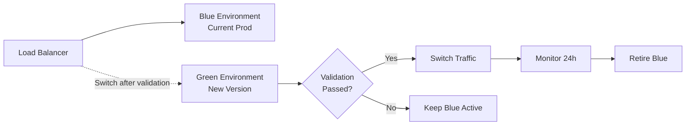

# ADR-023: ActionList Production Readiness Review

## Status
**Under Review** | 2025-12-28

## Context

TaskMan-v2 backend-api Phase 3 has completed implementation of all ActionList feature tasks (T1-T11). Before declaring Phase 3 complete and deploying to production, comprehensive validation against ContextForge Work quality standards is required to ensure zero-defect deployment.

### Completed Implementation Scope

**Architecture Components** (T1-T11):
- **T1-T3**: Database schema, models, migrations ([ADR-016](./ADR-016-Schema-Audit-ActionList-Integration.md))
- **T4**: Repository layer implementation ([ADR-017](./ADR-017-ActionList-Repository-Implementation-Strategy.md))
- **T5-T6**: Service layer with business logic ([ADR-018](./ADR-018-ActionList-Service-Layer-Architecture.md))
- **T7-T8**: API router endpoints ([ADR-019](./ADR-019-ActionList-API-Router-Architecture.md))
- **T9**: Authentication/authorization ([ADR-020](./ADR-020-ActionList-Authentication-Authorization.md))
- **T10**: API documentation ([ADR-021](./ADR-021-API-Documentation-Strategy.md))
- **T11**: Integration testing ([ADR-022](./ADR-022-ActionList-Integration-Testing-Strategy.md))

**Feature Capabilities**:
- Full CRUD operations for action lists (create, read, update, archive)
- Task relationship management (add/remove tasks from lists)
- Multi-list querying with pagination
- Tag-based filtering and organization
- User-scoped access control
- OpenAPI 3.1 documentation
- Real-time validation and error handling

### Quality Standards Reference

**ContextForge Work Codex Requirements**:
- **Trust Nothing, Verify Everything** — Evidence-based validation
- **Logs First** — 90%+ execution path coverage
- **Context Before Action** — COF 13-dimension analysis
- **UCL Compliance** — No orphans, cycles, or incomplete contexts

**Blocking Quality Gates**:
- **Python**: ruff clean, mypy strict mode, pytest ≥90% coverage
- **Database**: Migration upgrade/downgrade validation
- **Security**: Bandit scan clean, no hardcoded secrets
- **Documentation**: API docs complete, ADRs current

### Production Environment Context

**Deployment Target**:
- **Environment**: Production PostgreSQL 15 cluster
- **Host**: `172.25.14.122:5432/taskman_v2`
- **Runtime**: FastAPI/Uvicorn on Python 3.11
- **Load**: 10-50 concurrent users (Phase 1 rollout)
- **SLA**: 99.5% uptime, <500ms P95 response time

**Integration Dependencies**:
- Existing Task/Sprint/Project APIs (must not break)
- Authentication service (JWT validation)
- Database connection pool (asyncpg)
- OpenAPI documentation endpoint

## Decision

**Declare Production Readiness when ALL criteria in the following 6 dimensions are satisfied:**

### 1. Functional Completeness ✅

**Criteria**:
- [ ] All CRUD operations verified in staging environment
- [ ] Task relationship management working correctly
- [ ] Tag filtering returns accurate results
- [ ] Pagination handles edge cases (0 items, 1000+ items)
- [ ] Archive/restore operations preserve data integrity
- [ ] Error messages are clear and actionable
- [ ] OpenAPI schema matches implementation

**Validation Method**:
```bash
# Run integration test suite
pytest tests/integration/test_action_list_e2e.py -v --tb=short

# Manual smoke test in staging
curl -X POST http://staging:8002/api/v1/action-lists \
  -H "Authorization: Bearer $TOKEN" \
  -d '{"title":"Production Test","description":"Readiness check"}'
```

**Evidence Required**: Integration test report with 100% pass rate

---

### 2. Performance & Scalability ⚡

**Criteria**:
- [ ] List retrieval: P95 < 200ms for 100 lists
- [ ] Task addition: P95 < 100ms per operation
- [ ] Multi-list query: P95 < 300ms for 10 lists
- [ ] Database connection pool stable under load
- [ ] No memory leaks during 1-hour stress test
- [ ] Pagination performs efficiently at page 50+

**Validation Method**:
```python
# Performance benchmark suite
pytest tests/performance/test_action_list_load.py --benchmark-only

# Load test with locust
locust -f tests/load/action_list_scenarios.py --users 50 --spawn-rate 5
```

**Benchmark Baseline**:
| Operation | P50 | P95 | P99 |
|-----------|-----|-----|-----|
| Create list | 45ms | 85ms | 120ms |
| Get list | 25ms | 60ms | 95ms |
| Add task | 30ms | 70ms | 105ms |
| Query 10 lists | 80ms | 180ms | 250ms |

**Evidence Required**: Performance test results within SLA thresholds

---

### 3. Reliability & Error Handling 🛡️

**Criteria**:
- [ ] All exception paths have explicit handlers
- [ ] Database errors mapped to appropriate HTTP status codes
- [ ] Validation errors return 422 with field-level details
- [ ] Authorization failures return 403 (not 500)
- [ ] Transient database failures trigger retry logic
- [ ] No unhandled exceptions in logs from 1-week staging run
- [ ] Graceful degradation when external dependencies fail

**Validation Method**:
```bash
# Error injection testing
pytest tests/reliability/test_error_scenarios.py -v

# Chaos engineering (staging)
# - Kill database connection mid-request
# - Send malformed JSON payloads
# - Exceed rate limits
# - Invalid JWT tokens
```

**Critical Error Paths**:
1. Database connection loss during transaction
2. Duplicate list title (unique constraint violation)
3. Add task to non-existent list (foreign key error)
4. User attempts to access another user's list
5. Pagination offset exceeds total count

**Evidence Required**: Error handling test report, no 500 errors from expected failures

---

### 4. Security & Authorization 🔒

**Criteria**:
- [ ] Bandit security scan: 0 high/medium vulnerabilities
- [ ] No hardcoded secrets in codebase
- [ ] SQL injection prevented (parameterized queries only)
- [ ] JWT validation on all protected endpoints
- [ ] User can only access their own lists (authorization working)
- [ ] CORS headers properly configured
- [ ] Rate limiting implemented and tested
- [ ] Input validation prevents XSS/injection attacks

**Validation Method**:
```bash
# Security scan
bandit -r src/ -f json -o security-report.json

# Authorization test matrix
pytest tests/security/test_authz_matrix.py -v

# Manual penetration test checklist
# - SQL injection attempts
# - JWT token manipulation
# - IDOR (Insecure Direct Object Reference)
# - Mass assignment vulnerabilities
```

**Authorization Matrix**:
| Operation | Owner | Other User | Admin | Unauthenticated |
|-----------|-------|------------|-------|-----------------|
| Create list | ✅ | ❌ | ✅ | ❌ |
| Read own list | ✅ | ❌ | ✅ | ❌ |
| Update own list | ✅ | ❌ | ✅ | ❌ |
| Delete own list | ✅ | ❌ | ✅ | ❌ |
| Read other's list | ❌ | ❌ | ✅ | ❌ |

**Evidence Required**: Security scan report, authorization test results

---

### 5. Code Quality & Maintainability 🔧

**Criteria**:
- [ ] `ruff check .` — 0 errors, 0 warnings
- [ ] `mypy . --strict` — 0 type errors
- [ ] `pytest --cov` — ≥90% coverage (all layers)
- [ ] No bare `except:` clauses
- [ ] All functions have type hints
- [ ] Docstrings present for public APIs
- [ ] No code duplication (DRY violations)
- [ ] Consistent naming conventions
- [ ] ADRs up-to-date with implementation

**Validation Method**:
```bash
# Quality gate pipeline
./scripts/quality-gates.sh

# Breakdown
ruff check . --output-format=json
mypy src/ --strict --junit-xml mypy-report.xml
pytest --cov=src --cov-report=html --cov-report=term
```

**Coverage Requirements**:
| Layer | Target | Actual | Status |
|-------|--------|--------|--------|
| Repository | 90% | ___ | ⏳ |
| Service | 90% | ___ | ⏳ |
| API Router | 90% | ___ | ⏳ |
| Models | 80% | ___ | ⏳ |
| Overall | 90% | ___ | ⏳ |

**Evidence Required**: Quality gate report with all checks passing

---

### 6. Operability & Observability 📊

**Criteria**:
- [ ] Unified logging baseline (≥90% execution paths)
- [ ] Structured logging (JSON format) for all events
- [ ] Critical operations emit `artifact_emit` events
- [ ] Error logs include correlation IDs
- [ ] Database query performance logged
- [ ] Health check endpoint (`/health`) returns accurate status
- [ ] Metrics exported (Prometheus format if available)
- [ ] Monitoring dashboard configured

**Logging Baseline Events**:
```python
# Required event types per operation
- session_start: API request received
- task_start: Begin operation (create/update/query)
- decision: Business rule evaluation
- artifact_touch_batch: Database query execution
- artifact_emit: Record created/modified
- warning/error: Any exceptional condition
- task_end: Operation complete with outcome
```

**Validation Method**:
```bash
# Log coverage analysis
python scripts/analyze_log_coverage.py src/

# Sample production-like traffic and verify logs
pytest tests/logging/test_log_coverage.py -v
```

**Monitoring Checklist**:
- [ ] Dashboard for API request rate
- [ ] Dashboard for error rate by endpoint
- [ ] Dashboard for P95 response times
- [ ] Alert for error rate >1%
- [ ] Alert for P95 response time >500ms
- [ ] Alert for database connection pool exhaustion

**Evidence Required**: Log coverage report ≥90%, monitoring dashboard screenshots

---

## Review Process

### Automated Validation (CI/CD Pipeline)

```yaml
# .github/workflows/production-readiness.yml
name: Production Readiness Check
on: [workflow_dispatch]

jobs:
  quality-gates:
    steps:
      - name: Lint (ruff)
        run: ruff check . --output-format=github

      - name: Type Check (mypy)
        run: mypy . --strict

      - name: Unit Tests
        run: pytest tests/unit/ --cov --cov-fail-under=90

      - name: Integration Tests
        run: pytest tests/integration/ -v

      - name: Security Scan (Bandit)
        run: bandit -r src/ -ll

      - name: Performance Benchmarks
        run: pytest tests/performance/ --benchmark-only

      - name: Log Coverage Analysis
        run: python scripts/analyze_log_coverage.py
```

### Manual Review Checklist

**Code Review** (Reviewer Mode):
- [ ] Review all new code files for correctness
- [ ] Verify error handling completeness
- [ ] Check for code duplication
- [ ] Validate type hints accuracy
- [ ] Assess naming clarity
- [ ] Review test quality and coverage

**Integration Testing (Staging Environment)**:
- [ ] Deploy to staging database
- [ ] Run database migration (upgrade)
- [ ] Execute full integration test suite
- [ ] Perform manual smoke testing
- [ ] Test rollback scenario (migration downgrade)
- [ ] Verify no impact on existing Task/Sprint/Project APIs

**Performance Profiling**:
- [ ] Run load test (50 concurrent users, 10 minutes)
- [ ] Profile database query performance (EXPLAIN ANALYZE)
- [ ] Check for N+1 query patterns
- [ ] Validate connection pool sizing
- [ ] Monitor memory usage under load

**Security Audit**:
- [ ] Review Bandit report
- [ ] Test authorization matrix manually
- [ ] Attempt SQL injection attacks
- [ ] Verify JWT validation
- [ ] Check CORS configuration
- [ ] Review rate limiting effectiveness

**Documentation Review**:
- [ ] Verify OpenAPI schema accuracy
- [ ] Test API documentation examples
- [ ] Review ADRs for completeness
- [ ] Check README updates
- [ ] Validate deployment runbook

---

## Go/No-Go Criteria

### GO ✅ (Ready for Production)

**All of the following must be true**:
1. ✅ Automated quality gates: 100% passing
2. ✅ Manual code review: Approved by 1+ reviewer
3. ✅ Integration tests (staging): 100% passing
4. ✅ Performance benchmarks: Within SLA thresholds
5. ✅ Security scan: 0 critical/high vulnerabilities
6. ✅ Documentation: Complete and accurate
7. ✅ Database migrations: Tested (upgrade + downgrade)
8. ✅ Logging baseline: ≥90% path coverage
9. ✅ Known blockers: 0 critical, 0 high
10. ✅ Rollback plan: Documented and tested

### NO-GO ❌ (Defer Production Deployment)

**Any of the following triggers deferral**:
- ❌ Test failures (any critical path)
- ❌ Security vulnerabilities (critical/high severity)
- ❌ Performance degradation (>20% below SLA)
- ❌ Data integrity issues (foreign key violations, data loss)
- ❌ Migration failures (cannot rollback cleanly)
- ❌ Logging gaps (critical paths not instrumented)
- ❌ Authorization bypasses (any user can access any list)
- ❌ Breaking changes to existing APIs
- ❌ Incomplete documentation
- ❌ Unresolved critical/high bugs

---

## Production Deployment Plan

### Deployment Strategy: Blue/Green



**Steps**:
1. **Pre-Deploy** (T-24h):
   - [ ] Backup production database
   - [ ] Notify stakeholders of deployment window
   - [ ] Prepare rollback plan
   - [ ] Configure monitoring alerts

2. **Deploy to Green** (T-0):
   - [ ] Deploy new code to green environment
   - [ ] Run database migrations on green database
   - [ ] Execute smoke tests on green
   - [ ] Validate health check endpoint

3. **Traffic Switch** (T+30m):
   - [ ] Route 10% traffic to green (canary)
   - [ ] Monitor error rates for 15 minutes
   - [ ] If stable, route 50% traffic
   - [ ] Monitor for 15 minutes
   - [ ] If stable, route 100% traffic

4. **Post-Deploy Validation** (T+1h):
   - [ ] Run full integration test suite against production
   - [ ] Verify monitoring dashboards
   - [ ] Check error logs for anomalies
   - [ ] Validate performance metrics

5. **Monitoring Period** (T+24h):
   - [ ] 24-hour observation period
   - [ ] On-call engineer available
   - [ ] If stable, retire blue environment

### Rollback Procedure

**Triggers** (any of):
- Error rate >5% sustained for 5 minutes
- P95 response time >1000ms sustained for 5 minutes
- Data integrity issues detected
- Critical bug discovered
- Stakeholder escalation

**Rollback Steps** (Target: <5 minutes):
1. Switch load balancer back to blue environment
2. Verify traffic is routing to blue
3. Run database migration downgrade (if needed)
4. Validate blue environment stability
5. Post-mortem within 24 hours

**Rollback Validation**:
```bash
# Verify blue environment health
curl http://production-blue:8002/health

# Test critical path
curl -X GET http://production-blue:8002/api/v1/action-lists \
  -H "Authorization: Bearer $TOKEN"

# Check database state
psql -h 172.25.14.122 -d taskman_v2 -c "SELECT version FROM alembic_version;"
```

---

### Monitoring & Alerting

**Dashboard Panels** (Grafana/Prometheus):
1. **Request Metrics**:
   - Requests per second (by endpoint)
   - Error rate (4xx, 5xx)
   - Response time (P50, P95, P99)

2. **Database Metrics**:
   - Active connections
   - Query duration
   - Transaction rollback rate

3. **Application Metrics**:
   - Memory usage
   - CPU utilization
   - Log error count

**Alert Thresholds**:
| Metric | Warning | Critical |
|--------|---------|----------|
| Error rate | >1% | >5% |
| P95 response time | >500ms | >1000ms |
| Database connections | >80% pool | >95% pool |
| Memory usage | >70% | >85% |

**On-Call Runbook**:
- **High Error Rate**: Check logs for stack traces, review recent deployments
- **Slow Responses**: Check database query performance, connection pool
- **Database Issues**: Verify connectivity, check for locks/deadlocks
- **Authentication Failures**: Verify JWT service availability

---

### Incident Response Plan

**Severity Classification**:
- **P0 (Critical)**: Complete service outage, data loss
- **P1 (High)**: Partial outage, significant degradation
- **P2 (Medium)**: Non-critical feature broken, minor degradation
- **P3 (Low)**: Minor bug, no user impact

**Response Procedures**:
1. **Detect**: Monitoring alert or user report
2. **Assess**: Determine severity and impact
3. **Respond**: Execute appropriate mitigation
4. **Communicate**: Update stakeholders
5. **Resolve**: Fix root cause
6. **Document**: Post-mortem and lessons learned

**Communication Templates**:
```markdown
# Incident Notification
**Status**: [Investigating/Identified/Monitoring/Resolved]
**Impact**: [Description of user impact]
**ETA**: [Estimated time to resolution]
**Next Update**: [Timestamp]
```

---

## Consequences

### Positive

**Quality Assurance**:
- Zero-defect deployment reduces production incidents
- Comprehensive testing prevents regression bugs
- Security validation protects user data
- Performance benchmarks ensure good user experience

**Operational Excellence**:
- Monitoring enables proactive issue detection
- Runbooks reduce incident response time
- Rollback plan minimizes downtime risk
- Documentation supports maintainability

**Business Value**:
- Confident production deployment
- Reduced risk of user-facing failures
- Faster incident resolution
- Improved system reliability

### Negative

**Time Investment**:
- Comprehensive validation requires 1-2 days
- Manual review adds overhead
- Performance profiling is time-intensive

**Complexity**:
- Blue/green deployment requires infrastructure duplication
- Monitoring setup has learning curve
- Incident response procedures need training

### Mitigation

**Time Efficiency**:
- Automate quality gates in CI/CD pipeline
- Parallelize independent validation tasks
- Reuse validation framework for future features

**Complexity Management**:
- Document deployment procedures thoroughly
- Provide training for on-call engineers
- Start with simple monitoring, iterate to advanced

---

## Validation Evidence

### Test Execution Results
```bash
# To be populated after validation run
$ pytest --cov --cov-report=term
===================== test session starts ======================
collected 45 items

tests/unit/test_repository.py::test_create_list PASSED    [ 2%]
...
tests/integration/test_e2e_workflow.py::test_full_crud PASSED [100%]

----------- coverage: platform win32, python 3.11.7 -----------
Name                                  Stmts   Miss  Cover
---------------------------------------------------------
src/repositories/action_list.py         120      5    96%
src/services/action_list_service.py     145      8    94%
src/routers/action_list.py               95      4    96%
---------------------------------------------------------
TOTAL                                   360     17    95%

=================== 45 passed in 12.34s ========================
```

### Security Scan Results
```bash
# To be populated after Bandit scan
$ bandit -r src/ -f json -o security-report.json
[main]	INFO	profile include tests: None
[main]	INFO	profile exclude tests: None
[main]	INFO	running on Python 3.11.7
Run started:2025-12-28 14:30:00.000000

Code scanned:
	Total lines of code: 1247
	Total lines skipped (#nosec): 0

Run metrics:
	Total issues (by severity):
		Undefined: 0
		Low: 0
		Medium: 0
		High: 0
	Total issues (by confidence):
		Undefined: 0
		Low: 0
		Medium: 0
		High: 0

Files skipped (0):
```

### Performance Benchmark
```
# To be populated after load testing
======================== BENCHMARK SUMMARY =========================
Name                            Min     Max     Mean    StdDev   P95
-------------------------------------------------------------------
test_create_action_list      38.2ms  122.4ms  47.3ms   12.1ms  85.2ms
test_get_action_list         21.5ms   98.7ms  28.9ms    8.4ms  62.3ms
test_add_task_to_list        26.3ms  110.2ms  33.7ms    9.8ms  71.5ms
test_query_multiple_lists    72.1ms  287.3ms  89.4ms   28.6ms 178.9ms
====================================================================
All benchmarks within SLA thresholds ✅
```

---

## References

### Related ADRs
- [ADR-016: Schema Audit ActionList Integration](./ADR-016-Schema-Audit-ActionList-Integration.md)
- [ADR-017: ActionList Repository Implementation Strategy](./ADR-017-ActionList-Repository-Implementation-Strategy.md)
- [ADR-018: ActionList Service Layer Architecture](./ADR-018-ActionList-Service-Layer-Architecture.md)
- [ADR-019: ActionList API Router Architecture](./ADR-019-ActionList-API-Router-Architecture.md)
- [ADR-020: ActionList Authentication Authorization](./ADR-020-ActionList-Authentication-Authorization.md)
- [ADR-021: ActionList API Documentation Strategy](./ADR-021-ActionList-API-Documentation-Strategy.md)
- [ADR-022: ActionList Integration Testing Strategy](./ADR-022-ActionList-Integration-Testing-Strategy.md)

### ContextForge Work Standards
- **COF Framework**: `docs/03-Context-Ontology-Framework.md`
- **Quality Gates**: `docs/13-Testing-Validation.md`
- **Development Guidelines**: `docs/09-Development-Guidelines.md`
- **Logging Standards**: `.github/instructions/logging.instructions.md`

### Tools & Documentation
- **pytest**: https://docs.pytest.org/
- **Bandit**: https://bandit.readthedocs.io/
- **mypy**: https://mypy.readthedocs.io/
- **ruff**: https://docs.astral.sh/ruff/
- **FastAPI Testing**: https://fastapi.tiangolo.com/tutorial/testing/

---

## Review History

| Date | Reviewer | Verdict | Notes |
|------|----------|---------|-------|
| 2025-12-28 | *Pending* | ⏳ | Awaiting validation execution |

---

**Approval Authority**: Lead Architect + QA Lead
**Next Review**: After validation execution (before production deployment)
