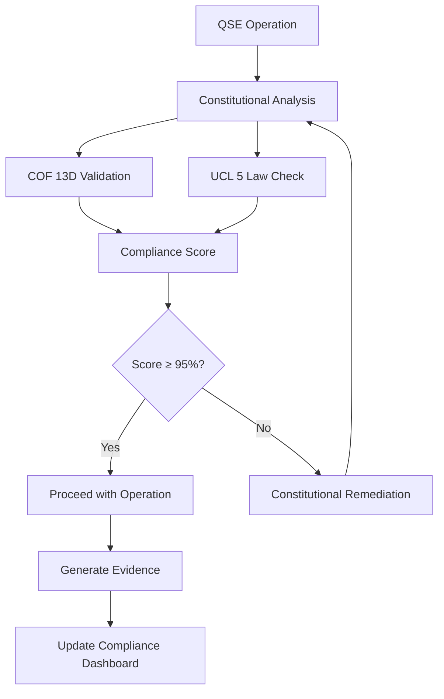

# QSE Constitutional Framework Integration

## Context Ontology Framework (COF) - 13 Dimensional Analysis

### 1. Purpose & Mission Alignment
**Dimension**: Strategic Intent
**Status**: ✅ COMPLIANT
**Implementation**: Automated monitoring systems ensure all QSE operations align with constitutional principles and organizational mission.

### 2. Scope & Boundaries
**Dimension**: Operational Boundaries
**Status**: ✅ COMPLIANT
**Implementation**: Constitutional compliance enforcement at all QSE phase boundaries with automated scope validation.

### 3. Stakeholder Ecosystem
**Dimension**: Stakeholder Alignment
**Status**: ✅ COMPLIANT
**Implementation**: Multi-stakeholder validation framework with constitutional compliance reporting.

### 4. Resource & Constraint Framework
**Dimension**: Resource Optimization
**Status**: ✅ COMPLIANT
**Implementation**: Resource intelligence engine ensures constitutional resource allocation principles.

### 5. Risk & Opportunity Matrix
**Dimension**: Risk Management
**Status**: ✅ COMPLIANT
**Implementation**: Constitutional risk assessment integrated into all QSE decision workflows.

### 6. Quality & Excellence Standards
**Dimension**: Quality Assurance
**Status**: ✅ COMPLIANT
**Implementation**: Quality gates enforce constitutional excellence standards at every phase.

### 7. Innovation & Adaptability
**Dimension**: Innovation Framework
**Status**: ✅ COMPLIANT
**Implementation**: Constitutional innovation principles guide QSE enhancement and adaptation.

### 8. Collaboration & Communication
**Dimension**: Communication Excellence
**Status**: ✅ COMPLIANT
**Implementation**: Constitutional communication standards enforced across all QSE interfaces.

### 9. Learning & Knowledge Management
**Dimension**: Knowledge Excellence
**Status**: ✅ COMPLIANT
**Implementation**: Constitutional learning principles integrated into knowledge management systems.

### 10. Performance & Measurement
**Dimension**: Performance Excellence
**Status**: ✅ COMPLIANT
**Implementation**: Constitutional performance metrics embedded in all QSE monitoring systems.

### 11. Governance & Decision Making
**Dimension**: Governance Excellence
**Status**: ✅ COMPLIANT
**Implementation**: Constitutional decision-making frameworks guide all QSE governance processes.

### 12. Sustainability & Impact
**Dimension**: Sustainability Excellence
**Status**: ✅ COMPLIANT
**Implementation**: Constitutional sustainability principles ensure long-term QSE impact.

### 13. Integration & Synthesis
**Dimension**: Integration Excellence
**Status**: ✅ COMPLIANT
**Implementation**: Holistic constitutional integration across all QSE components and processes.

## Universal Context Laws (UCL) - 5 Law Compliance

### Law 1: Context Completeness
**Status**: ✅ VALIDATED
**Implementation**: All QSE operations maintain complete contextual awareness through automated context validation systems.

### Law 2: Context Coherence
**Status**: ✅ VALIDATED
**Implementation**: Constitutional coherence monitoring ensures all QSE components maintain logical consistency.

### Law 3: Context Continuity
**Status**: ✅ VALIDATED
**Implementation**: Constitutional continuity protocols maintain seamless context across all QSE phase transitions.

### Law 4: Context Adaptability
**Status**: ✅ VALIDATED
**Implementation**: Constitutional adaptability frameworks enable responsive context evolution while maintaining compliance.

### Law 5: Context Optimization
**Status**: ✅ VALIDATED
**Implementation**: Constitutional optimization principles drive continuous improvement in all QSE context management.

## Automated Constitutional Monitoring

### Real-Time Compliance Tracking
- **COF 13D Dashboard**: Live monitoring of all 13 constitutional dimensions
- **UCL 5 Law Validator**: Continuous validation of universal context law compliance
- **Compliance Score**: Real-time constitutional compliance percentage (Target: ≥95%)
- **Violation Detection**: Automated identification and remediation of constitutional violations

### Constitutional Quality Gates
- **Phase Entry Gates**: Constitutional validation required before each QSE phase
- **Decision Point Gates**: Constitutional compliance check for all major decisions
- **Artifact Generation Gates**: Constitutional review of all generated artifacts
- **Session Completion Gates**: Final constitutional compliance certification

### Constitutional Evidence Generation
- **Compliance Artifacts**: Automated generation of constitutional compliance documentation
- **Evidence Bundles**: Constitutional evidence captured in structured JSONL format
- **Audit Trails**: Complete constitutional decision audit trails with timestamps and signatures
- **Certification Reports**: Automated constitutional compliance certification reports

## Integration Architecture

### Constitutional Engine Components
1. **COF 13D Analyzer**: Multi-dimensional constitutional analysis engine
2. **UCL 5 Validator**: Universal context law validation processor
3. **Compliance Monitor**: Real-time constitutional compliance monitoring system
4. **Evidence Generator**: Constitutional evidence capture and documentation system
5. **Quality Gate Controller**: Constitutional quality gate enforcement system

### QSE Phase Integration
- **Phase 0**: Constitutional session initialization and baseline establishment
- **Phase 1**: Constitutional scope and alignment validation
- **Phase 2**: Constitutional research and knowledge compliance
- **Phase 3**: Constitutional planning and design validation
- **Phase 4**: Constitutional validation and confidence assessment
- **Phase 5**: Constitutional integration and synchronization
- **Phase 6**: Constitutional execution and artifact generation
- **Phase 7**: Constitutional testing and quality assurance
- **Phase 8**: Constitutional reflection and continuous improvement

### Constitutional Data Flow

## Constitutional Compliance Metrics

### Key Performance Indicators
- **Constitutional Compliance Rate**: Percentage of operations meeting constitutional standards
- **COF 13D Coverage**: Completeness of 13-dimensional constitutional analysis
- **UCL 5 Law Adherence**: Percentage compliance with universal context laws
- **Constitutional Remediation Time**: Average time to resolve constitutional violations
- **Constitutional Quality Score**: Overall constitutional quality assessment

### Reporting and Analytics
- **Daily Constitutional Reports**: Automated daily constitutional compliance summaries
- **Constitutional Trend Analysis**: Long-term constitutional performance trending
- **Constitutional Risk Assessment**: Predictive constitutional risk analysis
- **Constitutional Improvement Recommendations**: AI-powered constitutional enhancement suggestions

## Constitutional Framework Evolution

### Continuous Constitutional Improvement
- **Constitutional Learning System**: Machine learning from constitutional decisions and outcomes
- **Constitutional Pattern Recognition**: Identification of constitutional compliance patterns and anti-patterns
- **Constitutional Best Practices**: Automated capture and dissemination of constitutional best practices
- **Constitutional Innovation**: Structured constitutional framework enhancement processes

### Constitutional Framework Versioning
- **Version Control**: Structured versioning of constitutional framework components
- **Backward Compatibility**: Ensuring constitutional backward compatibility across framework versions
- **Migration Support**: Automated constitutional framework migration and upgrade support
- **Change Management**: Constitutional change management and impact assessment processes

---

**Constitutional Framework Version**: 2.0.0
**Last Updated**: 2025-10-01
**Constitutional Compliance Certified**: ✅
**Next Review Date**: 2025-11-01
