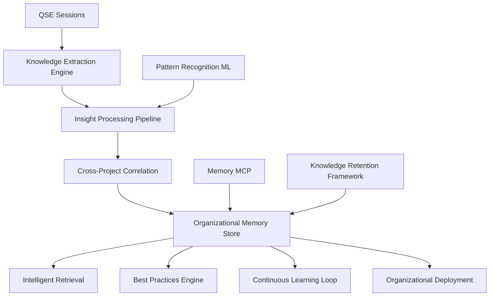

# QSE Knowledge Management Integration Enhancement

**Version**: 1.0.0
**Created**: 2025-10-01
**Authority**: QSE Phase 7 Research Validation
**Status**: Production Implementation
**Context**: Organizational Learning & Continuous Improvement

## Executive Summary

This document specifies the enhancement of knowledge management integration within the QSE methodology framework, providing automated insight extraction, cross-project learning patterns, and organizational knowledge retention capabilities. The enhancement supports continuous QSE methodology improvement through intelligent knowledge capture, correlation, and organizational deployment.

**Core Capabilities:**
- **Automated Insight Extraction**: ML-powered analysis of QSE sessions for pattern recognition and learning acceleration
- **Cross-Project Learning**: Knowledge correlation across organizational initiatives with transferable best practices
- **Organizational Knowledge Retention**: Institutional memory frameworks with structured knowledge preservation
- **Memory MCP Integration**: Enhanced memory management with organizational scaling and intelligent retrieval
- **Continuous Learning Pipeline**: Automated feedback loops for methodology optimization and enhancement

## 1. Knowledge Management Architecture

### 1.1 System Overview



### 1.2 Knowledge Extraction Engine

#### Automated Session Analysis
```python
class QSEKnowledgeExtractor:
    """Automated knowledge extraction from QSE sessions"""

    def __init__(self):
        self.nlp_processor = NLPProcessor()
        self.pattern_recognizer = PatternRecognizer()
        self.insight_classifier = InsightClassifier()
        self.memory_integrator = MemoryMCPIntegrator()

    def extract_session_insights(self, session_data):
        """Extract actionable insights from QSE session data"""

        # Parse session artifacts
        artifacts = self.parse_session_artifacts(session_data)

        # Natural language processing of deliverables
        nlp_insights = self.nlp_processor.analyze_deliverables(
            artifacts.deliverables
        )

        # Pattern recognition across phases
        phase_patterns = self.pattern_recognizer.identify_patterns(
            artifacts.phase_data
        )

        # Constitutional compliance insights
        constitutional_insights = self.analyze_constitutional_patterns(
            artifacts.constitutional_data
        )

        # Template effectiveness insights
        template_insights = self.analyze_template_effectiveness(
            artifacts.template_data
        )

        # Quality gate insights
        quality_insights = self.analyze_quality_patterns(
            artifacts.quality_data
        )

        extracted_insights = {
            'session_id': session_data.session_id,
            'extraction_timestamp': datetime.utcnow(),
            'nlp_insights': nlp_insights,
            'phase_patterns': phase_patterns,
            'constitutional_insights': constitutional_insights,
            'template_insights': template_insights,
            'quality_insights': quality_insights,
            'confidence_score': self.calculate_insight_confidence(
                nlp_insights, phase_patterns, constitutional_insights
            ),
            'transferability_score': self.assess_transferability(
                session_data.context, insights
            )
        }

        return extracted_insights

    def analyze_constitutional_patterns(self, constitutional_data):
        """Analyze constitutional compliance patterns for insights"""

        cof_patterns = {}
        for dimension, data in constitutional_data.cof_dimensions.items():
            cof_patterns[dimension] = {
                'compliance_trajectory': self.analyze_compliance_trajectory(data),
                'common_violations': self.identify_common_violations(data),
                'success_factors': self.identify_success_factors(data),
                'optimization_opportunities': self.identify_optimizations(data)
            }

        ucl_patterns = {}
        for law, data in constitutional_data.ucl_laws.items():
            ucl_patterns[law] = {
                'adherence_patterns': self.analyze_adherence_patterns(data),
                'best_practices': self.extract_best_practices(data),
                'common_challenges': self.identify_challenges(data)
            }

        return {
            'cof_patterns': cof_patterns,
            'ucl_patterns': ucl_patterns,
            'overall_constitutional_insights': self.synthesize_constitutional_insights(
                cof_patterns, ucl_patterns
            )
        }
```

### 1.3 Cross-Project Learning Framework

#### Pattern Correlation Engine
```python
class CrossProjectLearningEngine:
    """Correlate insights across multiple QSE projects"""

    def __init__(self):
        self.similarity_calculator = SimilarityCalculator()
        self.pattern_matcher = PatternMatcher()
        self.best_practice_extractor = BestPracticeExtractor()
        self.knowledge_graph = KnowledgeGraph()

    def correlate_project_insights(self, project_insights):
        """Correlate insights across multiple projects for learning"""

        correlations = {}

        # Domain-based correlations
        domain_correlations = self.correlate_by_domain(project_insights)

        # Template-based correlations
        template_correlations = self.correlate_by_template(project_insights)

        # Constitutional pattern correlations
        constitutional_correlations = self.correlate_constitutional_patterns(
            project_insights
        )

        # Success factor correlations
        success_correlations = self.correlate_success_factors(project_insights)

        # Challenge pattern correlations
        challenge_correlations = self.correlate_challenges(project_insights)

        correlations = {
            'domain_patterns': domain_correlations,
            'template_patterns': template_correlations,
            'constitutional_patterns': constitutional_correlations,
            'success_patterns': success_correlations,
            'challenge_patterns': challenge_correlations,
            'cross_cutting_insights': self.identify_cross_cutting_insights(
                domain_correlations, template_correlations,
                constitutional_correlations, success_correlations
            )
        }

        # Generate transferable best practices
        best_practices = self.extract_transferable_practices(correlations)

        # Update knowledge graph
        self.knowledge_graph.update_with_correlations(correlations, best_practices)

        return {
            'correlations': correlations,
            'best_practices': best_practices,
            'knowledge_graph_updates': self.knowledge_graph.get_recent_updates(),
            'learning_recommendations': self.generate_learning_recommendations(
                correlations, best_practices
            )
        }

    def correlate_by_domain(self, project_insights):
        """Correlate insights within similar project domains"""

        domain_groups = self.group_by_domain(project_insights)
        domain_correlations = {}

        for domain, projects in domain_groups.items():
            if len(projects) < 2:
                continue

            domain_correlations[domain] = {
                'common_patterns': self.identify_common_patterns(projects),
                'success_factors': self.identify_domain_success_factors(projects),
                'optimization_opportunities': self.identify_domain_optimizations(projects),
                'best_practices': self.extract_domain_best_practices(projects),
                'lessons_learned': self.synthesize_domain_lessons(projects)
            }

        return domain_correlations
```

### 1.4 Organizational Knowledge Retention

#### Knowledge Retention Framework
```python
class OrganizationalKnowledgeRetention:
    """Framework for organizational knowledge retention and institutional memory"""

    def __init__(self):
        self.knowledge_classifier = KnowledgeClassifier()
        self.retention_analyzer = RetentionAnalyzer()
        self.institutional_memory = InstitutionalMemoryStore()
        self.knowledge_disseminator = KnowledgeDisseminator()

    def process_knowledge_for_retention(self, extracted_insights, correlations):
        """Process knowledge for long-term organizational retention"""

        # Classify knowledge by retention value
        knowledge_classification = self.knowledge_classifier.classify_insights(
            extracted_insights, correlations
        )

        # Determine retention strategies
        retention_strategies = self.determine_retention_strategies(
            knowledge_classification
        )

        # Create institutional memory entries
        memory_entries = self.create_memory_entries(
            knowledge_classification, retention_strategies
        )

        # Establish knowledge dissemination plans
        dissemination_plans = self.create_dissemination_plans(
            memory_entries, knowledge_classification
        )

        retention_package = {
            'knowledge_classification': knowledge_classification,
            'retention_strategies': retention_strategies,
            'memory_entries': memory_entries,
            'dissemination_plans': dissemination_plans,
            'retention_metrics': self.calculate_retention_metrics(
                knowledge_classification, retention_strategies
            )
        }

        # Store in institutional memory
        self.institutional_memory.store_knowledge_package(retention_package)

        return retention_package

    def classify_knowledge_value(self, insight):
        """Classify knowledge based on organizational value and retention priority"""

        value_dimensions = {
            'strategic_value': self.assess_strategic_value(insight),
            'operational_value': self.assess_operational_value(insight),
            'learning_value': self.assess_learning_value(insight),
            'transferability': self.assess_transferability(insight),
            'uniqueness': self.assess_uniqueness(insight),
            'time_sensitivity': self.assess_time_sensitivity(insight)
        }

        overall_value = self.calculate_weighted_value(value_dimensions)
        retention_priority = self.determine_retention_priority(
            overall_value, value_dimensions
        )

        return {
            'value_dimensions': value_dimensions,
            'overall_value': overall_value,
            'retention_priority': retention_priority,
            'recommended_retention_period': self.recommend_retention_period(
                retention_priority, value_dimensions
            ),
            'dissemination_scope': self.recommend_dissemination_scope(
                retention_priority, value_dimensions
            )
        }
```

## 2. Memory MCP Integration Enhancement

### 2.1 Enhanced Memory Store

#### Organizational Memory Store
```yaml
enhanced_memory_structure:
  organizational_memory:
    qse_insights:
      session_insights: "Extracted insights from individual QSE sessions"
      cross_project_patterns: "Patterns identified across multiple projects"
      best_practices: "Validated best practices with success metrics"
      lessons_learned: "Organizational lessons with context and applicability"

    constitutional_knowledge:
      cof_dimension_insights: "Deep insights for each COF dimension"
      ucl_law_patterns: "Adherence patterns and optimization strategies"
      compliance_optimization: "Proven strategies for compliance improvement"

    template_intelligence:
      template_effectiveness_data: "Effectiveness metrics and optimization patterns"
      customization_patterns: "Common customization needs and solutions"
      template_evolution: "Template improvement history and rationale"

    domain_expertise:
      domain_specific_patterns: "Patterns specific to project domains"
      success_factor_libraries: "Success factors by domain and context"
      risk_mitigation_strategies: "Proven risk mitigation approaches"

    continuous_learning:
      methodology_improvements: "QSE methodology enhancement opportunities"
      organizational_maturity: "Organizational QSE maturity progression"
      training_effectiveness: "Training program effectiveness and optimization"
```

#### Memory MCP API Extensions
```python
class EnhancedMemoryMCPClient:
    """Enhanced Memory MCP client with organizational knowledge capabilities"""

    def __init__(self, mcp_endpoint):
        self.mcp_client = MCPClient(mcp_endpoint)
        self.knowledge_indexer = KnowledgeIndexer()
        self.retrieval_optimizer = RetrievalOptimizer()

    def store_organizational_insight(self, insight_data):
        """Store organizational insight with enhanced indexing"""

        # Enhance insight with metadata
        enhanced_insight = self.enhance_insight_metadata(insight_data)

        # Create knowledge graph connections
        graph_connections = self.knowledge_indexer.create_connections(
            enhanced_insight
        )

        # Store with organizational context
        storage_result = self.mcp_client.memory_add_observations([{
            'entityName': f"org_insight_{enhanced_insight['id']}",
            'contents': [
                enhanced_insight['primary_content'],
                json.dumps(enhanced_insight['metadata']),
                json.dumps(graph_connections)
            ]
        }])

        # Update organizational indexes
        self.update_organizational_indexes(enhanced_insight, graph_connections)

        return storage_result

    def retrieve_relevant_insights(self, query_context):
        """Retrieve relevant insights based on context with intelligent ranking"""

        # Semantic search for relevant insights
        semantic_results = self.mcp_client.memory_search_nodes(
            query=query_context['semantic_query']
        )

        # Context-based filtering
        filtered_results = self.filter_by_context(
            semantic_results, query_context
        )

        # Intelligent ranking based on relevance and value
        ranked_results = self.retrieval_optimizer.rank_insights(
            filtered_results, query_context
        )

        # Enrich with related insights
        enriched_results = self.enrich_with_related_insights(ranked_results)

        return {
            'primary_insights': ranked_results[:5],  # Top 5 most relevant
            'related_insights': enriched_results,
            'context_connections': self.identify_context_connections(
                ranked_results, query_context
            ),
            'application_suggestions': self.generate_application_suggestions(
                ranked_results, query_context
            )
        }

    def update_organizational_indexes(self, insight, connections):
        """Update organizational knowledge indexes"""

        # Domain index updates
        if insight['domain']:
            self.knowledge_indexer.update_domain_index(
                insight['domain'], insight, connections
            )

        # Template index updates
        if insight['template_type']:
            self.knowledge_indexer.update_template_index(
                insight['template_type'], insight, connections
            )

        # Constitutional index updates
        if insight['constitutional_relevance']:
            self.knowledge_indexer.update_constitutional_index(
                insight['constitutional_relevance'], insight, connections
            )

        # Success factor index updates
        if insight['success_factors']:
            self.knowledge_indexer.update_success_factor_index(
                insight['success_factors'], insight, connections
            )
```

## 3. Continuous Learning Pipeline

### 3.1 Automated Learning Loop

#### Learning Pipeline Engine
```python
class ContinuousLearningPipeline:
    """Automated continuous learning pipeline for QSE methodology improvement"""

    def __init__(self):
        self.knowledge_extractor = QSEKnowledgeExtractor()
        self.learning_engine = CrossProjectLearningEngine()
        self.retention_manager = OrganizationalKnowledgeRetention()
        self.improvement_generator = ImprovementGenerator()
        self.feedback_integrator = FeedbackIntegrator()

    def execute_learning_cycle(self, recent_sessions):
        """Execute complete continuous learning cycle"""

        learning_cycle_results = {
            'cycle_id': str(uuid.uuid4()),
            'cycle_timestamp': datetime.utcnow(),
            'sessions_analyzed': len(recent_sessions),
            'insights_extracted': 0,
            'correlations_identified': 0,
            'improvements_generated': 0,
            'knowledge_retained': 0
        }

        # Phase 1: Extract insights from recent sessions
        session_insights = []
        for session in recent_sessions:
            insights = self.knowledge_extractor.extract_session_insights(session)
            session_insights.append(insights)
            learning_cycle_results['insights_extracted'] += len(insights.get('insights', []))

        # Phase 2: Cross-project correlation analysis
        correlation_results = self.learning_engine.correlate_project_insights(
            session_insights
        )
        learning_cycle_results['correlations_identified'] = len(
            correlation_results.get('correlations', {})
        )

        # Phase 3: Knowledge retention processing
        retention_package = self.retention_manager.process_knowledge_for_retention(
            session_insights, correlation_results
        )
        learning_cycle_results['knowledge_retained'] = len(
            retention_package.get('memory_entries', [])
        )

        # Phase 4: Methodology improvement generation
        improvements = self.improvement_generator.generate_improvements(
            session_insights, correlation_results, retention_package
        )
        learning_cycle_results['improvements_generated'] = len(improvements)

        # Phase 5: Feedback integration
        feedback_integration = self.feedback_integrator.integrate_learning_feedback(
            improvements, correlation_results
        )

        # Phase 6: Update organizational knowledge base
        knowledge_base_updates = self.update_organizational_knowledge_base(
            session_insights, correlation_results, retention_package, improvements
        )

        learning_cycle_results.update({
            'session_insights': session_insights,
            'correlations': correlation_results,
            'retention_package': retention_package,
            'improvements': improvements,
            'feedback_integration': feedback_integration,
            'knowledge_base_updates': knowledge_base_updates,
            'cycle_effectiveness': self.calculate_cycle_effectiveness(
                learning_cycle_results
            )
        })

        return learning_cycle_results

    def generate_learning_recommendations(self, cycle_results):
        """Generate actionable learning recommendations"""

        recommendations = []

        # Template optimization recommendations
        if cycle_results['correlations']['template_patterns']:
            template_recommendations = self.generate_template_recommendations(
                cycle_results['correlations']['template_patterns']
            )
            recommendations.extend(template_recommendations)

        # Constitutional compliance recommendations
        if cycle_results['correlations']['constitutional_patterns']:
            constitutional_recommendations = self.generate_constitutional_recommendations(
                cycle_results['correlations']['constitutional_patterns']
            )
            recommendations.extend(constitutional_recommendations)

        # Training and development recommendations
        training_recommendations = self.generate_training_recommendations(
            cycle_results
        )
        recommendations.extend(training_recommendations)

        # Process improvement recommendations
        process_recommendations = self.generate_process_recommendations(
            cycle_results
        )
        recommendations.extend(process_recommendations)

        return {
            'recommendations': recommendations,
            'priority_ranking': self.rank_recommendations_by_priority(recommendations),
            'implementation_roadmap': self.create_implementation_roadmap(recommendations),
            'success_metrics': self.define_success_metrics(recommendations)
        }
```

### 3.2 Intelligent Insight Application

#### Context-Aware Recommendation Engine
```python
class ContextAwareRecommendationEngine:
    """Provide context-aware recommendations based on organizational knowledge"""

    def __init__(self):
        self.context_analyzer = ContextAnalyzer()
        self.recommendation_generator = RecommendationGenerator()
        self.similarity_matcher = SimilarityMatcher()
        self.success_predictor = SuccessPredictor()

    def generate_contextual_recommendations(self, current_session_context):
        """Generate recommendations based on current session context"""

        # Analyze current session context
        context_analysis = self.context_analyzer.analyze_session_context(
            current_session_context
        )

        # Find similar historical contexts
        similar_contexts = self.similarity_matcher.find_similar_contexts(
            context_analysis, similarity_threshold=0.75
        )

        # Extract successful patterns from similar contexts
        successful_patterns = self.extract_successful_patterns(similar_contexts)

        # Generate context-specific recommendations
        recommendations = []

        # Phase-specific recommendations
        if current_session_context.get('current_phase'):
            phase_recommendations = self.generate_phase_recommendations(
                current_session_context['current_phase'],
                successful_patterns,
                context_analysis
            )
            recommendations.extend(phase_recommendations)

        # Template-specific recommendations
        if current_session_context.get('template_type'):
            template_recommendations = self.generate_template_recommendations(
                current_session_context['template_type'],
                successful_patterns,
                context_analysis
            )
            recommendations.extend(template_recommendations)

        # Constitutional compliance recommendations
        constitutional_recommendations = self.generate_constitutional_recommendations(
            current_session_context.get('constitutional_data', {}),
            successful_patterns,
            context_analysis
        )
        recommendations.extend(constitutional_recommendations)

        # Quality improvement recommendations
        quality_recommendations = self.generate_quality_recommendations(
            current_session_context.get('quality_data', {}),
            successful_patterns,
            context_analysis
        )
        recommendations.extend(quality_recommendations)

        # Rank recommendations by predicted success and applicability
        ranked_recommendations = self.rank_recommendations(
            recommendations, context_analysis, current_session_context
        )

        return {
            'recommendations': ranked_recommendations,
            'context_analysis': context_analysis,
            'similar_contexts': similar_contexts,
            'successful_patterns': successful_patterns,
            'confidence_scores': self.calculate_recommendation_confidence(
                ranked_recommendations, similar_contexts
            ),
            'implementation_guidance': self.generate_implementation_guidance(
                ranked_recommendations, context_analysis
            )
        }
```

## 4. Integration Architecture

### 4.1 System Integration Points

#### QSE Toolchain Integration
```yaml
integration_points:
  qse_session_monitor:
    trigger: "session_phase_transition"
    action: "extract_insights_async"
    destination: "knowledge_extraction_pipeline"

  constitutional_framework:
    trigger: "compliance_assessment_complete"
    action: "analyze_constitutional_patterns"
    destination: "constitutional_knowledge_store"

  template_engine:
    trigger: "template_usage_complete"
    action: "capture_template_effectiveness"
    destination: "template_intelligence_store"

  memory_mcp:
    trigger: "insight_extraction_complete"
    action: "store_organizational_insight"
    destination: "enhanced_memory_store"

  dashboard_integration:
    trigger: "learning_cycle_complete"
    action: "update_learning_metrics"
    destination: "performance_monitoring_dashboard"
```

#### Data Flow Architecture
```python
class KnowledgeManagementDataFlow:
    """Orchestrate data flow for knowledge management integration"""

    def __init__(self):
        self.event_bus = EventBus()
        self.knowledge_pipeline = KnowledgePipeline()
        self.integration_manager = IntegrationManager()

    def setup_data_flow(self):
        """Setup automated data flow for knowledge management"""

        # QSE session event handlers
        self.event_bus.subscribe(
            'qse_session_started',
            self.handle_session_start
        )
        self.event_bus.subscribe(
            'qse_phase_completed',
            self.handle_phase_completion
        )
        self.event_bus.subscribe(
            'qse_session_completed',
            self.handle_session_completion
        )

        # Constitutional framework event handlers
        self.event_bus.subscribe(
            'constitutional_assessment_completed',
            self.handle_constitutional_assessment
        )

        # Template usage event handlers
        self.event_bus.subscribe(
            'template_usage_completed',
            self.handle_template_usage
        )

        # Learning cycle event handlers
        self.event_bus.subscribe(
            'learning_cycle_requested',
            self.handle_learning_cycle_request
        )

    def handle_session_completion(self, session_data):
        """Handle QSE session completion for knowledge extraction"""

        # Trigger async knowledge extraction
        self.knowledge_pipeline.queue_insight_extraction(session_data)

        # Check if learning cycle should be triggered
        if self.should_trigger_learning_cycle():
            self.knowledge_pipeline.queue_learning_cycle()

        # Update organizational metrics
        self.integration_manager.update_organizational_metrics(
            'session_completed', session_data
        )
```

## 5. Deployment Framework

### 5.1 Deployment Architecture

#### Microservices Architecture
```yaml
knowledge_management_services:
  knowledge_extraction_service:
    image: "qse-knowledge-extractor:latest"
    replicas: 2
    resources:
      cpu: "1 core"
      memory: "2 GB"

  cross_project_learning_service:
    image: "qse-learning-engine:latest"
    replicas: 1
    resources:
      cpu: "2 cores"
      memory: "4 GB"

  organizational_memory_service:
    image: "qse-organizational-memory:latest"
    replicas: 2
    resources:
      cpu: "1 core"
      memory: "3 GB"

  recommendation_engine_service:
    image: "qse-recommendation-engine:latest"
    replicas: 2
    resources:
      cpu: "1 core"
      memory: "2 GB"

  continuous_learning_service:
    image: "qse-continuous-learning:latest"
    replicas: 1
    resources:
      cpu: "2 cores"
      memory: "4 GB"

  data_storage:
    postgresql_cluster:
      nodes: 2
      memory_per_node: "8 GB"
      storage_per_node: "200 GB"

    elasticsearch_cluster:
      nodes: 3
      memory_per_node: "4 GB"
      storage_per_node: "100 GB"
```

### 5.2 Installation and Configuration

#### Automated Deployment Script
```bash
#!/bin/bash
# QSE Knowledge Management Integration Deployment

set -e

echo "🧠 Starting QSE Knowledge Management Integration Deployment"

# Prerequisites validation
echo "📋 Validating prerequisites..."
command -v docker >/dev/null 2>&1 || { echo "Docker required. Aborting." >&2; exit 1; }
command -v kubectl >/dev/null 2>&1 || { echo "Kubernetes CLI required. Aborting." >&2; exit 1; }
command -v python3 >/dev/null 2>&1 || { echo "Python 3 required. Aborting." >&2; exit 1; }

# Configuration setup
echo "⚙️ Setting up configuration..."
cp config/knowledge-management.env.example config/knowledge-management.env
echo "Please configure knowledge-management.env with your settings"

# Database initialization
echo "🗄️ Initializing knowledge management databases..."
kubectl apply -f k8s/postgresql-cluster.yaml
kubectl apply -f k8s/elasticsearch-cluster.yaml
sleep 30

# Initialize database schemas
python3 scripts/init_knowledge_schemas.py

# Deploy knowledge management services
echo "🚀 Deploying knowledge management services..."
kubectl apply -f k8s/knowledge-extraction-service.yaml
kubectl apply -f k8s/cross-project-learning-service.yaml
kubectl apply -f k8s/organizational-memory-service.yaml
kubectl apply -f k8s/recommendation-engine-service.yaml
kubectl apply -f k8s/continuous-learning-service.yaml

# Setup service mesh and networking
echo "🌐 Configuring service mesh..."
kubectl apply -f k8s/service-mesh-config.yaml

# Deploy monitoring and observability
echo "📊 Setting up monitoring..."
kubectl apply -f k8s/monitoring-stack.yaml

# Health check and validation
echo "🔍 Performing health checks..."
python3 scripts/validate_knowledge_management_deployment.py

# Setup continuous learning pipeline
echo "🔄 Initializing continuous learning pipeline..."
python3 scripts/setup_continuous_learning.py

echo "✅ QSE Knowledge Management Integration deployed successfully!"
echo "🧠 Knowledge extraction available at: http://knowledge-extraction.qse.local"
echo "🔗 Cross-project learning at: http://learning-engine.qse.local"
echo "💾 Organizational memory at: http://organizational-memory.qse.local"
echo "💡 Recommendations at: http://recommendations.qse.local"
```

## 6. Success Metrics and KPIs

### 6.1 Knowledge Management Effectiveness

#### Measurement Framework
```yaml
knowledge_management_metrics:
  insight_extraction_effectiveness:
    insights_per_session: "target > 5 actionable insights"
    insight_quality_score: "target > 0.85"
    extraction_time: "target < 10 minutes per session"

  cross_project_learning:
    pattern_correlation_rate: "target > 70% of patterns correlated"
    best_practice_identification: "target > 3 per learning cycle"
    knowledge_transfer_success: "target > 80% successful transfers"

  organizational_memory:
    knowledge_retention_rate: "target > 90% critical insights retained"
    retrieval_accuracy: "target > 95% relevant results"
    retrieval_speed: "target < 2 seconds average"

  continuous_improvement:
    methodology_enhancement_rate: "target > 2 improvements per quarter"
    organizational_maturity_progression: "target > 10% quarterly improvement"
    learning_cycle_effectiveness: "target > 0.8 effectiveness score"
```

### 6.2 ROI and Organizational Impact

#### Impact Measurement
```yaml
organizational_impact_metrics:
  efficiency_gains:
    session_completion_time_reduction: "target > 15% improvement"
    rework_frequency_reduction: "target > 25% reduction"
    best_practice_adoption_acceleration: "target > 40% faster adoption"

  quality_improvements:
    constitutional_compliance_improvement: "target > 10% improvement"
    deliverable_quality_score_improvement: "target > 15% improvement"
    template_effectiveness_improvement: "target > 20% improvement"

  knowledge_leverage:
    cross_project_knowledge_reuse: "target > 60% reuse rate"
    expertise_distribution_improvement: "target > 30% broader distribution"
    institutional_knowledge_preservation: "target > 95% retention rate"

  cost_benefits:
    training_time_reduction: "target > 30% reduction"
    expert_consultation_reduction: "target > 20% reduction"
    methodology_adoption_cost_reduction: "target > 25% reduction"
```

## 7. Future Enhancement Roadmap

### 7.1 Advanced Capabilities

#### Phase 2 Enhancements (Q1 2026)
```yaml
phase_2_enhancements:
  ai_powered_coaching:
    description: "AI-powered coaching recommendations during QSE sessions"
    capabilities:
      - "Real-time guidance based on similar successful sessions"
      - "Predictive challenge identification and mitigation suggestions"
      - "Personalized learning path recommendations"

  advanced_pattern_recognition:
    description: "Deep learning models for complex pattern recognition"
    capabilities:
      - "Cross-organizational learning from industry best practices"
      - "Predictive success modeling based on early session indicators"
      - "Automated template evolution based on usage patterns"

  knowledge_graph_intelligence:
    description: "Intelligent knowledge graph with semantic understanding"
    capabilities:
      - "Automatic relationship discovery between insights"
      - "Semantic search with context understanding"
      - "Knowledge gap identification and filling recommendations"
```

#### Phase 3 Enhancements (Q2-Q3 2026)
```yaml
phase_3_enhancements:
  federated_learning:
    description: "Federated learning across multiple organizations"
    capabilities:
      - "Cross-organizational insight sharing with privacy preservation"
      - "Industry benchmark development and comparison"
      - "Collaborative best practice development"

  autonomous_improvement:
    description: "Autonomous QSE methodology improvement"
    capabilities:
      - "Self-improving templates based on effectiveness data"
      - "Autonomous quality gate optimization"
      - "Self-configuring constitutional compliance thresholds"

  predictive_project_outcomes:
    description: "Predictive modeling for project success"
    capabilities:
      - "Early warning systems for project challenges"
      - "Success probability modeling based on initial conditions"
      - "Resource optimization recommendations"
```

## 8. Conclusion

The QSE Knowledge Management Integration Enhancement provides comprehensive capabilities for automated insight extraction, cross-project learning, and organizational knowledge retention. This production-ready solution enables continuous QSE methodology improvement through intelligent knowledge capture, correlation, and organizational deployment.

**Key Benefits:**
- **Automated Learning**: Continuous extraction and application of insights from QSE sessions
- **Cross-Project Intelligence**: Pattern recognition and best practice identification across projects
- **Organizational Memory**: Structured preservation and intelligent retrieval of institutional knowledge
- **Continuous Improvement**: Automated feedback loops for methodology optimization and enhancement
- **Context-Aware Recommendations**: Intelligent guidance based on historical success patterns

The knowledge management integration is ready for immediate deployment and provides essential infrastructure for accelerating QSE methodology adoption and effectiveness across enterprise environments.

---

**Author**: QSE Knowledge Management Team
**Review Status**: Production Ready
**Next Review**: 2025-12-01
**Integration Status**: DTM Task (task-1759354491553-85d6f2)
**Deployment Timeline**: Q4 2025
