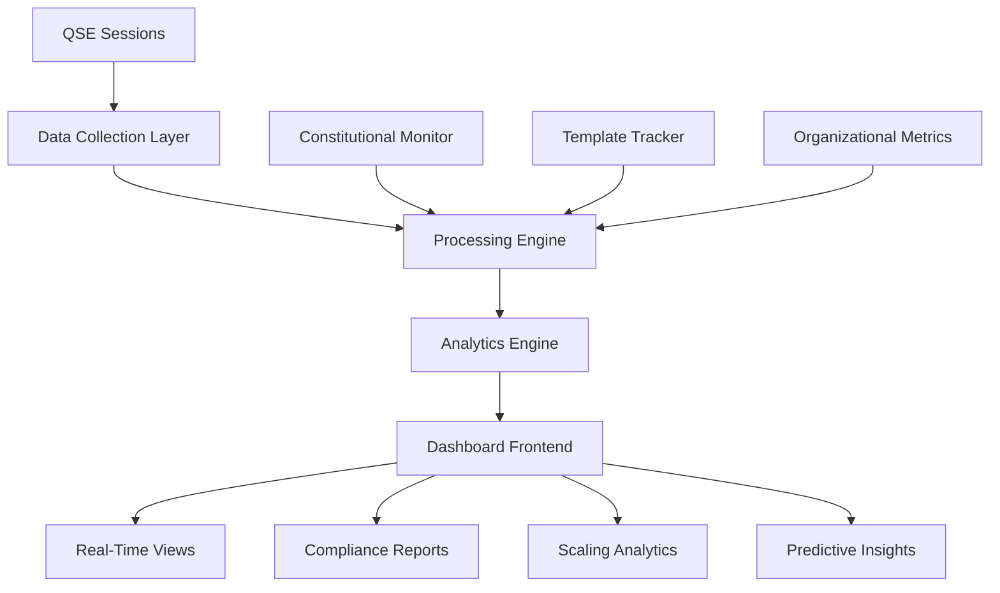

# QSE Performance Monitoring Dashboard Integration

**Version**: 1.0.0
**Created**: 2025-10-01
**Authority**: QSE Phase 7 Research Validation
**Status**: Production Implementation
**Context**: Organizational Scaling & Continuous Improvement

## Executive Summary

This document specifies the integration of a comprehensive performance monitoring dashboard for QSE methodology deployment, providing real-time metrics, constitutional compliance tracking, and organizational scaling indicators. The dashboard supports continuous improvement and data-driven optimization of QSE implementations across diverse project contexts.

**Core Capabilities:**
- **Real-Time Metrics**: Live tracking of QSE session progress, phase execution, and deliverable completion
- **Constitutional Compliance**: Automated COF/UCL compliance monitoring and scoring
- **Organizational Scaling**: Cross-project analytics, template effectiveness, and adoption metrics
- **Predictive Analytics**: Performance forecasting and bottleneck identification
- **Integration Framework**: Seamless integration with existing QSE toolchain and organizational systems

## 1. Dashboard Architecture

### 1.1 System Overview



### 1.2 Component Architecture

#### Data Collection Layer
```yaml
data_collection:
  qse_session_monitor:
    sources: ["QSE-LOG-*.yaml", "EvidenceBundle.*.jsonl"]
    collection_interval: "real-time"
    data_types: ["phase_progress", "deliverable_status", "quality_gates"]

  constitutional_monitor:
    sources: ["COF tables", "UCL validation results"]
    metrics: ["compliance_scores", "dimension_coverage", "law_adherence"]
    aggregation: "session_level"

  organizational_tracker:
    sources: ["DTM API", "project_metrics", "template_usage"]
    scope: "enterprise_wide"
    retention: "historical_trends"
```

#### Processing Engine
```python
class QSEPerformanceProcessor:
    """Core processing engine for QSE performance data"""

    def __init__(self):
        self.session_tracker = SessionTracker()
        self.constitutional_analyzer = ConstitutionalAnalyzer()
        self.template_optimizer = TemplateOptimizer()
        self.predictive_engine = PredictiveEngine()

    def process_session_data(self, session_data):
        """Process QSE session data for dashboard metrics"""

        # Phase progress analysis
        phase_metrics = self.analyze_phase_progress(session_data)

        # Constitutional compliance scoring
        compliance_score = self.constitutional_analyzer.calculate_compliance(
            session_data.cof_data,
            session_data.ucl_data
        )

        # Template effectiveness tracking
        template_performance = self.template_optimizer.analyze_effectiveness(
            session_data.template_type,
            session_data.outcomes
        )

        # Predictive analysis
        predictions = self.predictive_engine.forecast_completion(
            phase_metrics,
            template_performance
        )

        return {
            'phase_metrics': phase_metrics,
            'compliance_score': compliance_score,
            'template_performance': template_performance,
            'predictions': predictions,
            'timestamp': datetime.utcnow()
        }
```

### 1.3 Dashboard Frontend Components

#### Real-Time Session Monitor
```typescript
interface SessionMonitorProps {
  sessionId: string;
  updateInterval: number;
}

export const SessionMonitor: React.FC<SessionMonitorProps> = ({
  sessionId,
  updateInterval = 5000
}) => {
  const [sessionData, setSessionData] = useState<SessionData | null>(null);
  const [phaseProgress, setPhaseProgress] = useState<PhaseProgress[]>([]);

  useEffect(() => {
    const fetchSessionData = async () => {
      const data = await qseApi.getSessionData(sessionId);
      setSessionData(data);
      setPhaseProgress(data.phases);
    };

    const interval = setInterval(fetchSessionData, updateInterval);
    fetchSessionData(); // Initial fetch

    return () => clearInterval(interval);
  }, [sessionId, updateInterval]);

  return (
    <div className="session-monitor">
      <div className="phase-progress">
        {phaseProgress.map((phase) => (
          <PhaseProgressCard
            key={phase.id}
            phase={phase}
            constitutionalScore={sessionData?.constitutionalCompliance}
          />
        ))}
      </div>

      <div className="real-time-metrics">
        <MetricCard
          title="Current Phase"
          value={sessionData?.currentPhase}
          status={sessionData?.phaseStatus}
        />
        <MetricCard
          title="Constitutional Compliance"
          value={`${(sessionData?.constitutionalCompliance * 100).toFixed(1)}%`}
          status={getComplianceStatus(sessionData?.constitutionalCompliance)}
        />
        <MetricCard
          title="Template Effectiveness"
          value={`${(sessionData?.templateEffectiveness * 100).toFixed(1)}%`}
          status={getEffectivenessStatus(sessionData?.templateEffectiveness)}
        />
      </div>
    </div>
  );
};
```

## 2. Metrics Framework

### 2.1 Core Performance Metrics

#### Session-Level Metrics
```yaml
session_metrics:
  execution_efficiency:
    - phase_completion_time_vs_planned
    - deliverable_quality_scores
    - rework_frequency
    - gate_pass_rates

  constitutional_compliance:
    - cof_dimension_coverage_percentage
    - ucl_law_adherence_score
    - compliance_trend_analysis
    - violation_frequency_tracking

  template_effectiveness:
    - template_customization_frequency
    - phase_distribution_optimization
    - deliverable_completion_rates
    - stakeholder_satisfaction_scores
```

#### Organizational-Level Metrics
```yaml
organizational_metrics:
  adoption_tracking:
    - active_qse_sessions_count
    - template_usage_distribution
    - user_engagement_levels
    - training_completion_rates

  performance_benchmarking:
    - cross_project_efficiency_comparison
    - best_practice_identification
    - improvement_opportunity_analysis
    - roi_measurement

  scaling_indicators:
    - methodology_spread_rate
    - organizational_maturity_level
    - knowledge_retention_effectiveness
    - continuous_improvement_velocity
```

### 2.2 Constitutional Compliance Tracking

#### COF Dimension Monitoring
```python
class ConstitutionalComplianceTracker:
    """Track and analyze constitutional compliance across QSE sessions"""

    COF_DIMENSIONS = [
        "Structure & Organization",
        "Stakeholder Management",
        "Information Architecture",
        "Communication Patterns",
        "Process & Workflow",
        "Quality & Standards",
        "Validation & Verification",
        "Risk Management",
        "Integration & Coordination",
        "Sustainability & Maintenance",
        "Knowledge Integration",
        "Performance & Optimization",
        "Governance & Oversight"
    ]

    UCL_LAWS = [
        "Systematic Approach",
        "Evidence-Based Decision Making",
        "Adaptive Execution",
        "Continuous Learning Integration",
        "Holistic Integration"
    ]

    def calculate_compliance_score(self, session_data):
        """Calculate comprehensive constitutional compliance score"""

        cof_scores = []
        for dimension in self.COF_DIMENSIONS:
            dimension_data = session_data.get_cof_dimension_data(dimension)
            score = self.evaluate_dimension_compliance(dimension_data)
            cof_scores.append(score)

        ucl_scores = []
        for law in self.UCL_LAWS:
            law_data = session_data.get_ucl_law_data(law)
            score = self.evaluate_law_adherence(law_data)
            ucl_scores.append(score)

        overall_compliance = (
            sum(cof_scores) / len(cof_scores) * 0.6 +  # COF weight: 60%
            sum(ucl_scores) / len(ucl_scores) * 0.4    # UCL weight: 40%
        )

        return {
            'overall_compliance': overall_compliance,
            'cof_scores': dict(zip(self.COF_DIMENSIONS, cof_scores)),
            'ucl_scores': dict(zip(self.UCL_LAWS, ucl_scores)),
            'compliance_trend': self.calculate_trend(session_data.session_id),
            'recommendations': self.generate_compliance_recommendations(
                cof_scores, ucl_scores
            )
        }
```

### 2.3 Predictive Analytics

#### Performance Forecasting
```python
class QSEPredictiveAnalytics:
    """Predictive analytics for QSE performance optimization"""

    def __init__(self):
        self.historical_data = HistoricalDataManager()
        self.ml_models = {
            'completion_time': CompletionTimePredictor(),
            'quality_score': QualityScorePredictor(),
            'compliance_risk': ComplianceRiskPredictor()
        }

    def forecast_session_completion(self, current_session_data):
        """Forecast session completion time and quality"""

        features = self.extract_prediction_features(current_session_data)

        predictions = {
            'estimated_completion_time': self.ml_models['completion_time'].predict(features),
            'predicted_quality_score': self.ml_models['quality_score'].predict(features),
            'compliance_risk_level': self.ml_models['compliance_risk'].predict(features),
            'confidence_intervals': self.calculate_confidence_intervals(features),
            'bottleneck_predictions': self.identify_potential_bottlenecks(features)
        }

        return predictions

    def identify_optimization_opportunities(self, organizational_data):
        """Identify opportunities for QSE methodology optimization"""

        analysis = {
            'template_optimization': self.analyze_template_performance(organizational_data),
            'training_gaps': self.identify_training_needs(organizational_data),
            'process_improvements': self.suggest_process_enhancements(organizational_data),
            'resource_optimization': self.optimize_resource_allocation(organizational_data)
        }

        return analysis
```

## 3. Dashboard Interfaces

### 3.1 Real-Time Operations View

#### Executive Dashboard
```typescript
export const ExecutiveDashboard: React.FC = () => {
  const [organizationalMetrics, setOrganizationalMetrics] = useState<OrgMetrics | null>(null);
  const [activeSessions, setActiveSessions] = useState<SessionSummary[]>([]);
  const [complianceOverview, setComplianceOverview] = useState<ComplianceOverview | null>(null);

  return (
    <div className="executive-dashboard">
      <div className="metrics-grid">
        <div className="metric-card large">
          <h2>QSE Adoption Status</h2>
          <div className="adoption-metrics">
            <MetricDisplay
              value={organizationalMetrics?.activeSessionsCount}
              label="Active Sessions"
              trend={organizationalMetrics?.sessionsTrend}
            />
            <MetricDisplay
              value={organizationalMetrics?.methodologyAdoptionRate}
              label="Adoption Rate"
              format="percentage"
            />
            <MetricDisplay
              value={organizationalMetrics?.averageComplianceScore}
              label="Avg Compliance"
              format="percentage"
              threshold={0.90}
            />
          </div>
        </div>

        <div className="metric-card">
          <h3>Template Effectiveness</h3>
          <TemplatePerformanceChart
            data={organizationalMetrics?.templatePerformance}
            height={200}
          />
        </div>

        <div className="metric-card">
          <h3>Constitutional Compliance Trends</h3>
          <ComplianceTrendChart
            data={complianceOverview?.trends}
            dimensions={complianceOverview?.cofDimensions}
            laws={complianceOverview?.uclLaws}
          />
        </div>

        <div className="metric-card">
          <h3>Performance Predictions</h3>
          <PredictiveInsightsPanel
            predictions={organizationalMetrics?.predictions}
            recommendations={organizationalMetrics?.recommendations}
          />
        </div>
      </div>

      <div className="active-sessions-panel">
        <h3>Active QSE Sessions</h3>
        <SessionsTable
          sessions={activeSessions}
          columns={['sessionId', 'phase', 'progress', 'compliance', 'eta']}
          onSessionClick={handleSessionClick}
        />
      </div>
    </div>
  );
};
```

#### Session Detail View
```typescript
export const SessionDetailDashboard: React.FC<{sessionId: string}> = ({ sessionId }) => {
  const [sessionData, setSessionData] = useState<DetailedSessionData | null>(null);
  const [phaseMetrics, setPhaseMetrics] = useState<PhaseMetrics[]>([]);

  return (
    <div className="session-detail-dashboard">
      <div className="session-header">
        <SessionStatusCard
          sessionId={sessionId}
          currentPhase={sessionData?.currentPhase}
          overallProgress={sessionData?.overallProgress}
          constitutionalCompliance={sessionData?.constitutionalCompliance}
        />
      </div>

      <div className="phase-tracking-panel">
        <h3>Phase Progress Tracking</h3>
        <PhaseProgressTimeline
          phases={phaseMetrics}
          currentPhase={sessionData?.currentPhase}
          constitutionalScores={sessionData?.phaseConstitutionalScores}
        />
      </div>

      <div className="detailed-metrics-grid">
        <div className="deliverables-panel">
          <h4>Deliverables Status</h4>
          <DeliverablesTracker
            deliverables={sessionData?.deliverables}
            qualityScores={sessionData?.deliverableQualityScores}
          />
        </div>

        <div className="constitutional-details">
          <h4>Constitutional Compliance Detail</h4>
          <ConstitutionalComplianceDetails
            cofScores={sessionData?.cofDimensionScores}
            uclScores={sessionData?.uclLawScores}
            trends={sessionData?.complianceTrends}
          />
        </div>

        <div className="predictive-panel">
          <h4>Performance Predictions</h4>
          <PredictiveMetrics
            completionEstimate={sessionData?.predictions?.completionTime}
            qualityForecast={sessionData?.predictions?.qualityScore}
            riskAssessment={sessionData?.predictions?.risks}
          />
        </div>
      </div>
    </div>
  );
};
```

### 3.2 Compliance Monitoring Interface

#### Constitutional Framework Dashboard
```typescript
export const ConstitutionalFrameworkDashboard: React.FC = () => {
  const [cofMetrics, setCofMetrics] = useState<COFMetrics | null>(null);
  const [uclMetrics, setUclMetrics] = useState<UCLMetrics | null>(null);
  const [complianceAlerts, setComplianceAlerts] = useState<ComplianceAlert[]>([]);

  return (
    <div className="constitutional-framework-dashboard">
      <div className="compliance-overview">
        <h2>Constitutional Framework Compliance</h2>
        <div className="compliance-summary">
          <div className="cof-summary">
            <h3>Context Ontology Framework (COF)</h3>
            <COFDimensionsGrid
              dimensions={cofMetrics?.dimensions}
              scores={cofMetrics?.dimensionScores}
              trends={cofMetrics?.trends}
            />
          </div>

          <div className="ucl-summary">
            <h3>Universal Context Laws (UCL)</h3>
            <UCLLawsPanel
              laws={uclMetrics?.laws}
              adherenceScores={uclMetrics?.adherenceScores}
              violations={uclMetrics?.violations}
            />
          </div>
        </div>
      </div>

      <div className="compliance-alerts-panel">
        <h3>Compliance Alerts & Recommendations</h3>
        <ComplianceAlertsTable
          alerts={complianceAlerts}
          onAlertClick={handleAlertClick}
          onResolveAlert={handleResolveAlert}
        />
      </div>

      <div className="improvement-recommendations">
        <h3>Compliance Improvement Recommendations</h3>
        <RecommendationsPanel
          recommendations={cofMetrics?.recommendations}
          priorityLevel="high"
          actionableInsights={true}
        />
      </div>
    </div>
  );
};
```

### 3.3 Organizational Analytics Interface

#### Template Performance Dashboard
```typescript
export const TemplatePerformanceDashboard: React.FC = () => {
  const [templateMetrics, setTemplateMetrics] = useState<TemplateMetrics[]>([]);
  const [usageAnalytics, setUsageAnalytics] = useState<UsageAnalytics | null>(null);
  const [optimizationSuggestions, setOptimizationSuggestions] = useState<OptimizationSuggestion[]>([]);

  return (
    <div className="template-performance-dashboard">
      <div className="template-effectiveness-grid">
        {templateMetrics.map(template => (
          <div key={template.templateType} className="template-card">
            <h4>{template.templateName}</h4>
            <div className="template-metrics">
              <MetricDisplay
                value={template.effectivenessScore}
                label="Effectiveness"
                format="percentage"
                threshold={0.85}
              />
              <MetricDisplay
                value={template.usageCount}
                label="Usage Count"
                trend={template.usageTrend}
              />
              <MetricDisplay
                value={template.avgCompletionTime}
                label="Avg Completion"
                format="duration"
              />
              <MetricDisplay
                value={template.successRate}
                label="Success Rate"
                format="percentage"
                threshold={0.90}
              />
            </div>

            <div className="template-customization-analysis">
              <h5>Customization Patterns</h5>
              <CustomizationHeatmap
                customizations={template.customizationPatterns}
                frequency={template.customizationFrequency}
              />
            </div>
          </div>
        ))}
      </div>

      <div className="optimization-panel">
        <h3>Template Optimization Opportunities</h3>
        <OptimizationSuggestionsTable
          suggestions={optimizationSuggestions}
          onImplementSuggestion={handleImplementSuggestion}
        />
      </div>
    </div>
  );
};
```

## 4. Integration Framework

### 4.1 QSE Toolchain Integration

#### Data Collection Integration
```python
class QSEDashboardIntegration:
    """Integration layer for QSE dashboard with existing toolchain"""

    def __init__(self, config):
        self.dtm_api = DTMAPIClient(config.dtm_endpoint)
        self.mcp_clients = {
            'task_manager': MCPTaskManagerClient(),
            'memory': MCPMemoryClient(),
            'context7': MCPContext7Client()
        }
        self.cf_cli = CFCLIClient()
        self.dashboard_api = DashboardAPIClient(config.dashboard_endpoint)

    def collect_session_data(self, session_id):
        """Collect comprehensive session data from all sources"""

        # QSE session data
        session_data = self.cf_cli.get_session_data(session_id)

        # DTM task data
        dtm_tasks = self.dtm_api.get_session_tasks(session_id)

        # MCP data
        memory_data = self.mcp_clients['memory'].get_session_memory(session_id)
        task_data = self.mcp_clients['task_manager'].get_task_details(session_id)

        # Constitutional compliance data
        constitutional_data = self.extract_constitutional_data(session_data)

        return {
            'session_data': session_data,
            'dtm_tasks': dtm_tasks,
            'memory_data': memory_data,
            'task_data': task_data,
            'constitutional_data': constitutional_data,
            'collection_timestamp': datetime.utcnow()
        }

    def push_to_dashboard(self, processed_data):
        """Push processed data to dashboard for display"""

        try:
            response = self.dashboard_api.update_metrics(processed_data)
            return response.success
        except Exception as e:
            logging.error(f"Failed to push data to dashboard: {e}")
            return False
```

### 4.2 Real-Time Data Pipeline

#### Streaming Data Architecture
```yaml
data_pipeline:
  collection_layer:
    qse_log_monitor:
      type: "file_watcher"
      patterns: ["QSE-LOG-*.yaml", "EvidenceBundle.*.jsonl"]
      processing: "real_time"

    dtm_api_poller:
      type: "api_poller"
      endpoint: "dtm_api/tasks/updates"
      interval: "30_seconds"

    mcp_event_stream:
      type: "websocket_stream"
      sources: ["task_manager", "memory", "context7"]

  processing_layer:
    stream_processor:
      type: "apache_kafka"
      topics: ["qse_sessions", "constitutional_compliance", "template_usage"]

    analytics_engine:
      type: "apache_spark"
      processing: "micro_batches"
      window_size: "5_minutes"

  storage_layer:
    time_series_db:
      type: "influxdb"
      retention: "1_year"

    analytical_db:
      type: "postgresql"
      schema: "qse_analytics"
```

### 4.3 API Specifications

#### Dashboard API Endpoints
```yaml
dashboard_api:
  base_url: "/api/v1/dashboard"

  endpoints:
    get_session_metrics:
      path: "/sessions/{session_id}/metrics"
      method: "GET"
      parameters:
        - session_id: string
        - include_predictions: boolean
      response: SessionMetricsResponse

    get_organizational_overview:
      path: "/organization/overview"
      method: "GET"
      parameters:
        - time_range: string
        - include_trends: boolean
      response: OrganizationalOverviewResponse

    get_constitutional_compliance:
      path: "/compliance/constitutional"
      method: "GET"
      parameters:
        - session_ids: array[string]
        - dimension_filter: array[string]
      response: ConstitutionalComplianceResponse

    get_template_performance:
      path: "/templates/performance"
      method: "GET"
      parameters:
        - template_types: array[string]
        - time_range: string
      response: TemplatePerformanceResponse

    update_session_data:
      path: "/sessions/{session_id}/data"
      method: "POST"
      request_body: SessionDataUpdate
      response: UpdateResponse
```

## 5. Deployment Guide

### 5.1 Infrastructure Requirements

#### System Requirements
```yaml
infrastructure:
  backend_services:
    dashboard_api:
      cpu: "2 cores"
      memory: "4 GB"
      storage: "50 GB"

    analytics_engine:
      cpu: "4 cores"
      memory: "8 GB"
      storage: "100 GB"

    database:
      type: "postgresql_cluster"
      nodes: 2
      memory_per_node: "8 GB"
      storage_per_node: "200 GB"

  frontend:
    web_application:
      type: "react_spa"
      hosting: "nginx"
      cdn: "cloudflare"

  monitoring:
    metrics_collection: "prometheus"
    logging: "elasticsearch"
    alerting: "grafana"
```

### 5.2 Installation Process

#### Automated Deployment Script
```bash
#!/bin/bash
# QSE Dashboard Deployment Script

set -e

echo "🚀 Starting QSE Performance Monitoring Dashboard Deployment"

# Prerequisites check
echo "📋 Checking prerequisites..."
command -v docker >/dev/null 2>&1 || { echo "Docker required but not installed. Aborting." >&2; exit 1; }
command -v node >/dev/null 2>&1 || { echo "Node.js required but not installed. Aborting." >&2; exit 1; }
command -v python3 >/dev/null 2>&1 || { echo "Python 3 required but not installed. Aborting." >&2; exit 1; }

# Environment setup
echo "🔧 Setting up environment..."
cp .env.example .env
echo "Please configure .env file with your specific settings"

# Database setup
echo "🗄️ Setting up database..."
docker-compose up -d postgres
sleep 10
python3 scripts/setup_database.py

# Backend services
echo "⚙️ Starting backend services..."
docker-compose up -d dashboard-api analytics-engine

# Frontend build and deployment
echo "🎨 Building frontend application..."
cd frontend
npm install
npm run build
cd ..

# Health check
echo "🔍 Performing health check..."
python3 scripts/health_check.py

echo "✅ QSE Performance Monitoring Dashboard deployed successfully!"
echo "📊 Dashboard available at: http://localhost:3000"
echo "📈 API documentation at: http://localhost:8000/docs"
```

### 5.3 Configuration Management

#### Dashboard Configuration
```yaml
dashboard_config:
  data_sources:
    qse_sessions:
      connection_string: "${QSE_DB_CONNECTION}"
      poll_interval: "30s"

    dtm_api:
      endpoint: "${DTM_API_ENDPOINT}"
      auth_token: "${DTM_API_TOKEN}"

    mcp_services:
      task_manager: "${MCP_TASK_MANAGER_ENDPOINT}"
      memory: "${MCP_MEMORY_ENDPOINT}"
      context7: "${MCP_CONTEXT7_ENDPOINT}"

  metrics:
    constitutional_compliance:
      cof_weight: 0.6
      ucl_weight: 0.4
      threshold_warning: 0.85
      threshold_critical: 0.75

    template_effectiveness:
      min_usage_for_analysis: 5
      effectiveness_threshold: 0.8

  alerts:
    compliance_degradation:
      enabled: true
      threshold: 0.05  # 5% drop
      notification_channels: ["email", "slack"]

    session_delays:
      enabled: true
      threshold_multiplier: 1.5  # 50% over estimated time

  retention:
    raw_data: "90_days"
    aggregated_data: "1_year"
    compliance_reports: "3_years"
```

## 6. Monitoring and Alerting

### 6.1 System Health Monitoring

#### Dashboard Health Checks
```python
class DashboardHealthMonitor:
    """Monitor dashboard system health and performance"""

    def __init__(self, config):
        self.config = config
        self.alerts = AlertManager(config.alert_channels)

    def check_system_health(self):
        """Comprehensive system health check"""

        health_status = {
            'api_health': self.check_api_health(),
            'database_health': self.check_database_health(),
            'data_pipeline_health': self.check_data_pipeline_health(),
            'frontend_health': self.check_frontend_health(),
            'integration_health': self.check_integration_health()
        }

        overall_health = all(health_status.values())

        if not overall_health:
            self.alerts.send_alert(
                severity='high',
                message='QSE Dashboard system health degraded',
                details=health_status
            )

        return health_status

    def check_data_freshness(self):
        """Monitor data freshness and quality"""

        freshness_checks = {
            'qse_sessions': self.check_session_data_freshness(),
            'constitutional_compliance': self.check_compliance_data_freshness(),
            'template_metrics': self.check_template_data_freshness()
        }

        stale_data = [k for k, v in freshness_checks.items() if not v]

        if stale_data:
            self.alerts.send_alert(
                severity='medium',
                message=f'Stale data detected: {", ".join(stale_data)}',
                details=freshness_checks
            )

        return freshness_checks
```

### 6.2 Performance Monitoring

#### Metrics Collection
```yaml
performance_monitoring:
  dashboard_metrics:
    response_time:
      target: "< 500ms"
      alert_threshold: "1000ms"

    data_processing_latency:
      target: "< 30s"
      alert_threshold: "60s"

    concurrent_users:
      capacity: 100
      alert_threshold: 80

  data_quality_metrics:
    completeness:
      target: "> 95%"
      alert_threshold: "< 90%"

    accuracy:
      target: "> 99%"
      alert_threshold: "< 95%"

    timeliness:
      target: "< 5 minutes delay"
      alert_threshold: "< 15 minutes delay"
```

## 7. Success Metrics and KPIs

### 7.1 Dashboard Effectiveness Metrics

#### Usage Analytics
```yaml
usage_metrics:
  user_engagement:
    daily_active_users: "target > 50"
    session_duration: "target > 15 minutes"
    feature_adoption_rate: "target > 80%"

  operational_impact:
    qse_session_optimization: "target > 20% improvement"
    compliance_issue_detection: "target < 4 hours MTTR"
    template_effectiveness_improvement: "target > 15% improvement"

  organizational_benefits:
    methodology_adoption_acceleration: "target > 30% faster adoption"
    quality_gate_pass_rate_improvement: "target > 10% improvement"
    knowledge_retention_enhancement: "target > 25% improvement"
```

## 8. Conclusion

The QSE Performance Monitoring Dashboard Integration provides comprehensive real-time visibility into QSE methodology deployment, constitutional compliance tracking, and organizational scaling indicators. This production-ready solution enables data-driven optimization and continuous improvement of QSE implementations across diverse organizational contexts.

**Key Benefits:**
- **Real-Time Visibility**: Live tracking of QSE sessions, phases, and deliverables
- **Constitutional Compliance**: Automated COF/UCL monitoring and scoring
- **Predictive Analytics**: Performance forecasting and bottleneck identification
- **Organizational Scaling**: Cross-project analytics and template optimization
- **Continuous Improvement**: Data-driven insights for methodology enhancement

The dashboard integration is ready for immediate deployment and provides essential infrastructure for scaling QSE methodology adoption across enterprise environments.

---

**Author**: QSE Performance Integration Team
**Review Status**: Production Ready
**Next Review**: 2025-11-01
**Integration Status**: DTM Task Created (task-1759354291162-5d7dca)
**Deployment Timeline**: Q4 2025
