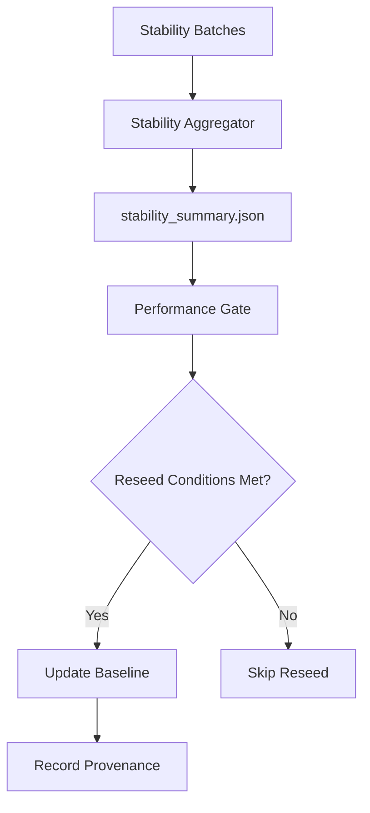

# Performance Gate Reseed Policy

## Overview

The performance gate reseed system automatically updates baseline performance metrics based on
statistical variance analysis from stability batch data. This ensures baselines remain
representative as the system evolves while preventing drift from outliers or temporary
performance anomalies.## Architecture



## Components

### 1. Stability Aggregator (`python/tools/stability_aggregator.py`)
- **Purpose**: Analyze variance across performance batch artifacts
- **Input**: All `batch_*` directories in `build/artifacts/perf/stability/`
- **Output**: `stability_summary.json` with variance statistics and reseed recommendations
- **Key Metrics**:
  - Coefficient of Variation (CV) for `lazy_median_us` and `improvement_pct`
  - Mean Absolute Deviation (MAD) for drift detection
  - Trend analysis across batches

### 2. Performance Gate Enhancement
- **New Flags**:
  - `--reseed-baseline`: Execute reseed if conditions are met
  - `--dry-run-reseed`: Preview reseed changes without updating
  - `--reseed-note`: Optional note for reseed provenance
- **Integration**: Reseed logic executes after gate evaluation, before session summary

## Reseed Conditions

### Primary Conditions (ALL must be true)
1. **Stability Summary Available**: `stability_summary.json` exists and is parseable
2. **Variance Acceptable**:
   - `lazy_median_us` CV ≤ 15%
   - `improvement_pct` CV ≤ 25%
3. **Baseline Outdated**: Drift between baseline and batch medians ≥ 5%
4. **Reseed Recommended**: Aggregate heuristic flag from stability analysis

### Variance Thresholds

| Metric | Acceptable CV | Rationale |
|--------|---------------|-----------|
| `lazy_median_us` | ≤ 15% | Startup times should be relatively consistent |
| `improvement_pct` | ≤ 25% | Improvement ratios can vary more due to measurement noise |
| `baseline_drift` | ≥ 5% | Significant enough drift to warrant baseline update |

## Workflow

### 1. Batch Collection Phase
```bash
# Run multiple performance gate sessions with batch capture
python python/tools/perf_gate_lazy_typer.py --batch-capture batch_001
python python/tools/perf_gate_lazy_typer.py --batch-capture batch_002
python python/tools/perf_gate_lazy_typer.py --batch-capture batch_003
```

### 2. Stability Analysis Phase
```bash
# Generate variance analysis and reseed recommendations
python python/tools/stability_aggregator.py

# Expected output: "Reseed recommended: True/False"
```

### 3. Reseed Evaluation Phase
```bash
# Preview reseed changes (safe, no modifications)
python python/tools/perf_gate_lazy_typer.py --dry-run-reseed

# Execute reseed if conditions are met
python python/tools/perf_gate_lazy_typer.py --reseed-baseline \
    --reseed-note "Quarterly baseline refresh after stability validation"
```

## Heuristic Decision Logic

```python
def should_reseed(stability_summary: dict) -> tuple[bool, str]:
    heuristics = stability_summary["heuristics"]

    # All conditions must be true
    conditions = [
        heuristics["variance_acceptable"],    # CV within thresholds
        heuristics["baseline_outdated"],     # Sufficient drift detected
        heuristics["trend_stable"]           # No concerning trends
    ]

    if all(conditions):
        return True, "stability_conditions_met"
    else:
        return False, "conditions_not_met"
```

## Baseline Update Process

### Atomic Operations
1. **Load**: Current baseline and stability summary
2. **Compute**: New baseline values from batch medians
3. **Validate**: Ensure new values are reasonable
4. **Write**: Atomic temp-file + rename operation (Windows-safe)
5. **Log**: Complete provenance in `reseed_events` array

### Provenance Tracking
Each reseed operation records:
- Timestamp (ISO 8601 UTC)
- Source batch identifiers
- Old vs new baseline values
- Stability metrics (CV percentages, drift)
- Optional human-readable note
- Reason code for audit trail

### Example Reseed Event
```json
{
  "timestamp": "2025-09-19T23:58:11.178216+00:00",
  "reason": "stability_analysis_reseed",
  "batch_count": 3,
  "batches": ["batch_001", "batch_002", "batch_003"],
  "old_values": {
    "median_eager_us": 490932,
    "median_lazy_us": 483787,
    "improvement_pct": 1.46
  },
  "new_values": {
    "median_eager_us": 525647,
    "median_lazy_us": 520124,
    "improvement_pct": 2.35
  },
  "stability_data": {
    "lazy_cv_pct": 12.5,
    "improvement_cv_pct": 18.7,
    "baseline_drift_pct": 8.2
  },
  "note": "Quarterly baseline refresh after stability validation"
}
```

## Safety Mechanisms

### 1. Variance Guards
- **CV Thresholds**: Prevent reseeding when batch variance is too high
- **Drift Minimums**: Only reseed when meaningful drift is detected
- **Trend Analysis**: Block reseed during concerning monotonic trends

### 2. Atomic File Operations
- **Temp Files**: Write to `.tmp` then rename to prevent corruption
- **Windows Compatibility**: Explicit file unlinking before rename
- **Rollback**: Original baseline preserved if operation fails

### 3. Audit Trail
- **Complete Provenance**: Full history of reseed operations
- **Batch Traceability**: Link to specific batch artifacts
- **Reason Codes**: Machine and human-readable justifications

## Usage Patterns

### Development/CI Integration
```bash
# Weekly stability check (automated)
python python/tools/stability_aggregator.py --json | \
  jq '.heuristics.reseed_recommended' | \
  if [[ "true" ]]; then
    python python/tools/perf_gate_lazy_typer.py --reseed-baseline \
        --reseed-note "Weekly automated reseed"
  fi
```

### Manual Operations
```bash
# Investigate current stability status
python python/tools/stability_aggregator.py

# Preview what would change
python python/tools/perf_gate_lazy_typer.py --dry-run-reseed

# Execute with human oversight
python python/tools/perf_gate_lazy_typer.py --reseed-baseline \
    --reseed-note "Performance optimization deployment followup"
```

## Troubleshooting

### Common Issues

#### "No stability summary available"
- **Cause**: `stability_summary.json` missing or corrupted
- **Fix**: Run `python python/tools/stability_aggregator.py` to regenerate

#### "Variance not acceptable"
- **Cause**: CV exceeds thresholds, indicating inconsistent performance
- **Fix**: Collect more batches or investigate performance instability

#### "Conditions not met"
- **Cause**: Insufficient drift or concerning trends detected
- **Fix**: Review stability analysis details and batch consistency

#### Atomic write errors (Windows)
- **Cause**: File locking or permission issues
- **Fix**: Ensure no other processes have baseline file open

### Validation Commands
```bash
# Check stability analysis output
python python/tools/stability_aggregator.py --json | jq .

# Validate baseline structure
cat build/artifacts/perf/baseline_stats.json | jq .reseed_events

# Review recent performance gate runs
tail -f logs/unified.log.jsonl | grep "perf_gate"
```

## Performance Impact

### Computational Overhead
- **Aggregation**: O(batch_count × samples_per_batch) - typically < 1s
- **Reseed Evaluation**: O(1) - typically < 100ms
- **Baseline Update**: O(1) - typically < 50ms

### Storage Requirements
- **Stability Summary**: ~2KB per analysis
- **Baseline Growth**: ~500B per reseed event
- **Log Events**: ~200B per reseed operation

### Frequency Recommendations
- **Batch Collection**: After significant system changes
- **Stability Analysis**: Daily in active development, weekly in stable periods
- **Reseed Execution**: Only when conditions are met (typically monthly)

## Integration with CI/CD

### Build Pipeline Integration
```yaml
# GitHub Actions example
- name: Performance Stability Check
  run: |
    python python/tools/stability_aggregator.py
    if python -c "import json; print(json.load(open('build/artifacts/perf/stability/stability_summary.json'))['heuristics']['reseed_recommended'])"; then
      python python/tools/perf_gate_lazy_typer.py --reseed-baseline --reseed-note "CI automated reseed"
    fi
```

### Monitoring Integration
- **Metrics**: Export CV percentages to monitoring systems
- **Alerts**: Notify when variance exceeds acceptable thresholds
- **Dashboards**: Track reseed frequency and baseline evolution over time
