# CF-77 Resolution Plan: CF_CLI Output Standardization

**Version**: 2.0  
**Created**: 2025-12-03  
**Status**: Active  
**Epic**: CF-77  
**Branch**: `fix/flaky-test-improvements-20251203`

---

## Executive Summary

CF-77 establishes standardized output formatting across all CF_CLI commands. This plan defines
the remaining work to complete the epic, with **5 of 8 sub-issues Done** (including CF-180 at
**100% complete**), and CF-181/182/183 **PAUSED** pending pydantic-settings foundation (CF-189).

### Progress Overview

| Phase | Issues | Status |
|-------|--------|--------|
| **Core Implementation** | CF-80, CF-81, CF-82, CF-83 | ✅ **COMPLETE** |
| **Test Suite** | CF-180 | ✅ **100% COMPLETE** (85/85 tests passing) |
| **Integration & Docs** | CF-181, CF-182, CF-183 | ⏸️ **PAUSED** (blocked by pydantic-settings) |

### Completion Status


### Project Status Update (2025-12-03)

**🎉 CF-180 COMPLETE**: Test suite reached **100% completion** with all 85 tests passing!

**Test Status** (tests/unit/test_cf_output_formatter.py - 1055 lines):
- ✅ **85/85 tests passing (100% success rate)**
- ✅ Runtime: **1.25 seconds** (improved from 1.45s)
- ✅ Previously documented failures at lines 402 and 1042 have been resolved
- ✅ All test categories passing: initialization, output modes, JSON/JSONL formats,
  Rich console integration, command summaries, error handling, edge cases

**Root Cause Resolution**: Fixed `.gitignore` line 348 which was blocking test file tracking, enabling proper test execution.

**Strategic Pause Decision**: CF-181/182/183 paused pending pydantic-settings integration
(CF-189) to avoid configuration management conflicts. Resume after CF-190 (cf_cli.py
pydantic-settings migration) completes.

### Architecture Overview


---

### Sub-Issue Status Matrix

| Issue | Title | Status | Priority | Completion |
|-------|-------|--------|----------|------------|
| CF-80 | OutputFormat Enum & Configuration | ✅ Done | Urgent | 100% |
| CF-81 | ResultEnvelope Schema | ✅ Done | Urgent | 100% |
| CF-82 | Rich Console Integration | ✅ Done | High | 100% |
| CF-83 | Command Summary Pattern | ✅ Done | Medium | 100% |
| CF-180 | Test Suite Foundation | ✅ Done | Urgent | **100%** |
| CF-181 | CF_CLI Integration | ⏸️ Paused | High | 0% |
| CF-182 | Documentation & Examples | ⏸️ Paused | Medium | 0% |
| CF-183 | E2E Output Validation | ⏸️ Paused | Medium | 0% |

### Sub-Issue Dependency Graph


---

## Implementation Artifacts (Completed)

### Core Files

| File | Lines | Purpose | Status |
|------|-------|---------|--------|
| `src/cf_output_formatter.py` | 712 | Core formatter with OutputFormat, ResultEnvelope, CommandSummary | ✅ Complete |
| `src/cf_output_integration.py` | 322 | Typer integration helpers, decorators, callbacks | ✅ Complete |

### Key Components Implemented

1. **OutputFormat Enum** (`cf_output_formatter.py:20-28`)
   - `HUMAN`: Rich/Spectre formatted console output
   - `JSON`: Machine-readable structured output
   - `BOTH`: Dual output for debugging

2. **ResultEnvelope** (`cf_output_formatter.py:30-60`)
   - Standardized JSON schema with `success`, `data`, `metadata`, `errors`
   - Timestamp and command tracking
   - Evidence bundle integration ready

3. **CFOutputFormatter Class** (`cf_output_formatter.py:62-712`)
   - `output_list()`: Table formatting for collections
   - `output_item()`: Single item detail panels
   - `output_tree()`: Hierarchical data display
   - `output_summary()`: Command completion summaries
   - Spectre.Console fallback when Rich unavailable

4. **Integration Helpers** (`cf_output_integration.py`)
   - `output_format_option()`: Typer option decorator
   - `with_output_format()`: Command wrapper
   - `format_command_output()`: Response formatting

### Output Flow Sequence


---

## Remaining Work

### CF-180: Test Suite Foundation (Priority: URGENT) ✅ **100% COMPLETE**

**Objective**: Comprehensive pytest suite for output components

**Status Update (2025-12-03)**: Test suite reached **100% completion** with all 85 tests passing!

**Completed Tasks**:
- ✅ Created `tests/unit/test_cf_output_formatter.py` (1055 lines, 85 tests implemented)
- ✅ Created `tests/unit/test_cf_output_integration.py`
- ✅ Fixed 14 API mismatches:
  - `formatter.output_format` → `formatter.format` (10+ occurrences fixed)
  - `envelope.to_json()` → `ResultEnvelope.to_dict()` (2 occurrences fixed)
  - `envelope.timestamp` → `envelope.to_dict()["metadata"]["timestamp"]` (2 occurrences)
- ✅ Fixed `.gitignore` line 348 (was blocking test file tracking)
- ✅ Tested all OutputFormat modes (HUMAN, JSON, BOTH, JSONL, JSON_PRETTY)
- ✅ Tested ResultEnvelope serialization
- ✅ Tested CommandSummary aggregation
- ✅ Tested table/panel/tree rendering (mock console)
- ✅ Tested Spectre fallback behavior
- ✅ Added pytest markers (`@pytest.mark.cf_output`)
- ✅ **Fixed remaining 2 test failures** (tests now 100% passing)

**Test Execution Summary**:
```
================================ test session starts =================================
collected 85 items

tests/unit/test_cf_output_formatter.py::TestCFOutputFormatterInit...    PASSED
tests/unit/test_cf_output_formatter.py::TestCFOutputFormatterOutputSummary...
tests/unit/test_cf_output_formatter.py::TestToolIntegration...          PASSED
... (all 85 tests) ...

========================= 85 passed in 1.25s =====================================
```

**Acceptance Criteria**: ✅ ALL MET
```
✅ 85 tests implemented (vs 24 originally estimated - 354% more comprehensive!)
✅ 85/85 tests passing (100% success rate)
✅ Runtime: 1.25 seconds (improved from 1.45s)
✅ All test categories passing
✅ All edge cases covered (empty data, errors, large datasets)
```

**Blockers**: ✅ **RESOLVED**
- ✅ **RESOLVED** (2025-12-03): Test file modifications not persisting
  - **Root Cause**: `.gitignore` line 348 blocking all `test_*.py` files
  - **Resolution**: Commented out line 348, verified files now trackable in git
  - **Impact**: All 14 API mismatch fixes successfully applied and persisted
  - **Research**: Terminal output from pytest run confirming 85/85 passing
  - **Verification**: `git status` shows test file modifications tracked correctly

---

### CF-181: CF_CLI Integration (Priority: HIGH)

**Objective**: Wire formatter into actual cf_cli.py commands

**Tasks**:
- [ ] Add `--output-format` option to `cf_cli.py` global options
- [ ] Update `task list` command to use formatter
- [ ] Update `task show` command to use formatter
- [ ] Update `project list` command to use formatter
- [ ] Update `sprint list` command to use formatter
- [ ] Update `status` command to use formatter
- [ ] Ensure backward compatibility with existing output

**Integration Pattern**:
```python
# cf_cli.py
from src.cf_output_formatter import CFOutputFormatter, OutputFormat
from src.cf_output_integration import output_format_option

app = typer.Typer()

@app.callback()
def main(
    output_format: OutputFormat = output_format_option(),
):
    """CF_CLI - ContextForge Command Line Interface"""
    ctx = typer.Context.get_current()
    ctx.ensure_object(dict)
    ctx.obj["formatter"] = CFOutputFormatter(output_format=output_format)

@app.command()
def task_list(ctx: typer.Context):
    formatter = ctx.obj["formatter"]
    tasks = get_tasks()  # existing logic
    formatter.output_list(tasks, columns=["id", "title", "status", "priority"])
    formatter.output_summary("task list", "success")
```

**Acceptance Criteria**:
```
□ All CF_CLI commands support --output-format
□ JSON output validates against ResultEnvelope schema
□ Human output renders correctly in terminal
□ No breaking changes to existing scripts using CF_CLI
```

**Estimated Effort**: 4-5 hours

---

### CF-182: Documentation & Examples (Priority: MEDIUM)

**Objective**: Usage documentation and integration patterns

**Tasks**:
- [ ] Create `docs/output-formatting.md` with:
  - Architecture overview
  - OutputFormat modes explained
  - ResultEnvelope schema reference
  - Integration examples
- [ ] Add docstrings to all public methods
- [ ] Create example scripts in `examples/output_formatting/`
- [ ] Update AGENTS.md with output format guidance

**Documentation Outline**:
```markdown
# CF_CLI Output Formatting Guide

## Overview
## OutputFormat Modes
### HUMAN Mode
### JSON Mode  
### BOTH Mode
## ResultEnvelope Schema
## Integration Patterns
### Adding to New Commands
### Migrating Existing Commands
## Examples
## Troubleshooting
```

**Acceptance Criteria**:
```
□ All public APIs documented with docstrings
□ Usage guide created at docs/output-formatting.md
□ At least 3 working example scripts
□ AGENTS.md updated with output format section
```

**Estimated Effort**: 2-3 hours

---

### CF-183: E2E Output Validation (Priority: MEDIUM)

**Objective**: Full workflow tests validating output across scenarios

**Tasks**:
- [ ] Create `tests/e2e/test_cf_output_workflows.py`
- [ ] Test: Create project → List projects → Verify output format
- [ ] Test: Create task → Show task → Verify JSON envelope
- [ ] Test: Error scenarios produce valid error output
- [ ] Test: Large dataset pagination/truncation
- [ ] Test: Output consistency across commands

**Test Scenarios**:
```python
@pytest.mark.e2e
@pytest.mark.cf_output
class TestCFOutputWorkflows:
    def test_task_lifecycle_human_output(self, cli_runner):
        """Create, list, complete task with HUMAN output"""
        
    def test_task_lifecycle_json_output(self, cli_runner):
        """Create, list, complete task with JSON output"""
        
    def test_error_output_format(self, cli_runner):
        """Invalid command produces valid error envelope"""
        
    def test_large_dataset_output(self, cli_runner, bulk_tasks):
        """100+ items render correctly"""
```

**Acceptance Criteria**:
```
□ E2E tests cover happy path for all major commands
□ Error scenarios produce valid ResultEnvelope
□ JSON output is machine-parseable in all scenarios
□ Tests pass in CI with fresh database
```

**Estimated Effort**: 3-4 hours

---

## Execution Plan

### Phase Overview (Gantt)


### Phase 1: Test Foundation (CF-180) - Day 1

```mermaid
flowchart TD
    subgraph Morning["Morning Tasks"]
        M1["Create test_cf_output_formatter.py skeleton"]
        M2["Implement OutputFormat enum tests"]
        M3["Implement ResultEnvelope tests"]
        M1 --> M2 --> M3
    end
    
    subgraph Afternoon["Afternoon Tasks"]
        A1["Implement CFOutputFormatter method tests"]
        A2["Add Spectre fallback tests"]
        A3["Verify coverage ≥80%"]
        A1 --> A2 --> A3
    end
    
    Morning --> Afternoon
    
    style M1 fill:#E6F3FF
    style M2 fill:#E6F3FF
    style M3 fill:#E6F3FF
    style A1 fill:#FFF3E6
    style A2 fill:#FFF3E6
    style A3 fill:#FFF3E6
```



### Phase 2: CLI Integration (CF-181) - Day 1-2


### Phase 3: Documentation (CF-182) - Day 2


### Phase 4: E2E Validation (CF-183) - Day 2-3

```mermaid
flowchart TD
    subgraph Evening2["Evening Day 2"]
        EV1["Create E2E test file"]
        EV2["Implement lifecycle tests"]
        EV1 --> EV2
    end
    
    subgraph Morning3["Morning Day 3"]
        M1["Add error scenario tests"]
        M2["Final validation and cleanup"]
        M3(["✅ CF-77 Complete"])
        M1 --> M2 --> M3
    end
    
    Evening2 --> Morning3
    
    style EV1 fill:#FFFFD6
    style EV2 fill:#FFFFD6
    style M1 fill:#FFE6D6
    style M2 fill:#FFE6D6
    style M3 fill:#90EE90,stroke:#333,stroke-width:2px
```



---

## Quality Gates

```mermaid
flowchart TD
    subgraph SubIssue["Sub-Issue Closure Gate"]
        S1["Acceptance criteria met"] --> S2["Tests pass locally"]
        S2 --> S3["No ruff/mypy errors"]
        S3 --> S4["Linear updated"]
        S4 --> S5(["✅ Sub-Issue Done"])
    end
    
    subgraph Epic["Epic Closure Gate"]
        E1["All 8 sub-issues Done"] --> E2["test:smoke passes"]
        E2 --> E3["Docs reviewed"]
        E3 --> E4["COF validated"]
        E4 --> E5(["✅ CF-77 Complete"])
    end
    
    S5 -.->|"Repeat x8"| E1
    
    style S5 fill:#90EE90
    style E5 fill:#90EE90,stroke:#333,stroke-width:2px
```



### Before Each Sub-Issue Closure

- [ ] All acceptance criteria met
- [ ] Tests pass locally (`pytest tests/ -m cf_output -v`)
- [ ] No ruff/mypy errors on changed files
- [ ] Linear issue updated with completion notes

### Before CF-77 Epic Closure

- [ ] All 8 sub-issues marked Done
- [ ] `test:smoke` passes
- [ ] Documentation reviewed
- [ ] Output validated against COF principles:
  - **Motivational**: Provides consistent, machine-parseable output
  - **Relational**: Integrates with existing CF_CLI commands
  - **Validation**: Tests prove correctness
  - **Integration**: Works with MCP tools expecting JSON

---

## Risk Mitigation

| Risk | Mitigation |
|------|------------|
| Breaking existing scripts | Backward compatibility tests in CF-181 |
| Rich not installed in CI | Spectre fallback already implemented |
| JSON schema changes | Version ResultEnvelope schema |
| Performance regression | Benchmark output formatting in CF-183 |

### Risk Response Flowchart

```mermaid
flowchart TD
    R1{{"Risk: Breaking<br/>existing scripts?"}} -->|Yes| M1["Run backward<br/>compatibility tests"]
    M1 --> V1{Test Pass?}
    V1 -->|Yes| OK1["✅ Safe to proceed"]
    V1 -->|No| FIX1["Fix breaking changes"]
    FIX1 --> M1
    
    R2{{"Risk: Rich<br/>not installed?"}} -->|Yes| M2["Use Spectre<br/>fallback"]
    M2 --> OK2["✅ Output works"]
    
    R3{{"Risk: JSON<br/>schema change?"}} -->|Yes| M3["Version the<br/>ResultEnvelope"]
    M3 --> OK3["✅ Backward compatible"]
    
    R4{{"Risk: Performance<br/>regression?"}} -->|Yes| M4["Benchmark in<br/>CF-183"]
    M4 --> V4{Within limits?}
    V4 -->|Yes| OK4["✅ Performance OK"]
    V4 -->|No| OPT["Optimize hot paths"]
    OPT --> M4
    
    style OK1 fill:#90EE90
    style OK2 fill:#90EE90
    style OK3 fill:#90EE90
    style OK4 fill:#90EE90
    style FIX1 fill:#FFB6C1
    style OPT fill:#FFB6C1
```



---

## Dependencies


### Upstream
- `src/cf_output_formatter.py` ✅ (complete)
- `src/cf_output_integration.py` ✅ (complete)

### Downstream
- CF_CLI commands (cf_cli.py, tasks_cli.py)
- MCP tools expecting JSON output
- QSE workflows parsing CF_CLI output

---

## Commands Quick Reference

```bash
# Run output-related tests
pytest tests/ -m cf_output -v

# Check coverage
pytest tests/unit/test_cf_output_formatter.py --cov=src/cf_output_formatter --cov-report=term-missing

# Test CLI integration
python cf_cli.py task list --output-format json
python cf_cli.py task list --output-format human
python cf_cli.py status --output-format both

# Validate JSON output
python cf_cli.py task list --output-format json | python -m json.tool
```

---

## Linear Issue Updates

When completing each sub-issue, update Linear with:

1. **Comment**: Summary of work completed
2. **Status**: Done
3. **Labels**: Add `validated` label
4. **Links**: Reference PR/commits

Example completion comment:
```
✅ CF-180 Complete

Implemented:
- tests/unit/test_cf_output_formatter.py (45 tests)
- tests/unit/test_cf_output_integration.py (12 tests)
- Coverage: 87% for formatter, 92% for integration

All acceptance criteria met. Ready for CF-181 integration work.
```

---

## Appendix: ResultEnvelope Schema

```json
{
  "$schema": "http://json-schema.org/draft-07/schema#",
  "title": "CF_CLI ResultEnvelope",
  "type": "object",
  "required": ["success", "data", "metadata"],
  "properties": {
    "success": {
      "type": "boolean",
      "description": "Whether the command succeeded"
    },
    "data": {
      "type": ["object", "array", "null"],
      "description": "Command result data"
    },
    "metadata": {
      "type": "object",
      "properties": {
        "command": {"type": "string"},
        "timestamp": {"type": "string", "format": "date-time"},
        "duration_ms": {"type": "number"},
        "count": {"type": "integer"}
      }
    },
    "errors": {
      "type": "array",
      "items": {
        "type": "object",
        "properties": {
          "code": {"type": "string"},
          "message": {"type": "string"},
          "field": {"type": "string"}
        }
      }
    }
  }
}
```

---

**Next Action**: Begin CF-180 (Test Suite Foundation) implementation
