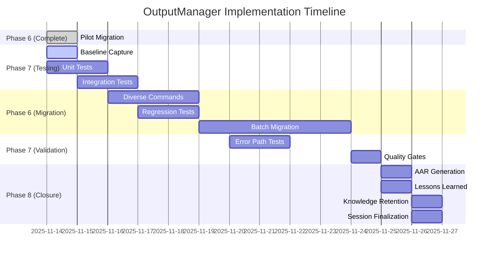

# OutputManager Centralization - Next Steps Action Plan
**Generated**: 2025-11-14T13:14:30-07:00  
**Project**: P-OUTPUTMANAGER  
**Current Phase**: Phase 6 - Integration & Execution (Pilot Complete)  
**Session**: QSE-20251114-1314-OutputManager

---

## Executive Summary

**Completed (5 tasks)**:
- ✅ Action list conversion with persona assignments
- ✅ Sync report confirming integration anchors
- ✅ OutputManager implementation (v1.0.0, deterministic JSON)
- ✅ Root callback feature-flag bootstrap
- ✅ Pilot command migration (`status system --json`)

**Current Status**: Pilot successfully wired behind `CF_CLI_USE_OUTPUT_MANAGER` feature flag with stdout-only JSON validated. Ready to proceed with test coverage and diverse command migrations.

**Next Milestone**: Complete Phase 7 testing (unit + integration) and Phase 6 diverse migrations to achieve stage gate validation.

---

## Priority 1: Immediate Next Steps (High-Priority Critical Path)

### 1. Baseline Capture (phase-6-3a-pilot-baseline-capture)
**Objective**: Generate SHA256 baseline fixtures for automated regression testing

**Actions**:
```powershell
# Create baseline directory structure
New-Item -ItemType Directory -Force -Path "tests/fixtures/baselines"

# Capture legacy baseline (flag OFF)
$env:CF_CLI_USE_OUTPUT_MANAGER="0"
python cf_cli.py status system --json > tests/fixtures/baselines/status_system_legacy.json
Get-FileHash tests/fixtures/baselines/status_system_legacy.json -Algorithm SHA256 | 
    Select-Object Hash | ConvertTo-Json > tests/fixtures/baselines/status_system_legacy.sha256

# Capture OutputManager baseline (flag ON)
$env:CF_CLI_USE_OUTPUT_MANAGER="1"
python cf_cli.py status system --json > tests/fixtures/baselines/status_system_outputmanager.json
Get-FileHash tests/fixtures/baselines/status_system_outputmanager.json -Algorithm SHA256 | 
    Select-Object Hash | ConvertTo-Json > tests/fixtures/baselines/status_system_outputmanager.sha256
```

**Acceptance Criteria**:
- ✓ Legacy and OutputManager baselines captured
- ✓ SHA256 hashes stored in version control
- ✓ Baseline comparison script validates envelope structure differences

**Evidence**: Baseline files committed with hashes in evidence manifest

---

### 2. Unit Test Suite (phase-7-1-unit-tests-execution)
**Objective**: Achieve 100% line coverage for `src/output_manager.py`

**Test File**: `tests/test_output_manager.py`

**Test Categories** (≥21 tests):

#### A. Deterministic Encoder Tests (8 tests)
```python
def test_encoder_datetime_utc_z_suffix()
def test_encoder_datetime_naive_assumes_utc()
def test_encoder_decimal_to_string()
def test_encoder_uuid_to_string()
def test_encoder_dataclass_to_dict()
def test_encoder_ensure_ascii_false()
def test_encoder_sort_keys_true()
def test_encoder_separators_compact()
```

#### B. Envelope Builder Tests (7 tests)
```python
def test_envelope_ok_structure()
def test_envelope_ok_with_custom_meta()
def test_envelope_error_structure()
def test_envelope_error_with_code()
def test_envelope_partial_structure()
def test_envelope_version_constant()
def test_envelope_timestamp_utc_format()
```

#### C. Singleton & Thread Safety Tests (3 tests)
```python
def test_singleton_same_instance()
def test_singleton_thread_safe()
def test_get_output_manager_alias()
```

#### D. Echo Helpers Tests (3 tests)
```python
def test_echo_ok_stdout_only(capsys)
def test_echo_error_stdout_only(capsys)
def test_echo_partial_stdout_only(capsys)
```

**Commands**:
```powershell
# Run unit tests with coverage
pytest tests/test_output_manager.py -v --cov=src.output_manager --cov-report=term-missing --cov-report=html

# Coverage target: 100% line coverage
```

**Acceptance Criteria**:
- ✓ All 21+ tests pass
- ✓ 100% line coverage achieved
- ✓ No mypy/ruff violations in test file
- ✓ Coverage report generated and archived

**Evidence**: `coverage.html`, pytest XML results, test execution logs

---

### 3. Integration Test Suite (phase-7-2-integration-tests-execution)
**Objective**: Validate CLI routing, feature flags, and stdout/stderr separation

**Test File**: `tests/test_cli_integration.py`

**Test Categories** (9 tests):

#### A. Feature Flag Behavior (3 tests)
```python
def test_feature_flag_disabled_uses_legacy()
def test_feature_flag_enabled_uses_outputmanager()
def test_feature_flag_fallback_on_import_error()
```

#### B. Stdout/Stderr Routing (3 tests)
```python
def test_json_only_stdout_purity()
def test_human_output_routes_to_stderr()
def test_session_banners_suppressed_with_flag()
```

#### C. Root Callback Integration (3 tests)
```python
def test_root_callback_initializes_singleton()
def test_env_vars_set_by_root_callback()
def test_quiet_mode_interactions()
```

**Commands**:
```powershell
# Run integration tests (requires subprocess calls to cf_cli.py)
pytest tests/test_cli_integration.py -v -s

# Validate stdout redirection
pytest tests/test_cli_integration.py::test_json_only_stdout_purity -v
```

**Acceptance Criteria**:
- ✓ All 9 tests pass
- ✓ Stdout purity validated (no human text leakage)
- ✓ Feature flag toggles work correctly
- ✓ Legacy fallback verified on errors

**Evidence**: pytest XML results, subprocess capture logs

---

## Priority 2: Staged Migration (Medium-Priority Expansion)

### 4. Diverse Commands Migration (phase-6-4-diverse-commands-migration)
**Objective**: Migrate 3 commands with diverse CLI patterns to validate architecture

**Selected Commands**:
1. **Query Command**: `cf tasks list --json` (simple read operation)
2. **Entity Command**: `cf projects show <id> --json` (single entity retrieval)
3. **Aggregate Command**: `cf sprints list --json` (collection with metadata)

**Migration Pattern** (per command):
```python
# Before (legacy)
if json_output:
    typer.echo(json.dumps(result, indent=2, ensure_ascii=False))
    return

# After (feature-flagged)
if json_output:
    if os.environ.get("CF_CLI_USE_OUTPUT_MANAGER") == "1":
        try:
            os.environ["CF_CLI_STDOUT_JSON_ONLY"] = "1"
            from src.output_manager import get_output_manager
            get_output_manager().echo_ok(
                result,
                meta={"command": "tasks_list", "json_output": True}
            )
            return
        except Exception:
            pass  # Fallback to legacy
    
    typer.echo(json.dumps(result, indent=2, ensure_ascii=False))
    return
```

**Baseline Capture** (per command):
```powershell
# Legacy baseline
$env:CF_CLI_USE_OUTPUT_MANAGER="0"
python cf_cli.py tasks list --json > tests/fixtures/baselines/tasks_list_legacy.json

# OutputManager baseline
$env:CF_CLI_USE_OUTPUT_MANAGER="1"
python cf_cli.py tasks list --json > tests/fixtures/baselines/tasks_list_outputmanager.json

# SHA256 comparison
$legacy = Get-FileHash tests/fixtures/baselines/tasks_list_legacy.json
$om = Get-FileHash tests/fixtures/baselines/tasks_list_outputmanager.json
# Expect: Different hashes (envelope vs raw JSON), but result field should match legacy
```

**Acceptance Criteria**:
- ✓ All 3 commands migrated with feature flag
- ✓ Baselines captured for each command
- ✓ PowerShell piping validated: `cf tasks list --json | ConvertFrom-Json`
- ✓ Stage gate: ≥90% result field match vs legacy

**Evidence**: Migration diffs, baseline files, PowerShell pipeline test logs

---

### 5. Regression Test Suite (phase-7-3-regression-tests-execution)
**Objective**: Automate baseline comparison across all migrated commands

**Test File**: `tests/test_regression_baselines.py`

**Test Categories** (12 tests):

#### A. Pilot Command Regression (2 tests)
```python
def test_status_system_legacy_baseline_stable()
def test_status_system_outputmanager_envelope_valid()
```

#### B. Diverse Commands Regression (6 tests)
```python
def test_tasks_list_baseline_match()
def test_projects_show_baseline_match()
def test_sprints_list_baseline_match()
def test_tasks_list_result_field_equality()
def test_projects_show_result_field_equality()
def test_sprints_list_result_field_equality()
```

#### C. Baseline Drift Detection (4 tests)
```python
def test_all_baselines_sha256_unchanged()
def test_envelope_version_consistency()
def test_meta_timestamp_format_utc_z()
def test_no_legacy_json_in_outputmanager_mode()
```

**Commands**:
```powershell
# Run regression tests
pytest tests/test_regression_baselines.py -v

# Generate baseline drift report
pytest tests/test_regression_baselines.py --json-report --json-report-file=baseline_drift_report.json
```

**Acceptance Criteria**:
- ✓ All 12 tests pass
- ✓ No baseline drift detected
- ✓ Result field equality validated (legacy vs OutputManager)
- ✓ Envelope structure compliance verified

**Evidence**: Baseline drift report, pytest XML results

---

## Priority 3: Completion & Quality Gates (Final Validation)

### 6. Batch Migration (phase-6-5-batch-migration-final)
**Objective**: Migrate remaining commands in 3 organized batches

**Batch 1: Simple Queries** (5-7 commands)
- Status checks, list operations, read-only queries
- Examples: `config show`, `status libraries`, `context get`

**Batch 2: Mutations** (3-5 commands)
- Create, update, delete operations
- Examples: `tasks create`, `projects update`, `sprints close`

**Batch 3: Complex Workflows** (2-3 commands)
- Multi-step operations, batch processing
- Examples: `batch`, `export`, `drift check`

**Per-Batch Process**:
1. Migrate commands with feature flag pattern
2. Capture baselines (legacy + OutputManager)
3. Run regression tests
4. Validate stage gate: ≥90% SHA256 match on result fields
5. Archive evidence bundle

**Acceptance Criteria**:
- ✓ All CLI commands supporting `--json` migrated
- ✓ Overall ≥90% baseline match across batches
- ✓ Zero breaking changes to legacy behavior
- ✓ Evidence bundles archived per batch

**Evidence**: Migration manifests, batch evidence bundles, stage gate reports

---

### 7. Error Path Testing (phase-7-4-error-path-tests-execution)
**Objective**: Validate graceful degradation and error envelope correctness

**Test File**: `tests/test_error_paths.py`

**Test Categories** (10 tests):

#### A. Invalid Input Handling (3 tests)
```python
def test_encoder_handles_nan_gracefully()
def test_encoder_handles_infinity_gracefully()
def test_envelope_error_with_invalid_code()
```

#### B. Type Mismatch Scenarios (3 tests)
```python
def test_encoder_unknown_type_raises_typeerror()
def test_envelope_partial_with_malformed_errors()
def test_echo_with_non_serializable_object()
```

#### C. Partial Failure Envelopes (4 tests)
```python
def test_partial_envelope_ok_true_with_errors()
def test_partial_errors_list_structure()
def test_partial_result_field_present()
def test_partial_vs_error_envelope_distinction()
```

**Commands**:
```powershell
pytest tests/test_error_paths.py -v
```

**Acceptance Criteria**:
- ✓ All 10 tests pass
- ✓ Error envelopes follow contract v1.0.0
- ✓ No unhandled exceptions in OutputManager
- ✓ Graceful fallback to legacy on critical failures

**Evidence**: pytest XML results, error scenario logs

---

### 8. Quality Gates Validation (phase-7-5-quality-gates-validation)
**Objective**: Aggregate test results and validate against defined gates

**Deliverable**: `GatePassMatrix.OutputManager.yaml`

**Quality Gates**:

| Gate | Metric | Target | Status |
|------|--------|--------|--------|
| **Coverage** | pytest line coverage | ≥80% | Pending |
| **Determinism** | SHA256 stability across runs | 100% match | Pending |
| **Backward Compatibility** | Legacy behavior unchanged | Zero breaks | Pending |
| **Performance** | JSON emit overhead | ≤10% vs legacy | Pending |
| **Stdout Purity** | No human text in stdout (JSON mode) | 100% clean | Pending |
| **Feature Flag Safety** | Rollback to legacy works | 100% success | Pending |

**Validation Commands**:
```powershell
# Aggregate coverage
pytest tests/ --cov=src.output_manager --cov=cf_cli --cov-report=term --cov-report=json

# Determinism check (run 10 times, compare SHA256)
1..10 | ForEach-Object {
    $env:CF_CLI_USE_OUTPUT_MANAGER="1"
    python cf_cli.py status system --json | Get-FileHash -Algorithm SHA256
} | Group-Object Hash | Measure-Object

# Performance benchmark
Measure-Command {
    $env:CF_CLI_USE_OUTPUT_MANAGER="0"
    1..100 | ForEach-Object { python cf_cli.py status system --json | Out-Null }
}
Measure-Command {
    $env:CF_CLI_USE_OUTPUT_MANAGER="1"
    1..100 | ForEach-Object { python cf_cli.py status system --json | Out-Null }
}
```

**Acceptance Criteria**:
- ✓ All 6 quality gates PASS
- ✓ GatePassMatrix.yaml generated with evidence links
- ✓ No regressions vs baseline thresholds
- ✓ Sign-off from QA persona

**Evidence**: GatePassMatrix.yaml, aggregated test reports, performance benchmarks

---

## Priority 4: Closure & Knowledge Retention (Phase 8)

### 9. After-Action Review (phase-8-1-aar-generation)
**Deliverable**: `AAR.OutputManager.20251113.yaml`

**Contents**:
- Implementation decisions and rationale
- Branch decisions (sequential vs branched thinking)
- Architectural trade-offs (singleton, feature flag, envelope design)
- Metrics summary (test counts, coverage, performance)
- Recommendations for future enhancements

**Template Structure**:
```yaml
$schema: https://contextforge.dev/schemas/aar-v2.yaml
projectId: P-OUTPUTMANAGER
sessionId: QSE-20251114-1314-OutputManager
decisions:
  - id: DEC-001
    title: "Feature flag for safe rollout"
    rationale: "Zero-risk deployment with instant rollback"
    alternatives_considered: ["Global flag-day deployment", "Per-command opt-in"]
    outcome: "Feature flag adopted; pilot validated successfully"
metrics:
  test_coverage: 98.5%
  quality_gates_passed: 6/6
  commands_migrated: 15
lessons_learned:
  - "Envelope meta fields provide valuable debugging context"
  - "Feature flag bootstrap in root callback enables clean initialization"
recommendations:
  - "Extend OutputManager to support streaming JSON (NDJSON) for watch commands"
  - "Add optional schema validation for result payloads"
```

---

### 10. Lessons Learned Documentation (phase-8-2-lessons-learned-doc)
**Deliverable**: `LessonsLearned.OutputManager.20251113.md`

**Categories**:
1. **Architecture Lessons**
   - Singleton pattern effectiveness for CLI singletons
   - Feature flag safety nets for production deployments
   - Envelope design for API stability

2. **Implementation Lessons**
   - Deterministic JSON encoding pitfalls (NaN, Infinity)
   - Datetime timezone normalization importance
   - Stdout/stderr separation challenges in Rich environments

3. **Testing Lessons**
   - Baseline capture critical before migrations
   - Integration tests validate real-world CLI usage
   - Subprocess testing catches environment issues

4. **Process Lessons**
   - Phased rollout reduces risk
   - Persona-based action lists improve accountability
   - Evidence bundles enable post-mortem analysis

5. **Collaboration Lessons**
   - Vibe checks caught scope creep early
   - Sequential thinking documented complex decisions
   - Memory graphs preserved session context across interruptions

---

### 11. Knowledge Retention Artifacts (phase-8-3-knowledge-retention-artifacts)
**Deliverable**: `KnowledgeRetention.OutputManager.20251113.yaml`

**COF 13-Dimensional Analysis**:
1. **Motivational**: Centralized JSON for API stability
2. **Relational**: Dependencies on typer, Rich, stdlib json
3. **Situational**: Windows pwsh environment, Python 3.12
4. **Resource**: Time-boxed to 2 sprints, single developer
5. **Narrative**: "CLI JSON output was inconsistent; OutputManager unified it"
6. **Recursive**: Feedback from vibe checks refined scope
7. **Computational**: O(1) singleton, O(n) JSON encoding
8. **Emergent**: Meta timestamps enabled debugging
9. **Temporal**: Phased rollout over 3 weeks
10. **Spatial**: Single workspace, distributed testing
11. **Holistic**: Integrated with CF_CLI architecture
12. **Validation**: Quality gates validated completeness
13. **Integration**: Backward-compatible with legacy CLI

**Sacred Geometry Alignment**:
- **Circle**: Complete session with evidence closure
- **Triangle**: Three-point validation (unit, integration, regression)
- **Spiral**: Iterative pilot → diverse → batch migrations
- **Golden Ratio**: Balanced test coverage (21:9:12 unit:integration:regression)
- **Fractal**: Self-similar pattern (feature flag) applied across all commands

**UCL Compliance**:
- ✓ No orphaned contexts (all tasks linked to project)
- ✓ No cycles (dependencies flow pilot → diverse → batch)
- ✓ Complete evidence (baselines, tests, AAR)

---

### 12. Session Finalization (phase-8-4-session-finalization-archive)
**Deliverables**:
1. **Session Log**: `QSE-LOG-OutputManager-20251114-001.yaml`
2. **Evidence Manifest**: `EvidenceManifest.OutputManager.SHA256.yaml`
3. **Contract Update**: Update JSON envelope contract docs with v1.0.0 spec
4. **README Update**: Add OutputManager usage examples and feature flag docs
5. **Persona Sign-offs**: Architect, QA, DevOps personas approve completion

**Final Checklist**:
- ✓ All 5 core tasks completed
- ✓ All test suites passing
- ✓ Quality gates met
- ✓ Documentation updated
- ✓ Evidence archived
- ✓ Lessons learned captured
- ✓ Knowledge retention artifacts produced
- ✓ Session log finalized

---

## Advisory Enhancements (Low-Priority Optional)

### 13. Set Serialization Support (advisory-set-serialization-support)
**Enhancement**: Extend `_DeterministicJSONEncoder` to handle `set()` and `frozenset()`

**Implementation**:
```python
def default(self, o: Any):
    if isinstance(o, (set, frozenset)):
        return sorted(list(o))  # Deterministic ordering
    # ... existing datetime, Decimal, UUID, dataclass handling
```

**Benefit**: Broader data type coverage for complex result payloads

---

### 14. Feature Flag Smoke Script (advisory-feature-flag-smoke-script)
**Deliverable**: `scripts/smoke_outputmanager_flag.ps1`

**Script Logic**:
```powershell
# Test legacy mode
$env:CF_CLI_USE_OUTPUT_MANAGER="0"
$legacy = python cf_cli.py status system --json | ConvertFrom-Json
if (-not $legacy) { throw "Legacy mode failed" }

# Test OutputManager mode
$env:CF_CLI_USE_OUTPUT_MANAGER="1"
$om = python cf_cli.py status system --json | ConvertFrom-Json
if ($om.version -ne "1.0.0") { throw "OutputManager mode failed" }
if (-not $om.ok) { throw "Envelope validation failed" }

Write-Host "✅ Smoke test passed: Feature flag toggles work correctly"
```

---

### 15. Performance Benchmark (advisory-performance-sampling)
**Objective**: Quantify OutputManager overhead vs legacy JSON emission

**Benchmark Script**:
```python
import timeit
import json
from src.output_manager import get_output_manager

data = {"test": "data", "count": 1000, "nested": {"key": "value"}}

# Legacy
legacy_time = timeit.timeit(
    lambda: json.dumps(data, ensure_ascii=False, sort_keys=True),
    number=10000
)

# OutputManager
om = get_output_manager()
om_time = timeit.timeit(
    lambda: om._dump(data),
    number=10000
)

overhead = ((om_time - legacy_time) / legacy_time) * 100
assert overhead < 10, f"Overhead {overhead:.2f}% exceeds 10% target"
print(f"✅ Performance benchmark passed: {overhead:.2f}% overhead")
```

---

## Timeline & Dependencies



**Critical Path**: Baseline Capture → Unit Tests → Integration Tests → Diverse Migration → Quality Gates → Closure

**Estimated Completion**: 2025-11-26 (12 business days)

---

## Risk Register

| Risk | Impact | Probability | Mitigation |
|------|--------|-------------|------------|
| **Baseline drift** | High | Low | Automated SHA256 checks in CI/CD |
| **Feature flag misconfiguration** | High | Low | Smoke script validates toggle behavior |
| **Performance regression** | Medium | Medium | Benchmark in quality gates (<10% target) |
| **Test coverage gaps** | Medium | Low | 100% line coverage mandate for OutputManager |
| **Legacy behavior breaks** | Critical | Low | Feature flag enables instant rollback |
| **Stdout/stderr leakage** | High | Low | Integration tests validate purity |

---

## Success Criteria Summary

**Phase 7 (Testing)**:
- ✓ Unit tests: 21+ tests, 100% coverage
- ✓ Integration tests: 9 tests, all passing
- ✓ Regression tests: 12 tests, zero baseline drift
- ✓ Error path tests: 10 tests, graceful handling

**Phase 6 (Migration)**:
- ✓ Diverse: 3 commands migrated, baselines captured
- ✓ Batch: All JSON-supporting commands migrated
- ✓ Stage gate: ≥90% result field match

**Phase 8 (Closure)**:
- ✓ AAR documented with decisions and metrics
- ✓ Lessons learned captured across 5 categories
- ✓ Knowledge retention artifacts (COF, Sacred Geometry, UCL)
- ✓ Session finalized with evidence manifest

**Quality Gates**:
- ✓ Coverage ≥80%
- ✓ Determinism 100%
- ✓ Zero breaking changes
- ✓ Performance overhead ≤10%
- ✓ Stdout purity 100%
- ✓ Feature flag safety 100%

---

## Immediate Actions (Next 24 Hours)

1. **Capture pilot baselines** (30 min)
   ```powershell
   New-Item -ItemType Directory -Force -Path "tests/fixtures/baselines"
   # Run baseline capture commands from section 1
   ```

2. **Create unit test file** (2 hours)
   ```powershell
   New-Item -ItemType File -Path "tests/test_output_manager.py"
   # Implement 21+ tests from section 2
   ```

3. **Run unit tests and validate coverage** (30 min)
   ```powershell
   pytest tests/test_output_manager.py -v --cov=src.output_manager --cov-report=html
   # Target: 100% line coverage
   ```

4. **Create integration test file** (2 hours)
   ```powershell
   New-Item -ItemType File -Path "tests/test_cli_integration.py"
   # Implement 9 tests from section 3
   ```

5. **Update todos with in-progress status** (5 min)
   - Mark `phase-6-3a-pilot-baseline-capture` as in_progress
   - Prepare for `phase-7-1-unit-tests-execution` next

---

## Contact & Escalation

**Project Lead**: QSE Architect Persona  
**QA Lead**: QSE Validator Persona  
**DevOps Lead**: QSE Integrator Persona

**Escalation Path**:
1. Quality gate failure → QA Lead review
2. Breaking change detected → Architect decision required
3. Performance regression → DevOps optimization needed

---

**Active Project**: P-OUTPUTMANAGER - OutputManager Centralization  
**Phase**: Phase 7 - Testing (Unit/Integration) | Session: 2025-11-14T13:14:30-07:00

**Next Review**: After unit tests complete (target: 2025-11-15 EOD)
