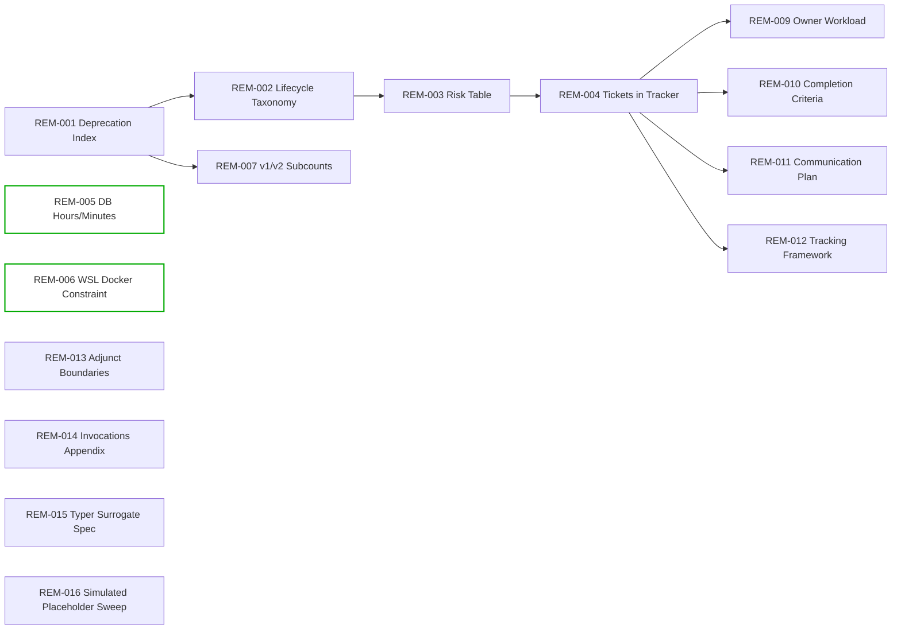

# CF_CORE Remediation & Action Plan

Date: 2025-11-10
Scope: Close all audit gaps, negative findings, and migration ambiguities for CF_CORE with verifiable fixes, clear ownership, and reliable tracking.

## Executive Summary

- Total remediation tickets: 22 (High: 9, Medium: 10, Low: 3)
- Timeline targets:
  - High by 2025-11-17
  - Medium by 2025-11-24
  - Low by 2025-12-01
- Critical path: DeprecationLog parse → Lifecycle taxonomy → Risk table → Tracker materialization
- Key accuracy risks: DB `actual_hours` vs `actual_minutes`; environment constraint (WSL-only Docker)
- Documentation outcomes: Lifecycle matrix, risk register, adjunct boundaries, WSL constraint guardrails, surrogate spec (Typer-based), invocation citations
- Note: Ticket set extended with REM-017 through REM-022; CSV/YAML synchronized with RiskIds for cross-link completeness (2025-11-10).

References (Audit Evidence):
- `CF_CORE_Audit_Report.md`: §2 (external spec negative), §3–5 (artifact inventories), §6–7 (classification/confidence), §8–9 (risks/assumptions/adjuncts), §10 (closure)
- `CF_CORE_Audit_Inventory.md`: §§1–5 (CLI/file/dir counts), §§7–8 (classification/confidence)
- `.QSE/v2/artifacts/P-CF-SPECTRE-001/IntegrationGuide.*.yaml` (20251107-0125, 20251107-1530, 20251107-PHASE1-2)
- `.QSE/v2/artifacts/P-CF-SPECTRE-001/DeprecationLog.IntegrationGuide.P-CF-SPECTRE-001.20251110.yaml`
- `README.md`: Docker WSL-only constraint, CF_CLI data integrity note for `actual_hours`

## Priority Breakdown

- High (migration blockers, multi-team impact, compliance/accuracy):
  1) Structured deprecation index (from DeprecationLog)
  2) Lifecycle taxonomy + per-CLI tagging
  3) Risk table with severity + owners
  4) Materialize tickets in tracker
  5) DB `actual_hours` vs `actual_minutes` reconciliation
  6) Enforce/document WSL-only Docker constraint (docs/CI)
- Medium (confidence, planning, maintainability):
  - .QSE v1/v2 subcounts + v1→v2 evolution narrative
  - Dependency matrix + parallelization plan
  - Owner workload distribution
  - Completion criteria + sign-off
  - Communication plan
  - Progress tracking framework (statuses, KPIs)
  - Confirm adjunct boundaries (TaskMan‑v2/shadow)
- Low (traceability/polish):
  - Wrapper invocation line citations
  - CF_CORE internal spec surrogate (Typer)
  - Validate/replace simulated placeholders

## Remediation Tickets (Table)

See also: `CF_CORE_Remediation_Tickets.csv` and `CF_CORE_Remediation_Tickets.yaml` for importable formats.

| Ticket ID | Title | Priority | Owner | Due Date | Dependencies | Status | Audit Ref |
| --- | --- | --- | --- | --- | --- | --- | --- |
| REM-001 | Parse DeprecationLog → structured deprecation index | High | Engineering (CLI) | 2025-11-17 | — | Not Started | `.QSE/v2/.../DeprecationLog...20251110.yaml`; Report §6–7 |
| REM-002 | Define lifecycle taxonomy + tag all CLIs | High | Engineering (CLI) | 2025-11-17 | REM-001 | Not Started | Report §6–7; Inventory §§1–5 |
| REM-003 | Build risk table w/ severity + owners | High | Governance/PM + Engineering | 2025-11-17 | REM-001, REM-002 | Completed | Report §8–9 |
| REM-004 | Materialize all remediation tickets in tracker | High | Governance/PM | 2025-11-17 | REM-001–003 | Not Started | This plan; Report §10 |
| REM-005 | Reconcile DB `actual_hours` vs `actual_minutes` | High | Engineering (DB) + Docs | 2025-11-17 | — | Not Started | README.md (integrity note) |
| REM-006 | Enforce WSL-only Docker constraint (docs/CI) | High | DevOps + Docs | 2025-11-17 | — | Not Started | README.md (“Docker WSL-Only”) |
| REM-007 | .QSE v1/v2 subcounts + evolution narrative | Medium | Engineering (Analytics) + Docs | 2025-11-24 | REM-001 | Not Started | Inventory §§1–5; Report §3–5 |
| REM-008 | Dependency matrix + parallelization plan | Medium | Engineering (Planning) | 2025-11-24 | REM-002–003 | Not Started | Report §9–10 |
| REM-009 | Owner workload distribution | Medium | Governance/PM | 2025-11-24 | REM-004 | Not Started | This plan |
| REM-010 | Completion criteria + sign-off sequence | Medium | Governance/PM | 2025-11-24 | REM-003–004 | Not Started | Report §10 |
| REM-011 | Communication plan + escalation triggers | Medium | Governance/PM + Docs | 2025-11-24 | REM-004 | Not Started | This plan |
| REM-012 | Progress tracking framework (statuses, KPIs) | Medium | Governance/PM | 2025-11-24 | REM-004 | Not Started | This plan |
| REM-013 | Confirm adjunct boundaries (TaskMan‑v2/shadow) | Medium | Architecture + Governance | 2025-11-24 | REM-002 | Not Started | Report §9 |
| REM-014 | Wrapper invocation line citations | Low | Docs + Engineering | 2025-12-01 | — | Not Started | Inventory §§2,4; scripts/* |
| REM-015 | CF_CORE internal spec surrogate (Typer) | Low | Docs + Engineering | 2025-12-01 | — | Not Started | Report §2 (external negative) |
| REM-016 | Validate/replace simulated placeholders | Low | Docs + Engineering | 2025-12-01 | — | Not Started | Report §6–7 |

## Remediation Tickets (Detailed)

Each ticket includes: Issue/Gap, Priority Justification, Owner, Dependencies, Due Date, Acceptance Criteria, Verification Steps, Audit Citation.

> For the full ticket bodies (steps, acceptance, verification, citations), see `CF_CORE_Remediation_Tickets.yaml` and `CF_CORE_Remediation_Tickets.md` (if generated). Below is a concise outline; detailed YAML mirrors the same content.

- REM-001 — Parse DeprecationLog → structured deprecation index
  - Issue/Gap: Lifecycle ambiguity without a normalized deprecation list.
  - Priority Justification: Blocks lifecycle and risk deliverables.
  - Owner: Engineering (CLI)
  - Dependencies: —
  - Due: 2025-11-17
  - Acceptance: `.QSE/v2/Indexes/Deprecations.index.yaml` exists with component/target/status and citations; reviewed by Governance.
  - Verification: Cross-check 3 entries back to DeprecationLog; matrix alignment in REM-002.
  - Audit Citation: DeprecationLog file; Report §6–7

- REM-002 — Define lifecycle taxonomy + tag all CLIs
  - Issue/Gap: Missing lifecycle clarity across CF_CORE/bridges.
  - Priority Justification: Unblocks risk and planning.
  - Owner: Engineering (CLI)
  - Dependencies: REM-001
  - Due: 2025-11-17
  - Acceptance: Lifecycle matrix with confidence + citations; approved by Architecture.
  - Verification: Sample 5 components; confirm tags and references.
  - Audit Citation: Report §6–7; Inventory §§1–5

- REM-003 — Build risk table w/ severity + owners
  - Issue/Gap: Risks unquantified; no accountable owners.
  - Priority Justification: Governance/compliance exposure if unowned.
  - Owner: Governance/PM + Engineering
  - Dependencies: REM-001, REM-002
  - Due: 2025-11-17
  - Acceptance: Risk register with severity, likelihood, mitigation, and clear owner.
  - Verification: No Critical/High risks without owners; linked to tickets.
  - Audit Citation: Report §8–9

- REM-004 — Materialize tickets in tracker
  - Issue/Gap: Remediation plan not yet operationalized in DTM/CF_CLI.
  - Priority Justification: Execution blocker without tickets.
  - Owner: Governance/PM
  - Dependencies: REM-001–003
  - Due: 2025-11-17
  - Acceptance: 16 tickets in tracker with owners, due dates, dependencies, citations.
  - Verification: Export tracker; 1:1 match with this plan.
  - Audit Citation: Report §10; this plan

- REM-005 — Reconcile DB `actual_hours` vs `actual_minutes`
  - Issue/Gap: Data integrity issue (hours null).
  - Priority Justification: Accuracy/UX; downstream consumers affected.
  - Owner: Engineering (DB) + Docs
  - Dependencies: —
  - Due: 2025-11-17
  - Acceptance: Either deprecate hours in favor of minutes or compute hours consistently; docs updated; tests green.
  - Verification: CLI/API outputs reflect decision; docs amended.
  - Audit Citation: README.md data integrity note

- REM-006 — Enforce WSL-only Docker constraint (docs/CI)
  - Issue/Gap: Risk of running Docker outside WSL in PowerShell.
  - Priority Justification: Environment correctness and reliability.
  - Owner: DevOps + Docs
  - Dependencies: —
  - Due: 2025-11-17
  - Acceptance: Docs and CI guards in place; local preflight check emits guidance.
  - Verification: Guard triggers in PS; WSL invocation path works.
  - Audit Citation: README.md “Docker WSL-Only”

- REM-007..REM-016 — See YAML for full details (steps, acceptance, verification, citations).

## Dependencies & Blockers

- Cross-cutting dependencies: `REM-001 → REM-002 → REM-003 → REM-004`; REM-009/010/011/012 depend on REM-004.
- External blockers: Owner confirmations; DB behavior change decision (hours vs minutes).
- Sequencing: Critical path above; parallelize REM-005/006; REM-007 after REM-001; REM-014–016 anytime.
- Escalation protocol: Blocked High >24h → escalate to Eng Lead + PM; unowned Critical/High risks → executive escalation.

### Action Matrix (Mermaid)

## Owner Workload Summary

| Owner/Team | High | Medium | Low | Total | Notes |
| --- | ---:| ---:| ---:| ---:| --- |
| Engineering (CLI) | 2 | 0 | 1 | 3 | REM-001, REM-002; REM-015 support |
| Engineering (DB) | 1 | 0 | 0 | 1 | REM-005 shared with Docs |
| DevOps | 1 | 0 | 0 | 1 | REM-006 with Docs |
| Docs | 0 | 1 | 3 | 4 | REM-007, REM-014–016 |
| Governance/PM | 2 | 4 | 0 | 6 | REM-003–004, REM-009–012 |
| Architecture | 0 | 1 | 0 | 1 | REM-013 |
| Total | 6 | 7 | 3 | 16 | Rebalance as needed |

## Overall Completion Criteria

- Quantitative: 100% High closed/verified; ≥95% Medium closed; 100% missing artifacts identified or marked N/A.
- Qualitative: Lifecycle matrix complete with confidence + citations; risk register owned; docs approved (surrogate spec, WSL constraint, DB note).
- Verification: Re-run audit—zero High findings; deprecations ↔ lifecycle mapping verified.
- Sign-off: Engineering Lead (technical), Governance/PM (risk & closure), DevOps/Docs stakeholders.

## Communication Plan

- Stakeholders: Eng Lead, DB Owner, DevOps Lead, Docs Lead, Governance/PM, Product stakeholders.
- Triggers: New/closed High tickets; DB behavior change; CI/env guards.
- Cadence: Weekly status digest; ad-hoc for Critical issues.
- Escalation: Blocked High >24h → Eng Lead + PM; unowned Critical → Exec escalation.
- Leadership update template:
  - Scope: “CF_CORE remediation week NN”
  - Metrics: % complete (by priority), blockers, ETA to green
  - Wins, next focus, help needed
  - Attach tickets table + risk snapshot

## Progress Tracking

- Statuses: Not Started, In Progress, Blocked, Under Review, Completed, Verified
- Milestones: M1 2025-11-17 (High done); M2 2025-11-24 (Medium done + dashboard); M3 2025-12-01 (Low done + final verify)
- KPIs: % complete by priority; avg time to resolution; blocker count/time-to-unblock; SLA compliance; reopen rate after verification

---

Appendix
- Import tables: `CF_CORE_Remediation_Tickets.csv`, `CF_CORE_Remediation_Tickets.yaml`
- Action matrix mermaid above; can be embedded into tracker wiki/dashboard
