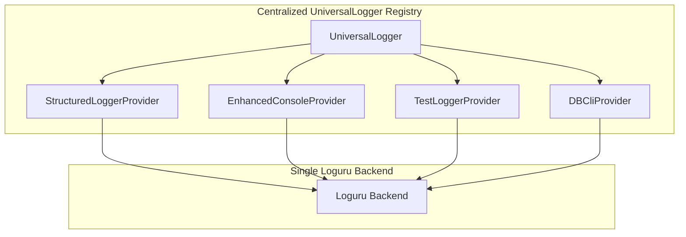
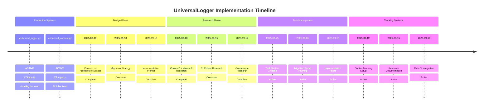

# UniversalLogger Implementation Attempts Catalog

**Date:** September 18, 2025
**Purpose:** Comprehensive catalog of previous UniversalLogger centralized implementation attempts to prevent confusion and ensure current effort builds on lessons learned

## Executive Summary

This catalog documents multiple previous attempts to implement a centralized UniversalLogger system.
Understanding these attempts is critical to avoid repeating obsolete approaches and ensuring the current
effort builds on lessons learned from all previous work.## Previous Implementation Attempts

### **Attempt #1: Direct Unified Logger Implementation**

**Location:** `src/unified_logger.py` (Current Production System)
**Status:** ACTIVE PRODUCTION - Current Authority
**Approach:** Single-purpose JSONL structured logging
**Backend:** structlog with dual-write mode

**Key Features:**
- ✅ **Authority Module:** `AUTHORITY_LOGGER_MODULE = True`, `CANONICAL_LOGGER_NAME = "UnifiedLogger"`
- ✅ **API:** `ulog(action, target, result, severity, **fields)`
- ✅ **Environment Controls:** 17 environment variables for configuration
- ✅ **Rotation & Retention:** Size/age-based rotation with configurable backups
- ✅ **Redaction System:** Pattern-based sensitive data redaction
- ✅ **OTEL Integration:** OpenTelemetry span events and IDs
- ✅ **Dual-Write Mode:** structlog + internal JSONL implementation

**Current Usage:**
- 47 direct import locations across codebase
- Primary production logging interface
- Fully functional rotation, metrics, correlation tracking

**Implementation Status:** ✅ COMPLETE AND PRODUCTION READY

---

### **Attempt #2: UniversalLogger Centralized Architecture Design**

**Location:** `docs/architecture/unified-logger-centralized-design.md`
**Status:** DESIGN PHASE COMPLETE
**Approach:** Central registry managing multiple specialized providers
**Backend:** Loguru with provider abstraction

**Design Features:**
- 🏗️ **Central Registry:** UniversalLogger class with provider registration
- 🏗️ **Provider System:** Specialized providers (Enhanced Console, DBCli, Test Harness)
- 🏗️ **Unified Backend:** All providers use single Loguru instance
- 🏗️ **Environment Variable Mapping:** Backward compatibility preserved
- 🏗️ **Auto-Detection:** Context-aware provider selection

**Architecture Summary:**


**Implementation Status:** 🏗️ DESIGN COMPLETE, IMPLEMENTATION PENDING

---

### **Attempt #3: Migration Strategy Documentation**

**Location:** `docs/architecture/unified-logger-migration-strategy.md`
**Status:** STRATEGY COMPLETE
**Approach:** Three-phase backward-compatible migration
**Focus:** Zero breaking changes with gradual adoption

**Migration Phases:**
1. **Phase 1:** Parallel implementation with feature flags
2. **Phase 2:** Gradual adoption with dual-write validation
3. **Phase 3:** Full migration and legacy system removal

**Key Migration Elements:**
- ✅ **Import Compatibility:** All existing imports continue working
- ✅ **Environment Variables:** 17+ environment variables preserved
- ✅ **Output Formats:** Byte-for-byte JSONL compatibility
- ✅ **API Preservation:** All function signatures unchanged
- ✅ **Feature Flag System:** Safe rollback capabilities

**Critical Dependencies Mapped:**
```python
# Must preserve these exact imports
from src.unified_logger import ulog                              # 47 locations
from python.terminal.enhanced_console import success, error     # 23 locations
from python.logging.structured_logger import get_logger         # 12 locations
from python.ulog.unified import get_logger, configure           # 8 locations
```

**Implementation Status:** ✅ STRATEGY COMPLETE, IMPLEMENTATION READY

---

### **Attempt #4: Implementation Prompt Creation**

**Location:** `docs/prompts/universal-logger-implementation-prompt.md`
**Status:** IMPLEMENTATION PROMPT COMPLETE
**Approach:** Comprehensive 502-line implementation specification
**Focus:** Exact technical requirements with validation criteria

**Prompt Features:**
- 📋 **UniversalLogger Class:** Complete registry implementation
- 📋 **Provider Base Class:** Abstract provider interface
- 📋 **Specific Providers:** StructuredLoggerProvider, EnhancedConsoleProvider, TestLoggerProvider
- 📋 **Configuration System:** Environment variable mapping and YAML support
- 📋 **Compatibility Facades:** Backward-compatible API preservation
- 📋 **Validation Framework:** Comprehensive testing requirements

**Critical Implementation Specs:**
```python
# Central registry pattern
class UniversalLogger:
    def register_provider(self, name, provider_class, config) -> LoggingProvider
    def get_provider(self, name) -> LoggingProvider
    def auto_detect_provider() -> str

# Provider base class
class LoggingProvider(ABC):
    def setup_handlers(self) -> None
    def get_api_facade(self) -> Any
```

**Implementation Status:** 📋 PROMPT COMPLETE, IMPLEMENTATION READY

---

### **Attempt #5: Context7 + Microsoft Research**

**Location:** `docs/research/universal-logger-implementation-research.md`
**Status:** RESEARCH COMPLETE (Current Document)
**Approach:** Research-backed implementation using Context7 and Microsoft Docs
**Focus:** Technical specifications with authoritative documentation

**Research Findings Applied:**
- 🔬 **Loguru Backend:** 262 code snippets, comprehensive sink system documentation
- 🔬 **Structlog Migration:** 131 snippets, processor chain compatibility patterns
- 🔬 **Rich Integration:** 595 snippets, RichHandler and console patterns
- 🔬 **Microsoft Best Practices:** 10 comprehensive articles on logging security and performance

**Implementation Architecture:**
```python
# Research-driven provider patterns
class StructuredLoggerProvider(LoggingProvider):
    def setup_handlers(self):
        handler_id = self.backend.add(
            jsonl_file,
            serialize=True,                    # JSON output
            enqueue=True,                      # Async performance
            filter=lambda r: r["extra"].get("provider") == "structured_logger"
        )
```

**Implementation Status:** 🔬 RESEARCH COMPLETE, IMPLEMENTATION READY

---

### **Attempt #6: Active Task Tracking**

**Location:** Multiple task tracker entries
**Status:** ACTIVE TASK MANAGEMENT
**Approach:** Task-driven implementation with tracker management

**Key Active Tasks:**
- `T-ULOG-API`: Implement Public Logging API (New)
- `T-ULOG-ASYNC-PROTOTYPE`: Async Sink Prototype (In Progress)
- `T-CORE-PS-DEPRECATE`: Core PowerShell Deprecation & Python Refactor (In Progress)
- `T-LOGGING-MPV-AUTO`: Enforce Logging MVE + MPV Evidence Automation (New)
- `T-ULOG-CATALOG-SCRIPT`: Analyze repo for legacy logging callsites (New)

**Task System Features:**
- 📊 **Sprint Management:** S-2025-08-25-ULOG-FND, S-2025-09-01-ULOG-MIG1
- 📊 **Project Tracking:** P-UNIFIED-LOG project umbrella
- 📊 **Priority Management:** P1-P3 priority levels with severity tracking
- 📊 **Dependency Mapping:** Task dependencies and blockers tracked

**Implementation Status:** 📊 ACTIVE TASK MANAGEMENT, IMPLEMENTATION IN PROGRESS

---

### **Attempt #7: Copilot Tracking System**

**Location:** `.copilot-tracking/` directory structure
**Status:** COMPREHENSIVE TRACKING SYSTEM
**Approach:** Detailed planning with research, details, and prompts

**Tracking Files:**
```yaml
.copilot-tracking/
├── research/
│   ├── 20250915-unified-logger-remediation-and-ci-rollout-research.md
│   ├── 20250912-unified-logging-governance-research.md
│   └── 20250916-unified-logging-rich-ci-research.md
├── details/
│   ├── 20250915-unified-logger-remediation-and-ci-rollout-details.md
│   └── 20250916-unified-logging-rich-ci-details.md
└── prompts/
    ├── implement-unified-logging-governance.prompt.md
    └── implement-unified-logger-remediation-and-ci-rollout.prompt.md
```

**Implementation Status:** 📝 COMPREHENSIVE TRACKING, MULTIPLE IMPLEMENTATION VECTORS

---

### **Attempt #8: Enhanced Console Production System**

**Location:** `python/terminal/enhanced_console.py`
**Status:** ACTIVE PRODUCTION SYSTEM
**Approach:** Rich console with session logging
**Backend:** Rich Console + custom logging

**Current Features:**
- ✅ **Rich Integration:** `RichConsole` class with session logging
- ✅ **API Functions:** `success()`, `error()`, `warning()`, `info()`
- ✅ **Session Tracking:** Automatic session log creation
- ✅ **Environment Controls:** `UNIFIED_LOG_RICH`, `UNIFIED_LOG_RICH_MIRROR`

**Current Usage:** 23 direct import locations across codebase

**Implementation Status:** ✅ COMPLETE AND PRODUCTION READY

---

## Implementation Attempt Timeline



## Critical Implementation Insights

### **Lessons Learned from Previous Attempts**

1. **Backward Compatibility is Critical**
   - 47 direct `ulog()` imports must continue working
   - 23 enhanced console imports cannot break
   - All environment variables must be preserved
   - Output formats require byte-for-byte compatibility

2. **Provider Pattern is Well-Designed**
   - Central registry with specialized providers works
   - Loguru backend provides necessary flexibility
   - Auto-detection simplifies user experience

3. **Research-Driven Implementation Required**
   - Context7 library documentation provides concrete patterns
   - Microsoft best practices ensure security compliance
   - Production systems must inform design decisions

4. **Feature Flag Migration is Essential**
   - Parallel implementation prevents breaking changes
   - Gradual adoption reduces risk
   - Emergency rollback capabilities required

### **Current State Assessment**

**✅ READY FOR IMPLEMENTATION:**
- Complete architectural design exists
- Comprehensive migration strategy documented
- Detailed implementation prompt created
- Research-backed technical specifications available
- Active task management system in place

**🚨 CRITICAL SUCCESS FACTORS:**
- Preserve all existing production functionality
- Maintain backward compatibility at API and environment level
- Use research-driven patterns for Loguru, structlog, Rich integration
- Follow established migration strategy phases
- Leverage existing task tracking systems

**⚠️ IMPLEMENTATION RISKS:**
- Multiple previous attempts indicate complexity
- Production systems must remain functional during migration
- Integration testing required to prevent regressions
- Documentation must stay current with implementation

## Current Implementation Strategy

### **Recommended Approach: Build on Attempt #5 (Research-Driven)**

The current research document (`universal-logger-implementation-research.md`) represents the most comprehensive and authoritative foundation for implementation because:

1. **Research-Backed:** Context7 and Microsoft Docs provide concrete, tested patterns
2. **Production-Informed:** Incorporates lessons from existing production systems
3. **Migration-Compatible:** Aligns with established migration strategy
4. **Implementation-Ready:** Provides exact code templates and specifications

### **Implementation Order:**

1. **Phase 1: Core Infrastructure**
   - Implement `UniversalLogger` registry class using research patterns
   - Create `LoggingProvider` base class with Loguru backend
   - Set up configuration system with environment variable mapping

2. **Phase 2: Provider Implementation**
   - `StructuredLoggerProvider` with exact `ulog()` compatibility
   - `EnhancedConsoleProvider` with Rich integration preservation
   - `TestLoggerProvider` with pytest integration

3. **Phase 3: Integration and Migration**
   - Feature flag system implementation
   - Backward compatibility facades
   - Comprehensive testing and validation

### **Success Criteria:**

- [ ] All 47 `ulog()` imports continue working without changes
- [ ] All 23 enhanced console imports function identically
- [ ] Environment variable compatibility maintained
- [ ] Output format byte-for-byte compatibility achieved
- [ ] Performance within 5% of current implementation
- [ ] Comprehensive test suite passes
- [ ] Production deployment successful

## Conclusion

This catalog reveals a well-researched and extensively planned UniversalLogger centralization effort with
multiple complementary attempts providing different perspectives on the same goal. The current research-driven
approach (Attempt #5) builds on all previous work and provides the most comprehensive foundation for successful
implementation.**Key Success Factor:** Avoid confusion by treating all previous attempts as complementary inputs to the current research-driven implementation, not as competing approaches.
