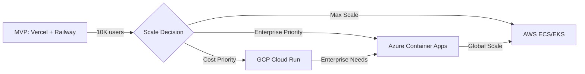

# Cloud Hosting Decision Analysis for TaskMan-v2

**Date**: 2025-12-27  
**Status**: Complete  
**Related**: [STACK_COMPATIBILITY_ANSWERS.md](STACK_COMPATIBILITY_ANSWERS.md)

---

## Executive Summary

| Scenario | Recommendation | Rationale |
|----------|---------------|-----------|
| **MVP (Fastest)** | Vercel + Railway | Same-day deployment, zero config, best DX |
| **Scale (Growth)** | GCP Cloud Run + Cloud SQL | Auto-scaling, cost-efficient, enterprise-ready |
| **Enterprise (Compliance)** | Azure Container Apps + PostgreSQL | AD integration, enterprise agreements, compliance |

---

## Stack Requirements (From STACK_COMPATIBILITY_ANSWERS.md)

| Component | Technology | Notes |
|-----------|------------|-------|
| Frontend | React 19 + Vite SPA | Static hosting suitable |
| Backend | FastAPI (Python) | Containerizable |
| Database | PostgreSQL | Managed preferred |
| CI/CD | GitHub Actions | Native integration needed |
| Container | Docker/K8s ready | All options support |
| Use Case | Internal enterprise tool | ~100-1000 users |
| Team | Python expert, TypeScript strong | Key skill match factor |

---

## Decision Matrix

**Scoring: 1 (Poor) → 5 (Excellent)**

| Dimension | Weight | Vercel+Railway | Azure | AWS | GCP | Self-hosted |
|-----------|--------|----------------|-------|-----|-----|-------------|
| **Setup Complexity** | 20% | ⭐⭐⭐⭐⭐ (5) | ⭐⭐⭐ (3) | ⭐⭐ (2) | ⭐⭐⭐⭐ (4) | ⭐⭐⭐ (3) |
| **Cost Efficiency** | 20% | ⭐⭐⭐⭐ (4) | ⭐⭐⭐ (3) | ⭐⭐ (2) | ⭐⭐⭐⭐ (4) | ⭐⭐⭐⭐⭐ (5) |
| **CI/CD Integration** | 15% | ⭐⭐⭐⭐⭐ (5) | ⭐⭐⭐⭐ (4) | ⭐⭐⭐ (3) | ⭐⭐⭐⭐ (4) | ⭐⭐ (2) |
| **PostgreSQL Options** | 15% | ⭐⭐⭐⭐ (4) | ⭐⭐⭐⭐⭐ (5) | ⭐⭐⭐⭐⭐ (5) | ⭐⭐⭐⭐⭐ (5) | ⭐⭐ (2) |
| **Scaling Flexibility** | 15% | ⭐⭐⭐ (3) | ⭐⭐⭐⭐ (4) | ⭐⭐⭐⭐⭐ (5) | ⭐⭐⭐⭐⭐ (5) | ⭐⭐ (2) |
| **Team Skill Match** | 15% | ⭐⭐⭐⭐⭐ (5) | ⭐⭐⭐⭐ (4) | ⭐⭐⭐ (3) | ⭐⭐⭐⭐ (4) | ⭐⭐⭐⭐ (4) |
| **Weighted Score** | 100% | **4.35** | **3.80** | **3.25** | **4.35** | **3.05** |

### Winner by Use Case

- **Developer Experience**: Vercel + Railway 🥇
- **Enterprise Features**: Azure 🥇
- **Pure Scaling**: AWS or GCP 🥇
- **Cost Minimization**: Self-hosted 🥇

---

## Cost Comparison (Monthly Estimates)

**Assumptions**: Small team, ~1000 active users, 5GB database, moderate traffic

| Option | Frontend | Backend | Database | Total/Month |
|--------|----------|---------|----------|-------------|
| **Vercel + Railway** | $0-20 | $5-20 | $5-15 | **$10-55** |
| **Azure** | $0-13 | $13-50 | $12-50 | **$25-113** |
| **AWS** | $0-20 | $30-100 | $15-50 | **$45-170** |
| **GCP** | $0-10 | $0-50 | $10-40 | **$10-100** |
| **Self-hosted** | Included | Included | Included | **$5-25** |

### Cost Breakdown Notes

**Vercel + Railway**:
- Vercel: Free tier (100GB/month), Pro $20/month
- Railway: $5/month min, Postgres included
- Railway Postgres: $5-15/month based on usage

**Azure (App Service + Container Apps + PostgreSQL Flexible)**:
- App Service Basic B1: ~$13/month
- Container Apps: Pay-per-use ~$0.40/vCPU-hour
- PostgreSQL Flexible (B1ms): ~$12/month minimum
- Virtual Network: Free (basic)

**AWS (Amplify + ECS Fargate + RDS)**:
- Amplify: Free tier, then ~$0.01/build minute
- ECS Fargate: ~$0.04/vCPU-hour + ~$0.0044/GB-hour
- RDS PostgreSQL: db.t3.micro ~$15/month minimum

**GCP (Cloud Run + Cloud SQL)**:
- Cloud Run: Free tier (2M requests/month), then pay-per-use
- Cloud SQL: ~$10/month minimum (shared core)
- Scales to zero when not in use ✨

**Self-hosted (DigitalOcean/Linode/Vultr)**:
- Basic VPS: $5-12/month
- PostgreSQL: Self-managed (included in VPS)
- Additional: Backup storage ~$1-5/month

---

## Detailed Option Analysis

### Option 1: Vercel (Frontend) + Railway (Backend + DB)

**Architecture**:
```
┌─────────────────┐     ┌─────────────────┐     ┌─────────────────┐
│   Vercel CDN    │────▶│  Railway API    │────▶│ Railway Postgres│
│  (React 19 SPA) │     │  (FastAPI)      │     │   (Managed)     │
└─────────────────┘     └─────────────────┘     └─────────────────┘
         │                      │
         └──────────────────────┴─────▶ GitHub Actions (optional)
```

**Pros**:
- ✅ **Fastest Setup**: Deploy in <1 hour
- ✅ **Zero Config**: Git-push deploys work out of box
- ✅ **Developer Experience**: Best-in-class for small teams
- ✅ **PostgreSQL Included**: Railway provides managed Postgres
- ✅ **GitHub Native**: No Actions config needed (optional enhancement)
- ✅ **Preview Deployments**: Every PR gets a preview URL

**Cons**:
- ⚠️ **Scaling Limits**: May need migration at >10K users
- ⚠️ **Enterprise Features**: Limited SSO/audit capabilities
- ⚠️ **Vendor Lock-in Risk**: Railway is smaller company
- ⚠️ **No Azure AD Integration**: Manual auth setup needed

**GitHub Actions Integration**:
```yaml
# .github/workflows/deploy.yml (optional - can use native git-push)
name: Deploy to Railway
on:
  push:
    branches: [main]
jobs:
  deploy:
    runs-on: ubuntu-latest
    steps:
      - uses: actions/checkout@v4
      - uses: railway-app/railway-deploy@v1
        with:
          token: ${{ secrets.RAILWAY_TOKEN }}
```

**When to Choose**: MVP, rapid prototyping, small teams, developer-focused tools

---

### Option 2: Azure (App Service + Container Apps + PostgreSQL Flexible)

**Architecture**:
```
┌─────────────────┐     ┌─────────────────┐     ┌─────────────────┐
│ Azure Static    │────▶│ Container Apps  │────▶│  PostgreSQL     │
│ Web Apps (CDN)  │     │ (FastAPI)       │     │  Flexible Server│
└─────────────────┘     └─────────────────┘     └─────────────────┘
         │                      │                       │
         └──────────────────────┴───────────────────────┘
                               VNet (Private Network)
```

**Pros**:
- ✅ **Enterprise Ready**: Azure AD, RBAC, compliance certifications
- ✅ **GitHub Actions**: Excellent integration via `azure/container-apps-deploy-action`
- ✅ **Managed PostgreSQL**: Flexible Server with HA options
- ✅ **Auto-Scaling**: Container Apps scales automatically
- ✅ **VNet Integration**: Secure by default
- ✅ **azd CLI**: Fast setup with `azd up`

**Cons**:
- ⚠️ **Complexity**: More services to manage
- ⚠️ **Cost Creep**: Easy to provision unused resources
- ⚠️ **Learning Curve**: Azure portal can be overwhelming
- ⚠️ **Startup Time**: Container Apps cold starts (~2-5s)

**GitHub Actions Integration**:
```yaml
# .github/workflows/azure-deploy.yml
name: Deploy to Azure Container Apps
on:
  push:
    branches: [main]
jobs:
  deploy:
    runs-on: ubuntu-latest
    steps:
      - uses: actions/checkout@v4
      - uses: azure/login@v1
        with:
          creds: ${{ secrets.AZURE_CREDENTIALS }}
      - uses: azure/container-apps-deploy-action@v1
        with:
          appSourcePath: ${{ github.workspace }}/backend
          acrName: myregistry
          containerAppName: taskman-api
          resourceGroup: taskman-rg
```

**When to Choose**: Enterprise requirements, Azure AD auth needed, existing Azure investment

---

### Option 3: AWS (Amplify + ECS Fargate + RDS)

**Architecture**:
```
┌─────────────────┐     ┌─────────────────┐     ┌─────────────────┐
│   AWS Amplify   │────▶│   ECS Fargate   │────▶│   RDS Postgres  │
│   (React SPA)   │     │   (FastAPI)     │     │   (Managed)     │
└─────────────────┘     └─────────────────┘     └─────────────────┘
         │                      │                       │
    CloudFront CDN          ALB + VPC              Multi-AZ (opt)
```

**Pros**:
- ✅ **Infinite Scale**: AWS handles massive workloads
- ✅ **RDS Maturity**: Most mature managed PostgreSQL
- ✅ **Service Ecosystem**: Every tool you might need
- ✅ **Multi-Region**: Easy geographic distribution

**Cons**:
- ⚠️ **Complexity**: Many services to configure
- ⚠️ **Cost**: Generally most expensive option
- ⚠️ **Learning Curve**: Steep, even for experienced devs
- ⚠️ **IAM Complexity**: Credential management is complex
- ⚠️ **Over-Engineering Risk**: Easy to build too much

**GitHub Actions Integration**:
```yaml
# .github/workflows/aws-deploy.yml
name: Deploy to AWS
on:
  push:
    branches: [main]
jobs:
  deploy:
    runs-on: ubuntu-latest
    steps:
      - uses: actions/checkout@v4
      - uses: aws-actions/configure-aws-credentials@v4
        with:
          aws-access-key-id: ${{ secrets.AWS_ACCESS_KEY_ID }}
          aws-secret-access-key: ${{ secrets.AWS_SECRET_ACCESS_KEY }}
          aws-region: us-east-1
      - uses: aws-actions/amazon-ecr-login@v2
      - run: |
          docker build -t taskman-api .
          docker push $ECR_REGISTRY/taskman-api:${{ github.sha }}
      # ECS deployment requires additional task definition updates
```

**When to Choose**: High-scale requirements, existing AWS investment, need for specific AWS services

---

### Option 4: GCP (Cloud Run + Cloud SQL)

**Architecture**:
```
┌─────────────────┐     ┌─────────────────┐     ┌─────────────────┐
│  Cloud Storage  │────▶│   Cloud Run     │────▶│   Cloud SQL     │
│  + CDN (SPA)    │     │   (FastAPI)     │     │   (PostgreSQL)  │
└─────────────────┘     └─────────────────┘     └─────────────────┘
         │                      │                       │
    Global CDN           Auto-scaling 0→∞        Private IP (VPC)
```

**Pros**:
- ✅ **Scale to Zero**: Pay nothing when idle
- ✅ **Auto-Scaling**: Handles traffic spikes automatically
- ✅ **Simple Deployment**: `gcloud run deploy` is straightforward
- ✅ **Cloud SQL**: Enterprise-grade PostgreSQL
- ✅ **Python-Friendly**: Google's primary backend language
- ✅ **Cost-Efficient at Scale**: Better pricing than AWS for most workloads

**Cons**:
- ⚠️ **Cold Starts**: ~1-3s cold start for Cloud Run
- ⚠️ **VPC Connector Cost**: Private networking adds ~$7/month
- ⚠️ **Less Enterprise Presence**: Fewer enterprise sales/support
- ⚠️ **Console UX**: GCP Console less intuitive than Azure portal

**GitHub Actions Integration**:
```yaml
# .github/workflows/gcp-deploy.yml
name: Deploy to Cloud Run
on:
  push:
    branches: [main]
jobs:
  deploy:
    runs-on: ubuntu-latest
    steps:
      - uses: actions/checkout@v4
      - uses: google-github-actions/auth@v2
        with:
          credentials_json: ${{ secrets.GCP_SA_KEY }}
      - uses: google-github-actions/setup-gcloud@v2
      - name: Deploy to Cloud Run
        run: |
          gcloud run deploy taskman-api \
            --source . \
            --region us-central1 \
            --allow-unauthenticated
```

**When to Choose**: Cost-conscious scaling, Python expertise, need auto-scaling to zero

---

### Option 5: Self-Hosted (Docker Compose on VM)

**Architecture**:
```
┌─────────────────────────────────────────────────────────┐
│                    VPS (DigitalOcean/Linode)            │
│  ┌─────────────┐  ┌─────────────┐  ┌─────────────┐     │
│  │   Nginx     │──│  FastAPI    │──│  PostgreSQL │     │
│  │   (SPA+SSL) │  │  Container  │  │  Container  │     │
│  └─────────────┘  └─────────────┘  └─────────────┘     │
│                         Docker Compose                   │
└─────────────────────────────────────────────────────────┘
```

**Pros**:
- ✅ **Lowest Cost**: $5-25/month for everything
- ✅ **Full Control**: Complete customization
- ✅ **No Vendor Lock-in**: Standard Docker
- ✅ **Simple Architecture**: Everything on one machine
- ✅ **Privacy**: Data never leaves your server

**Cons**:
- ⚠️ **Ops Burden**: Backups, security patches, monitoring
- ⚠️ **No Auto-Scaling**: Manual scaling only
- ⚠️ **Single Point of Failure**: Unless you set up HA
- ⚠️ **CI/CD Complexity**: Must build deployment scripts
- ⚠️ **SSL/Security**: Manual Let's Encrypt setup

**GitHub Actions Integration**:
```yaml
# .github/workflows/deploy-self-hosted.yml
name: Deploy to VPS
on:
  push:
    branches: [main]
jobs:
  deploy:
    runs-on: ubuntu-latest
    steps:
      - uses: actions/checkout@v4
      - name: Build and push to registry
        run: |
          docker build -t ghcr.io/${{ github.repository }}/api:${{ github.sha }} .
          echo ${{ secrets.GITHUB_TOKEN }} | docker login ghcr.io -u ${{ github.actor }} --password-stdin
          docker push ghcr.io/${{ github.repository }}/api:${{ github.sha }}
      - name: Deploy via SSH
        uses: appleboy/ssh-action@v1
        with:
          host: ${{ secrets.VPS_HOST }}
          username: deploy
          key: ${{ secrets.VPS_SSH_KEY }}
          script: |
            cd /opt/taskman
            docker compose pull
            docker compose up -d
```

**When to Choose**: Maximum cost savings, simple ops environment, strong DevOps skills

---

## Recommendations

### 🏆 Best for MVP: Vercel + Railway

**Why**: Fastest path to production with minimal configuration.

**Timeline**: Same-day deployment possible

**Setup Steps**:
1. Connect GitHub repo to Vercel (frontend) → Automatic
2. Connect GitHub repo to Railway (backend) → Automatic
3. Add PostgreSQL service in Railway → 2 clicks
4. Configure environment variables → 10 minutes
5. **Total: <2 hours to production**

**First 90 Days Cost**: ~$30-50/month

---

### 🚀 Best for Scale: GCP Cloud Run + Cloud SQL

**Why**: Best auto-scaling with cost efficiency. Scales from zero to millions.

**Migration Trigger**: When you need:
- >10,000 active users
- Sub-second cold start requirements
- Multi-region deployment
- Enterprise SLAs

**Setup Steps**:
1. Create GCP project + enable APIs
2. Build Docker image → push to Artifact Registry
3. Deploy Cloud Run service
4. Create Cloud SQL instance
5. Configure VPC connector for private DB access
6. Set up GitHub Actions workflow
7. **Total: 4-8 hours for experienced team**

**At Scale Cost**: ~$100-300/month for 10K users

---

### 🏢 Best for Enterprise: Azure Container Apps

**Why**: Best enterprise integration, especially with Microsoft ecosystem.

**Choose Azure If**:
- Organization has Azure Enterprise Agreement
- Need Azure AD/Entra for authentication
- Compliance requirements (SOC 2, HIPAA, FedRAMP)
- Hybrid cloud with on-premises resources
- Existing Azure DevOps pipelines

**Key Azure Advantage**: 
Microsoft provides an official FastAPI + PostgreSQL tutorial with one-command deployment:
```bash
azd init --template msdocs-fastapi-postgresql-sample-app
azd up
```

---

## Migration Path: MVP → Scale



### Phase 1: MVP on Vercel + Railway (0-6 months)
- **Trigger**: Project kickoff
- **Effort**: 2-4 hours
- **Cost**: ~$35/month

### Phase 2: Migrate to Cloud Platform (6-18 months)
- **Trigger**: >5,000 users OR enterprise requirements
- **Target**: GCP Cloud Run (recommended) or Azure
- **Effort**: 2-3 days
- **Migration Steps**:
  1. Export PostgreSQL data from Railway
  2. Import to Cloud SQL/Azure PostgreSQL
  3. Update Docker image for Cloud Run/Container Apps
  4. Configure GitHub Actions for new platform
  5. Update DNS/CDN configuration
  6. Test thoroughly, then cutover

### Phase 3: Enterprise Scale (18+ months)
- **Trigger**: >50,000 users OR multi-region requirement
- **Target**: GKE/AKS (full Kubernetes)
- **Effort**: 1-2 weeks
- **Key Changes**:
  - Convert Docker Compose → Kubernetes manifests
  - Add ingress controllers, service mesh
  - Implement GitOps with ArgoCD/Flux
  - Multi-region database replication

---

## Decision Checklist

Use this checklist to validate your hosting choice:

### MVP Phase Checklist
- [ ] Can deploy from GitHub in <1 hour?
- [ ] Has managed PostgreSQL option?
- [ ] Fits within $50/month budget?
- [ ] Team can debug without cloud expertise?
- [ ] Preview deployments available for PRs?

**Winner: Vercel + Railway** ✅

### Scale Phase Checklist
- [ ] Supports auto-scaling to zero?
- [ ] Handles 10,000+ concurrent users?
- [ ] Cost-efficient at scale?
- [ ] GitHub Actions integration documented?
- [ ] Has enterprise SLA options?

**Winner: GCP Cloud Run** ✅

### Enterprise Phase Checklist
- [ ] Azure AD/SAML integration?
- [ ] Compliance certifications (SOC 2, etc.)?
- [ ] Private networking/VPC support?
- [ ] Enterprise support available?
- [ ] Multi-region redundancy?

**Winner: Azure** ✅

---

## Appendix: PostgreSQL Feature Comparison

| Feature | Railway | Azure Flex | RDS | Cloud SQL | Self-hosted |
|---------|---------|------------|-----|-----------|-------------|
| **Auto-backups** | ✅ Daily | ✅ Configurable | ✅ Configurable | ✅ Configurable | ❌ Manual |
| **Point-in-time** | ❌ | ✅ | ✅ | ✅ | ❌ Manual |
| **Read replicas** | ❌ | ✅ | ✅ | ✅ | ❌ Manual |
| **High Availability** | ❌ | ✅ Optional | ✅ Multi-AZ | ✅ Regional | ❌ Manual |
| **Connection pooling** | ✅ | ✅ | ✅ | ✅ | ❌ Manual |
| **SSL/TLS** | ✅ | ✅ | ✅ | ✅ | ❌ Manual |
| **Min cost** | $5/month | $12/month | $15/month | $10/month | $0 |

---

## References

- [Azure FastAPI + PostgreSQL Tutorial](https://learn.microsoft.com/en-us/azure/app-service/tutorial-python-postgresql-app-fastapi)
- [Azure Container Apps + GitHub Actions](https://learn.microsoft.com/en-us/azure/container-apps/github-actions)
- [Railway Documentation](https://docs.railway.app/)
- [Vercel Documentation](https://vercel.com/docs)
- [GCP Cloud Run Documentation](https://cloud.google.com/run/docs)
- [AWS Amplify Documentation](https://docs.amplify.aws/)

---

**Document Status**: Complete ✅  
**Decision Required**: Select hosting strategy based on current phase  
**Recommended**: Start with **Vercel + Railway** for MVP, plan **GCP Cloud Run** migration path
