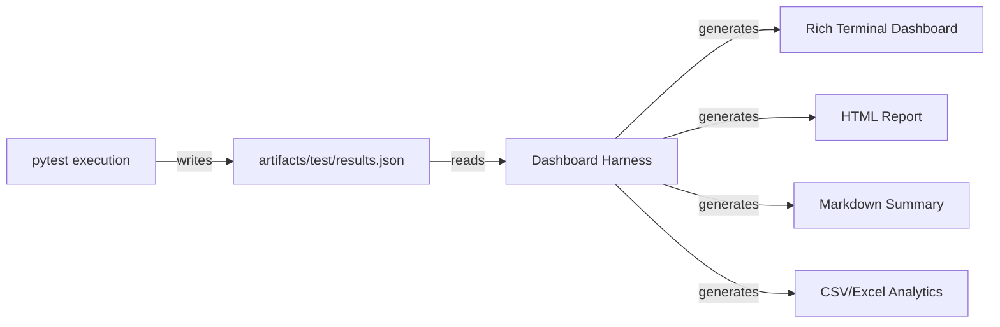

# PyTest Rich Dashboard Harness - Architecture Plan

**Status**: PLANNED  
**Priority**: MEDIUM (Post-JSON Implementation)  
**Created**: 2025-11-29  
**Authority**: ContextForge Work Codex - "Best Tool for the Context" + Separation of Concerns

---

## Purpose

Create a **separate Python tool** that reads pytest JSON output files and generates Rich-based terminal dashboards, HTML reports, and visual summaries. This separates data generation (pytest) from presentation (dashboard harness), enabling:

- **AI-friendly structured data** from pytest
- **Multiple visualization strategies** from same JSON source
- **Reprocessable test results** without re-running tests
- **Flexible dashboard customization** without pytest plugin conflicts

---

## Architecture

### Data Flow



### Separation of Concerns

| Component | Responsibility | Output Format |
|-----------|---------------|---------------|
| **pytest** | Execute tests, collect data | `results.json` (structured) |
| **pytest-json-report** | Serialize test results | Comprehensive JSON |
| **Dashboard Harness** | Read JSON, generate visuals | Rich Console, HTML, MD, CSV |
| **User** | Configure dashboards | YAML/TOML config files |

---

## JSON Input Schema

Based on `pytest-json-report` output structure:

```json
{
  "created": 1701234567.89,
  "duration": 45.23,
  "exitcode": 0,
  "root": "/path/to/project",
  "environment": {
    "Python": "3.12.9",
    "Platform": "Windows-10",
    "Packages": {"pytest": "8.2.0"}
  },
  "summary": {
    "collected": 150,
    "passed": 145,
    "failed": 3,
    "skipped": 2,
    "total": 150
  },
  "tests": [
    {
      "nodeid": "tests/test_example.py::test_function",
      "outcome": "passed",
      "duration": 0.123,
      "setup": {"duration": 0.001},
      "call": {"duration": 0.122},
      "teardown": {"duration": 0.0}
    }
  ]
}
```

**Key Fields for Dashboard**:
- `summary`: Pass/fail/skip counts
- `duration`: Total execution time
- `tests[].outcome`: Individual test results
- `tests[].duration`: Performance analysis
- `environment`: Context metadata

---

## Dashboard Harness Features

### Phase 1: Core Dashboard (MVP)

**Command**: `python dashboard_harness.py artifacts/test/results.json`

**Output** (Rich Console):

```
╔═══════════════════════════════════════════════════════════════╗
║               PyTest Results Dashboard                        ║
╠═══════════════════════════════════════════════════════════════╣
║ Status: ✅ PASSED (145/150 tests)                            ║
║ Duration: 45.2s                                               ║
║ Environment: Python 3.12.9 on Windows-10                     ║
╠═══════════════════════════════════════════════════════════════╣
║ Summary:                                                      ║
║   ✅ Passed:  145 (96.7%)                                    ║
║   ❌ Failed:    3 (2.0%)                                     ║
║   ⏭️  Skipped:  2 (1.3%)                                     ║
╠═══════════════════════════════════════════════════════════════╣
║ Failed Tests:                                                 ║
║   ❌ tests/test_auth.py::test_invalid_token                  ║
║   ❌ tests/test_db.py::test_connection_pool                  ║
║   ❌ tests/test_api.py::test_rate_limiting                   ║
╠═══════════════════════════════════════════════════════════════╣
║ Slowest Tests:                                                ║
║   🐌 tests/test_integration.py::test_e2e_flow - 12.3s        ║
║   🐌 tests/test_db.py::test_migration - 8.7s                 ║
║   🐌 tests/test_api.py::test_bulk_import - 5.4s              ║
╚═══════════════════════════════════════════════════════════════╝
```

**Features**:
- Color-coded status (green=passed, red=failed, yellow=skipped)
- Pass/fail percentages
- Top 10 slowest tests
- Failed test list with nodeids
- Environment metadata

---

### Phase 2: HTML Report Generation

**Command**: `python dashboard_harness.py artifacts/test/results.json --html artifacts/dashboard.html`

**Output**: Self-contained HTML file with:
- Interactive charts (pass/fail pie chart, duration histogram)
- Sortable test table (by status, duration, name)
- Expandable stack traces for failures
- Search/filter functionality
- Responsive design for mobile

**Technologies**:
- `rich` for HTML generation (built-in HTML export)
- OR `jinja2` templates with embedded CSS/JS
- Chart.js for interactive visualizations

---

### Phase 3: Advanced Analytics

**Command**: `python dashboard_harness.py artifacts/test/results.json --analytics`

**Features**:

1. **Trend Analysis**:
   - Compare current run vs. previous runs
   - Pass rate over time (requires historical JSON files)
   - Performance regression detection

2. **Test Organization Analysis**:
   - Tests by module/package
   - Test duration distribution
   - Fixture usage statistics

3. **Coverage Integration**:
   - Read `coverage.json` alongside `results.json`
   - Show coverage % per module
   - Identify untested code paths

4. **Export Formats**:
   - CSV: `artifacts/test_results.csv` for Excel/BI tools
   - Markdown: `artifacts/TEST_SUMMARY.md` for documentation
   - JSON: `artifacts/analytics.json` for programmatic access

---

### Phase 4: Configuration System

**File**: `.pytest-dashboard.yaml`

```yaml
dashboard:
  theme: dark  # dark | light | auto
  show_passed: false  # Hide passed tests for focus on failures
  max_slowest: 20  # Show top 20 slowest instead of 10
  
html:
  template: custom_template.html.j2
  embed_charts: true
  responsive: true

analytics:
  compare_previous: true
  history_path: artifacts/test/history/
  regression_threshold: 1.5  # Flag tests >1.5x slower

export:
  csv: artifacts/test_results.csv
  markdown: docs/TEST_SUMMARY.md
  json: artifacts/analytics.json
```

**Override Example**:
```bash
python dashboard_harness.py results.json --theme light --max-slowest 5
```

---

## Implementation Plan

### File Structure

```
cli/python/dashboard_harness/
├── __init__.py
├── __main__.py              # CLI entry point
├── parser.py                # JSON parsing from pytest-json-report
├── renderers/
│   ├── __init__.py
│   ├── rich_console.py      # Rich terminal dashboard
│   ├── html_report.py       # HTML report generator
│   ├── markdown.py          # Markdown summary
│   └── csv_export.py        # CSV analytics export
├── analytics/
│   ├── __init__.py
│   ├── trends.py            # Historical comparison
│   ├── performance.py       # Duration analysis
│   └── organization.py      # Test structure analysis
├── config.py                # YAML config parsing
└── templates/
    ├── dashboard.html.j2    # HTML Jinja2 template
    └── summary.md.j2        # Markdown template
```

### Dependencies

**Required**:
- `rich>=14.0.0` (already in dependencies)
- `click>=8.1.7` (already in dependencies)
- `pyyaml>=6.0` (for config)

**Optional** (Phase 2+):
- `jinja2>=3.1` (HTML templates)
- `pandas>=2.0` (analytics, CSV export)
- `plotly>=5.0` (interactive HTML charts)

---

## CLI Interface

### Basic Usage

```bash
# Generate Rich console dashboard (default)
python -m dashboard_harness artifacts/test/results.json

# Generate HTML report
python -m dashboard_harness artifacts/test/results.json --html artifacts/dashboard.html

# Generate multiple outputs
python -m dashboard_harness artifacts/test/results.json \
  --console \
  --html artifacts/dashboard.html \
  --markdown docs/TEST_SUMMARY.md \
  --csv artifacts/test_results.csv

# Compare with previous run
python -m dashboard_harness artifacts/test/results.json \
  --compare artifacts/test/results_previous.json
```

### Advanced Options

```bash
# Custom theme and filters
python -m dashboard_harness results.json \
  --theme dark \
  --show-passed false \
  --max-slowest 20

# Load configuration file
python -m dashboard_harness results.json --config .pytest-dashboard.yaml

# Analytics mode
python -m dashboard_harness results.json --analytics --trend-days 30
```

---

## Integration with pytest

### Automated Dashboard Generation

**Option 1**: pytest hook (requires small plugin)
```python
# conftest.py
def pytest_sessionfinish(session, exitstatus):
    """Auto-generate dashboard after test run"""
    import subprocess
    subprocess.run([
        "python", "-m", "dashboard_harness",
        "artifacts/test/results.json",
        "--console"
    ])
```

**Option 2**: Shell wrapper (no plugin needed)
```bash
# test_with_dashboard.sh
pytest tests/ --json-report --json-report-file=artifacts/test/results.json && \
python -m dashboard_harness artifacts/test/results.json --console --html artifacts/dashboard.html
```

**Option 3**: VS Code task (recommended)
```json
{
  "label": "test:dashboard",
  "type": "shell",
  "command": "pytest tests/ --json-report && python -m dashboard_harness artifacts/test/results.json",
  "dependsOn": [],
  "group": "test"
}
```

---

## Phase 1 Implementation (MVP)

### Step 1: Basic JSON Parser

```python
# dashboard_harness/parser.py
import json
from pathlib import Path
from typing import Dict, List

def load_pytest_json(json_path: Path) -> Dict:
    """Load and validate pytest-json-report output"""
    with open(json_path) as f:
        data = json.load(f)
    
    # Validate required fields
    required = ["created", "duration", "summary", "tests"]
    for field in required:
        if field not in data:
            raise ValueError(f"Invalid pytest JSON: missing '{field}'")
    
    return data

def get_failed_tests(data: Dict) -> List[Dict]:
    """Extract failed tests from JSON"""
    return [t for t in data["tests"] if t["outcome"] == "failed"]

def get_slowest_tests(data: Dict, n: int = 10) -> List[Dict]:
    """Get top N slowest tests"""
    tests = sorted(data["tests"], key=lambda t: t["duration"], reverse=True)
    return tests[:n]
```

### Step 2: Rich Console Renderer

```python
# dashboard_harness/renderers/rich_console.py
from rich.console import Console
from rich.panel import Panel
from rich.table import Table
from rich.text import Text

def render_dashboard(data: Dict, console: Console):
    """Render Rich console dashboard"""
    
    # Summary panel
    summary = data["summary"]
    total = summary["total"]
    passed = summary["passed"]
    failed = summary["failed"]
    
    status_text = Text()
    if failed == 0:
        status_text.append("✅ PASSED", style="bold green")
    else:
        status_text.append(f"❌ FAILED ({failed}/{total})", style="bold red")
    
    summary_panel = Panel(
        f"[bold]Status:[/bold] {status_text}\n"
        f"[bold]Duration:[/bold] {data['duration']:.1f}s\n"
        f"[bold]Passed:[/bold] {passed}/{total} ({passed/total*100:.1f}%)",
        title="Test Results",
        border_style="blue"
    )
    console.print(summary_panel)
    
    # Failed tests table
    if failed > 0:
        failed_table = Table(title="Failed Tests", style="red")
        failed_table.add_column("Test", style="cyan")
        failed_table.add_column("Duration", justify="right")
        
        for test in get_failed_tests(data):
            failed_table.add_row(
                test["nodeid"],
                f"{test['duration']:.3f}s"
            )
        
        console.print(failed_table)
```

### Step 3: CLI Entry Point

```python
# dashboard_harness/__main__.py
import click
from pathlib import Path
from rich.console import Console

from .parser import load_pytest_json
from .renderers.rich_console import render_dashboard

@click.command()
@click.argument("json_path", type=click.Path(exists=True))
@click.option("--html", type=click.Path(), help="Generate HTML report")
@click.option("--theme", type=click.Choice(["dark", "light"]), default="dark")
def main(json_path: str, html: str, theme: str):
    """Generate Rich dashboard from pytest JSON results"""
    
    data = load_pytest_json(Path(json_path))
    console = Console(theme=theme)
    
    render_dashboard(data, console)
    
    if html:
        # Phase 2: HTML generation
        click.echo(f"HTML report: {html} (Phase 2 - not implemented)")

if __name__ == "__main__":
    main()
```

---

## Success Criteria

### Phase 1 (MVP)
- [ ] Load and parse `pytest-json-report` JSON files
- [ ] Display Rich console dashboard with summary, failures, slowest tests
- [ ] Color-coded status (green/red/yellow)
- [ ] Percentage calculations for pass/fail rates
- [ ] CLI with `--theme` option

### Phase 2 (HTML)
- [ ] Generate self-contained HTML reports
- [ ] Interactive charts (Chart.js or Plotly)
- [ ] Sortable/filterable test table
- [ ] Responsive design for mobile

### Phase 3 (Analytics)
- [ ] Compare current vs. previous runs
- [ ] Export to CSV/Excel format
- [ ] Trend analysis over multiple runs
- [ ] Performance regression detection

### Phase 4 (Configuration)
- [ ] YAML config file support
- [ ] Custom templates (Jinja2)
- [ ] Plugin system for custom renderers
- [ ] Integration with CI/CD (GitHub Actions, GitLab CI)

---

## Benefits vs. pytest Plugins

| Aspect | pytest Plugins | Dashboard Harness |
|--------|---------------|-------------------|
| **Conflicts** | Terminal output plugins conflict | No conflicts - separate process |
| **Performance** | Overhead during test execution | Zero overhead - post-processing |
| **Flexibility** | Limited by pytest hooks | Unlimited customization |
| **Reusability** | One-time display | Reprocess JSON anytime |
| **AI Integration** | Complex plugin integration | Simple JSON parsing |
| **Multiple Views** | One view per run | Generate multiple dashboards from same data |

---

## Related Documents

- [PYTEST-PLUGIN-CONFLICT-ANALYSIS.md](PYTEST-PLUGIN-CONFLICT-ANALYSIS.md) - Plugin conflicts that led to this architecture
- [pyproject.toml](../pyproject.toml) - pytest configuration with JSON-first approach
- [ContextForge Work Codex](../Codex/CODEX.md) - "Best Tool for the Context" principle

---

## Next Steps

1. **Immediate**: Install `pytest-json-report` and test JSON output generation
2. **Phase 1**: Implement basic Rich console dashboard (MVP)
3. **Test**: Validate dashboard with existing test suite JSON output
4. **Phase 2**: Add HTML report generation
5. **Future**: Analytics, trends, configuration system

---

**Version**: 1.0  
**Status**: PLANNED - Awaiting Phase 1 implementation  
**Author**: ContextForge Development Team  
**License**: Same as project
