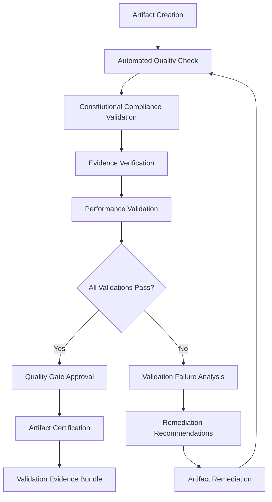

# QSE Validation Framework

## Overview

The QSE Validation Framework provides comprehensive quality assurance, testing, and validation capabilities for all QSE operations and artifacts. This framework ensures that every component, process, and output meets the highest standards of excellence and compliance.

## Automated Testing Architecture

### Multi-Layer Testing Strategy
1. **Unit Testing**: Individual component validation
2. **Integration Testing**: Cross-component interaction validation
3. **System Testing**: End-to-end system validation
4. **Performance Testing**: Resource and performance validation
5. **Security Testing**: Security and compliance validation
6. **User Acceptance Testing**: Stakeholder validation and approval

### Testing Framework Components

#### 1. QSE Test Orchestrator
- **Purpose**: Coordinate and manage all testing activities across QSE phases
- **Features**:
  - Automated test discovery and execution
  - Parallel test execution with resource management
  - Test result aggregation and reporting
  - Test failure analysis and remediation suggestions

#### 2. Constitutional Compliance Validator
- **Purpose**: Ensure all operations comply with COF 13D and UCL 5 standards
- **Features**:
  - Real-time constitutional compliance monitoring
  - Automated compliance score calculation
  - Constitutional violation detection and remediation
  - Compliance certification generation

#### 3. Quality Gate Controller
- **Purpose**: Enforce quality standards at critical decision points
- **Features**:
  - Configurable quality gate definitions
  - Automated quality assessment and scoring
  - Quality gate bypass controls with authorization
  - Quality trend analysis and improvement recommendations

#### 4. Evidence Verification Engine
- **Purpose**: Validate and verify all evidence artifacts and claims
- **Features**:
  - Automated evidence collection and validation
  - Evidence integrity checking with hash verification
  - Evidence completeness assessment
  - Evidence audit trail generation

#### 5. Performance Validation System
- **Purpose**: Ensure optimal performance across all QSE operations
- **Features**:
  - Automated performance benchmarking
  - Resource utilization monitoring
  - Performance regression detection
  - Performance optimization recommendations

## Quality Assurance Protocols

### Comprehensive Quality Assessment

#### 1. Artifact Quality Validation
- **Content Quality**: Grammar, coherence, completeness assessment
- **Structure Quality**: Format, organization, and consistency validation
- **Technical Quality**: Accuracy, precision, and technical correctness
- **Compliance Quality**: Adherence to standards, guidelines, and requirements

#### 2. Process Quality Validation
- **Workflow Adherence**: Compliance with QSE UTMW phase requirements
- **Documentation Completeness**: Comprehensive documentation validation
- **Traceability**: End-to-end traceability verification
- **Consistency**: Cross-phase consistency validation

#### 3. Output Quality Validation
- **Deliverable Completeness**: All required deliverables present and complete
- **Quality Standards**: Adherence to quality standards and metrics
- **Stakeholder Acceptance**: Stakeholder validation and approval
- **Continuous Improvement**: Quality improvement recommendations

### Quality Metrics and KPIs

#### Core Quality Metrics
- **Quality Score**: Overall quality assessment percentage (Target: ≥95%)
- **Compliance Rate**: Constitutional and regulatory compliance percentage
- **Test Coverage**: Percentage of code/functionality under test
- **Defect Density**: Number of defects per unit of work
- **Quality Gate Pass Rate**: Percentage of quality gates passed on first attempt

#### Advanced Quality Analytics
- **Quality Trend Analysis**: Long-term quality performance trends
- **Quality Predictive Modeling**: Predictive quality risk assessment
- **Quality Root Cause Analysis**: Automated quality issue root cause identification
- **Quality Improvement ROI**: Return on investment for quality improvements

## Constitutional Compliance Testing

### COF 13D Validation Testing
Comprehensive testing across all 13 dimensions of the Context Ontology Framework:

1. **Purpose & Mission Alignment Testing**
2. **Scope & Boundaries Validation Testing**
3. **Stakeholder Ecosystem Testing**
4. **Resource & Constraint Framework Testing**
5. **Risk & Opportunity Matrix Testing**
6. **Quality & Excellence Standards Testing**
7. **Innovation & Adaptability Testing**
8. **Collaboration & Communication Testing**
9. **Learning & Knowledge Management Testing**
10. **Performance & Measurement Testing**
11. **Governance & Decision Making Testing**
12. **Sustainability & Impact Testing**
13. **Integration & Synthesis Testing**

### UCL 5 Law Compliance Testing
Rigorous testing of Universal Context Law compliance:

1. **Context Completeness Testing**: Validate complete contextual coverage
2. **Context Coherence Testing**: Ensure logical consistency across contexts
3. **Context Continuity Testing**: Verify seamless context transitions
4. **Context Adaptability Testing**: Test responsive context evolution
5. **Context Optimization Testing**: Validate continuous context improvement

## Evidence Verification Protocols

### Multi-Source Evidence Validation
- **Primary Source Verification**: Direct validation of original sources
- **Secondary Source Cross-Validation**: Cross-reference validation across multiple sources
- **Evidence Chain Verification**: Complete evidence chain validation
- **Evidence Integrity Validation**: Hash-based evidence integrity verification

### Evidence Quality Assessment
- **Relevance Scoring**: Evidence relevance to claims and objectives
- **Reliability Assessment**: Source reliability and trustworthiness evaluation
- **Completeness Evaluation**: Evidence completeness and coverage assessment
- **Timeliness Validation**: Evidence currency and recency verification

### Evidence Documentation Standards
- **Evidence Metadata**: Comprehensive evidence metadata capture
- **Evidence Provenance**: Complete evidence source and origin documentation
- **Evidence Relationships**: Evidence relationship and dependency mapping
- **Evidence Access Controls**: Evidence security and access management

## Continuous Validation Pipeline

### Automated Validation Workflow

### Continuous Improvement Integration
- **Validation Metrics Collection**: Comprehensive validation metrics capture
- **Validation Performance Analysis**: Validation process performance analysis
- **Validation Framework Enhancement**: Continuous validation framework improvement
- **Validation Best Practices**: Validation best practice identification and sharing

## Integration with QSE Phases

### Phase-Specific Validation Requirements

#### Phase 0: Session Initialization Validation
- Session setup validation
- Context initialization verification
- Resource availability validation
- Constitutional baseline establishment

#### Phase 1: Scoping & Alignment Validation
- Scope definition validation
- Stakeholder alignment verification
- Objective clarity assessment
- Constitutional alignment validation

#### Phase 2: Research & SME Study Validation
- Research methodology validation
- Source reliability verification
- Knowledge depth assessment
- Constitutional research compliance

#### Phase 3: Plan & Design Validation
- Plan completeness validation
- Design consistency verification
- Risk assessment validation
- Constitutional plan compliance

#### Phase 4: Validation & Confidence Validation
- Confidence metric validation
- Validation framework testing
- Quality assurance verification
- Constitutional validation compliance

#### Phase 5: Integration & Sync Validation
- Integration testing execution
- Synchronization verification
- Cross-component validation
- Constitutional integration compliance

#### Phase 6: Execution & Artifact Generation Validation
- Execution process validation
- Artifact quality verification
- Evidence generation validation
- Constitutional execution compliance

#### Phase 7: Testing & Quality Gates Validation
- Test execution validation
- Quality gate enforcement
- Testing framework verification
- Constitutional testing compliance

#### Phase 8: Reflection & AAR Validation
- Reflection completeness validation
- Lessons learned verification
- Knowledge retention validation
- Constitutional reflection compliance

## Validation Framework Deployment

### Infrastructure Requirements
- **Validation Servers**: Dedicated validation processing infrastructure
- **Testing Environments**: Isolated testing environments for validation
- **Monitoring Systems**: Comprehensive validation monitoring and alerting
- **Data Storage**: Scalable validation data storage and archival

### Security and Compliance
- **Access Controls**: Role-based access controls for validation systems
- **Audit Trails**: Complete validation audit trail generation
- **Data Protection**: Validation data protection and privacy compliance
- **Compliance Reporting**: Automated compliance reporting and certification

### Performance and Scalability
- **Parallel Processing**: Parallel validation processing capabilities
- **Load Balancing**: Validation workload distribution and balancing
- **Resource Optimization**: Validation resource optimization and management
- **Scalability Planning**: Validation framework scalability planning and implementation

---

**Validation Framework Version**: 2.0.0
**Last Updated**: 2025-10-01
**Quality Assurance Certified**: ✅
**Next Review Date**: 2025-11-01
