# Vibe Check STDIO Validation - Visual Roadmap

```mermaid
graph TD
    Start[Start: CLI-Managed Config ✅] --> Phase1[Phase 1: Foundation]

    Phase1 --> P1_1[1.1 Environment Validation<br/>- VS Code + Claude Code<br/>- Doctor command<br/>- Connection verification]
    Phase1 --> P1_2[1.2 Tool Discovery<br/>- Enumerate all 5 tools<br/>- Capture schemas<br/>- Document capabilities]

    P1_1 --> Phase2[Phase 2: Constitution]
    P1_2 --> Phase2

    Phase2 --> P2_1[2.1 Echo Test<br/>update → check → reset]
    Phase2 --> P2_2[2.2 Merge Test<br/>Multiple updates accumulate]
    Phase2 --> P2_3[2.3 Persistence Test<br/>Rules survive checks]
    Phase2 --> P2_4[2.4 Reset Test<br/>Complete clearing]

    P2_1 --> Phase3[Phase 3: Vibe Check Core]
    P2_2 --> Phase3
    P2_3 --> Phase3
    P2_4 --> Phase3

    Phase3 --> P3_1[3.1 Baseline<br/>goal + plan minimal]
    Phase3 --> P3_2[3.2 Enriched<br/>Full context parameters]
    Phase3 --> P3_3[3.3 Constitution Integration<br/>Rule-aware feedback]
    Phase3 --> P3_4[3.4 Strategic Cadence<br/>10-15% CPI dosage]

    P3_1 --> Phase4[Phase 4: Vibe Learn]
    P3_2 --> Phase4
    P3_3 --> Phase4
    P3_4 --> Phase4

    Phase4 --> P4_1[4.1 Category Coverage<br/>All 7 categories tested]
    Phase4 --> P4_2[4.2 Minimal Payload<br/>Required fields only]

    P4_1 --> Phase5[Phase 5: Multi-Provider]
    P4_2 --> Phase5

    Phase5 --> P5_1[5.1 Provider Tests<br/>Gemini/OpenAI/OpenRouter]

    P5_1 --> Phase6[Phase 6: Error Handling]

    Phase6 --> P6_1[6.1 Schema Validation<br/>Invalid inputs]
    Phase6 --> P6_2[6.2 Edge Cases<br/>Boundary conditions]

    P6_1 --> Phase7[Phase 7: Documentation]
    P6_2 --> Phase7

    Phase7 --> P7_1[7.1 Schema Capture<br/>Complete tool schemas]
    Phase7 --> P7_2[7.2 README Audit<br/>Drift detection]

    P7_1 --> Phase8[Phase 8: Integration]
    P7_2 --> Phase8

    Phase8 --> P8_1[8.1 Complete Workflow<br/>Multi-tool simulation]

    P8_1 --> Deliverables[Deliverables]

    Deliverables --> D1[Validation Report]
    Deliverables --> D2[Schema Documentation]
    Deliverables --> D3[Evidence Bundle]
    Deliverables --> D4[Integration Guide]

    D1 --> Complete[✅ Validation Complete]
    D2 --> Complete
    D3 --> Complete
    D4 --> Complete

    style Start fill:#90EE90
    style Phase1 fill:#87CEEB
    style Phase2 fill:#87CEEB
    style Phase3 fill:#87CEEB
    style Phase4 fill:#87CEEB
    style Phase5 fill:#FFD700
    style Phase6 fill:#87CEEB
    style Phase7 fill:#87CEEB
    style Phase8 fill:#87CEEB
    style Deliverables fill:#DDA0DD
    style Complete fill:#90EE90
```



## Execution Timeline


## Test Coverage Matrix

| Phase | Tools Tested | Test Cases | Evidence Files | Est. Duration |
|-------|--------------|------------|----------------|---------------|
| 1 | All 5 tools | 2 | 2 JSONL | 30 min |
| 2 | Constitution (3) | 4 | 4 JSONL | 60 min |
| 3 | vibe_check | 4 | 4 JSONL | 90 min |
| 4 | vibe_learn | 2 | 2 JSONL | 45 min |
| 5 | vibe_check | 3 | 1 JSONL | 30 min |
| 6 | All 5 tools | 6 | 2 JSONL | 45 min |
| 7 | All 5 tools | 2 | 1 JSONL | 60 min |
| 8 | All 5 tools | 1 | 1 JSONL | 45 min |
| **Total** | **5 tools** | **24 cases** | **17 files** | **6-7 hours** |

## Constitution Framework Flow


## CPI Strategic Cadence Pattern


**Legend:**
- 🟨 Solid: MANDATORY checkpoint (4 total)
- 🟧 Dashed: CONDITIONAL checkpoint (0-1 based on complexity)
- **Dosage:** 4-5 checkpoints / 8 phases = 10-15% ✅

## Success Metrics Dashboard


**Target Success Rates:**
- ≥95% overall assertion pass rate
- 100% tool discovery success
- 100% schema capture completeness
- 100% evidence bundle generation

## Risk Heat Map

| Risk | Likelihood | Impact | Mitigation |
|------|------------|--------|------------|
| Constitution empty return | Medium | High | Detailed capture + diagnostic |
| Provider key unavailable | Low | Low | Conditional phase |
| Connection instability | Low | Medium | Retry logic |
| Schema drift | Low | Medium | README comparison |

**Overall Risk Level:** 🟢 LOW - All risks have documented mitigations

## Evidence Bundle Structure

```
logs/vibe-check-stdio-validation-20251110/
├── 00-environment-validation.jsonl          (Phase 1.1)
├── 01-tools-enumeration.jsonl               (Phase 1.2)
├── 02-constitution-echo.jsonl               (Phase 2.1)
├── 03-constitution-merge.jsonl              (Phase 2.2)
├── 04-constitution-persistence.jsonl        (Phase 2.3)
├── 05-constitution-reset.jsonl              (Phase 2.4)
├── 06-vibe-check-baseline.jsonl             (Phase 3.1)
├── 07-vibe-check-enriched.jsonl             (Phase 3.2)
├── 08-vibe-check-constitution.jsonl         (Phase 3.3)
├── 09-vibe-check-cadence.jsonl              (Phase 3.4)
├── 10-vibe-learn-categories.jsonl           (Phase 4.1)
├── 11-vibe-learn-minimal.jsonl              (Phase 4.2)
├── 12-provider-tests.jsonl                  (Phase 5.1)
├── 13-error-handling.jsonl                  (Phase 6.1)
├── 14-edge-cases.jsonl                      (Phase 6.2)
├── 15-schema-capture.jsonl                  (Phase 7.1)
├── 16-workflow-integration.jsonl            (Phase 8.1)
├── summary.yaml                             (Final report)
└── README.md                                (Bundle documentation)
```

## Quick Start Checklist

### Prerequisites
- [x] VS Code MCP configuration (CLI-managed) ✅
- [x] Claude Code MCP configuration (CLI-managed) ✅
- [x] Node.js v24.5.0 verified ✅
- [x] Doctor command passed ✅
- [ ] Restart VS Code to load configuration
- [ ] Restart Claude Code to load configuration

### Session 1 Setup (30 minutes)
- [ ] Create `scripts/Test-VibeCheck-STDIO.ps1` harness
- [ ] Verify MCP connections in both editors
- [ ] Run Phase 1.1: Environment validation
- [ ] Run Phase 1.2: Tool discovery
- [ ] Capture baseline evidence

### Go/No-Go Decision Point
After Phase 1 completion, assess:
- ✅ All 5 tools discovered?
- ✅ Schemas documented?
- ✅ Both editors connected?
- ✅ Evidence logs generating?

**If YES to all:** Proceed to Phase 2
**If NO to any:** Troubleshoot before continuing

---

**Plan Status:** READY FOR EXECUTION
**Visual Aids:** Flowcharts, timeline, coverage matrix
**Next Action:** Review + approve → Create harness → Execute Phase 1
