# Project Plan: QSE Strategic Advancement - Next-Generation Framework

**Epic**: QSE Strategic Advancement & Next-Generation Framework
**Feature**: Next-Generation Orchestration Framework
**Work ID**: W-QSE-RESEARCH-PLANNING-001
**Created**: 2025-09-26T07:45:00Z
**Context Ref**: CF-CLI-QSE-ACTIVATION-20250924 v1.0.0

---

## 1. Project Overview

### Feature Summary
Development of advanced orchestration architecture capabilities that extend beyond the current QSE Framework's 52.2 stages/sec performance baseline. This feature focuses on multi-framework coordination, distributed processing, event-driven orchestration models, and hybrid synchronous/asynchronous coordination patterns while maintaining constitutional compliance.

**Business Value**: Enable next-generation testing and orchestration capabilities that support enterprise-scale deployments with improved performance, scalability, and governance.

**Problem Statement**: Current QSE Framework (15/15 components) provides solid foundation but requires advanced orchestration capabilities for enterprise deployment, multi-framework integration, and performance optimization beyond current baselines.

### Success Criteria/KPIs
- **Performance**: 25-50% improvement over 52.2 stages/sec baseline (target: 65-75 stages/sec)
- **Scalability**: Linear scaling up to 20 concurrent orchestration stages
- **Multi-Framework Support**: Coordinate ≥3 different framework types simultaneously
- **Constitutional Compliance**: Maintain ≥90% compliance across COF 13-dimensions and UCL 5-laws
- **Reliability**: 99.9% uptime with fault-tolerant distributed processing
- **Event Processing**: <100ms latency for asynchronous event-driven operations

### Key Milestones
1. **Research Foundation Complete** - SME expertise ≥0.95 across orchestration domains
2. **Architecture Design Validated** - Advanced orchestration blueprints approved
3. **Core Implementation Delivered** - Multi-framework coordination operational
4. **Performance Targets Achieved** - 25-50% improvement validated
5. **Enterprise Integration Ready** - Production deployment patterns confirmed

### Risk Assessment
**High Risk**: Integration complexity across multiple frameworks
**Medium Risk**: Performance optimization without degrading existing functionality
**Low Risk**: Constitutional compliance maintenance (established patterns available)

**Blockers**: None identified - foundation components operational
**Mitigations**: Phased approach, continuous performance monitoring, automated compliance validation

---

## 2. Hierarchy Diagram

```mermaid
graph TD
  A[Epic: QSE Strategic Advancement] --> B[Feature: Next-Gen Orchestration Framework]
  B --> C[Story 1: Multi-Framework Orchestration]
  B --> D[Story 2: Distributed Orchestration Architecture]
  B --> E[Story 3: Event-Driven Orchestration Model]
  B --> F[Story 4: Hybrid Sync/Async Coordination]
  B --> G[Enabler 1: Performance Monitoring Infrastructure]
  B --> H[Enabler 2: Orchestration API Gateway]
  B --> I[Enabler 3: Constitutional Compliance Engine]
  B --> J[Enabler 4: Multi-Platform Deployment Pipeline]

  C --> C1[Task: Framework Discovery & Integration]
  C --> C2[Task: Coordination Protocol Implementation]
  C --> C3[Test: Multi-Framework Integration Tests]

  D --> D1[Task: Distributed Node Management]
  D --> D2[Task: Fault Tolerance Implementation]
  D --> D3[Test: Distributed System Validation]

  E --> E1[Task: Event Processing Engine]
  E --> E2[Task: Asynchronous Message Handling]
  E --> E3[Test: Event Processing Performance Tests]

  F --> F1[Task: Synchronous Coordination Logic]
  F --> F2[Task: Asynchronous Coordination Logic]
  F --> F3[Test: Hybrid Coordination Validation]

  G --> G1[Task: Metrics Collection Infrastructure]
  G --> G2[Task: Performance Analytics Dashboard]

  H --> H1[Task: API Gateway Implementation]
  H --> H2[Task: Service Mesh Integration]

  I --> I1[Task: COF Validation Engine]
  I --> I2[Task: UCL Compliance Checker]

  J --> J1[Task: Cross-Platform Build Pipeline]
  J --> J2[Task: Deployment Automation]
```

---

## 3. Detailed Work Item Breakdown

### Epic: QSE Strategic Advancement & Next-Generation Framework

**Priority**: P0 (Critical)
**Value**: High
**Estimate**: XL (10-12 weeks)
**Component**: qse-framework

**Acceptance Criteria**:
- [ ] Research completed across 8 domains with SME expertise ≥0.95
- [ ] 3-5 strategic advancement options identified and validated
- [ ] Enterprise integration patterns validated
- [ ] Performance improvements of 25-50% demonstrated
- [ ] Constitutional compliance maintained at ≥90%

**Labels**: `epic`, `priority-critical`, `value-high`, `qse-framework`

---

### Feature: Next-Generation Orchestration Framework

**Priority**: P0 (Critical)
**Value**: High
**Estimate**: L (6-8 weeks)
**Component**: orchestration-engine

**Dependencies**:
- **Blocked by**: Research Foundation Complete (SME expertise ≥0.95)
- **Blocks**: Enterprise Integration Patterns, Constitutional Framework Evolution

**Acceptance Criteria**:
- [ ] 25-50% performance improvement over 52.2 stages/sec baseline
- [ ] Multi-framework coordination supporting ≥3 framework types
- [ ] Distributed processing across ≥5 nodes with fault tolerance
- [ ] Event-driven processing with <100ms latency
- [ ] Constitutional compliance ≥90% maintained
- [ ] Linear scalability up to 20 concurrent orchestration stages

**Labels**: `feature`, `priority-critical`, `value-high`, `orchestration`

---

### User Stories

#### Story 1: Multi-Framework Orchestration Coordination

**Priority**: P0, **Value**: High, **Estimate**: 8 points, **Component**: coordination-layer

As a **QSE framework developer**, I want **the orchestration system to coordinate multiple testing frameworks simultaneously** so that **I can leverage the best capabilities of each framework in a unified workflow**.

**Acceptance Criteria**:
- [ ] Support coordination of ≥3 different framework types (pytest, Pester, custom)
- [ ] Maintain independent framework state and configuration
- [ ] Provide unified orchestration interface and status reporting
- [ ] Handle framework-specific error conditions and recovery

**Technical Tasks**:
- [ ] #NGO-T001 - Framework Discovery & Integration Service
- [ ] #NGO-T002 - Coordination Protocol Implementation
- [ ] #NGO-T003 - Unified Interface Development

**Testing**:
- [ ] #NGO-TEST001 - Multi-Framework Integration Tests

**Dependencies**: Blocked by Research Foundation Complete
**DoD**: AC met; code review passed; integration tests ≥95% coverage; performance validated

**Labels**: `user-story`, `priority-critical`, `fullstack`, `coordination`

---

#### Story 2: Distributed Orchestration Architecture

**Priority**: P0, **Value**: High, **Estimate**: 13 points, **Component**: distributed-engine

As a **DevOps engineer**, I want **orchestration to work reliably across distributed nodes** so that **I can scale testing and orchestration operations across multiple environments**.

**Acceptance Criteria**:
- [ ] Support distributed orchestration across ≥5 nodes
- [ ] Implement fault tolerance with automatic failover
- [ ] Maintain state consistency across distributed nodes
- [ ] Provide node health monitoring and automatic recovery

**Technical Tasks**:
- [ ] #NGO-T004 - Distributed Node Management System
- [ ] #NGO-T005 - Fault Tolerance & Failover Implementation
- [ ] #NGO-T006 - State Consistency & Synchronization

**Testing**:
- [ ] #NGO-TEST002 - Distributed System Validation Tests

**Labels**: `user-story`, `priority-critical`, `backend`, `distributed-systems`

---

#### Story 3: Event-Driven Orchestration Model

**Priority**: P1, **Value**: High, **Estimate**: 8 points, **Component**: event-processing

As a **test automation specialist**, I want **asynchronous event-driven orchestration** so that **I can handle complex workflows with non-blocking operations and improved performance**.

**Acceptance Criteria**:
- [ ] Support asynchronous event processing with <100ms latency
- [ ] Implement event-driven workflow coordination
- [ ] Provide event tracing and debugging capabilities
- [ ] Handle event ordering and dependency management

**Technical Tasks**:
- [ ] #NGO-T007 - Event Processing Engine Implementation
- [ ] #NGO-T008 - Asynchronous Message Handling System
- [ ] #NGO-T009 - Event Tracing & Debugging Interface

**Testing**:
- [ ] #NGO-TEST003 - Event Processing Performance Tests

**Labels**: `user-story`, `priority-high`, `backend`, `event-processing`

---

### Technical Enablers

#### Enabler 1: Advanced Performance Monitoring Infrastructure

**Priority**: P1, **Value**: Medium, **Estimate**: 5 points, **Component**: monitoring

**Description**: Comprehensive performance monitoring infrastructure supporting real-time metrics collection, analytics, and optimization feedback for orchestration operations.

**Requirements**:
- [ ] Real-time metrics collection with <5ms overhead
- [ ] Performance analytics dashboard with visualization
- [ ] Automated performance regression detection
- [ ] Integration with existing QSE Framework monitoring

**Implementation Tasks**:
- [ ] #NGO-T010 - Metrics Collection Infrastructure
- [ ] #NGO-T011 - Performance Analytics Dashboard

**Enables**: All orchestration user stories require performance monitoring

**Acceptance Criteria**:
- [ ] <5ms monitoring overhead validated
- [ ] Performance regression detection operational
- [ ] Dashboard provides real-time orchestration insights

**Labels**: `enabler`, `priority-high`, `infra`, `monitoring`

---

#### Enabler 2: Orchestration API Gateway & Service Mesh

**Priority**: P1, **Value**: Medium, **Estimate**: 8 points, **Component**: gateway

**Description**: API gateway and service mesh infrastructure supporting secure, scalable communication between orchestration components and external frameworks.

**Requirements**:
- [ ] API gateway with authentication and rate limiting
- [ ] Service mesh for inter-service communication
- [ ] Load balancing and traffic management
- [ ] Integration with enterprise authentication systems

**Implementation Tasks**:
- [ ] #NGO-T012 - API Gateway Implementation
- [ ] #NGO-T013 - Service Mesh Integration

**Labels**: `enabler`, `priority-high`, `api`, `infrastructure`

---

## 4. Priority & Estimation Matrix

| Work Item | Priority | Value | Estimate | Dependencies | Risk |
|-----------|----------|-------|----------|--------------|------|
| Epic: QSE Strategic Advancement | P0 | High | XL (10-12w) | Foundation Ready ✅ | Medium |
| Feature: Next-Gen Orchestration | P0 | High | L (6-8w) | Research Complete | Medium |
| Story 1: Multi-Framework Coord | P0 | High | 8 pts | Research Complete | Low |
| Story 2: Distributed Architecture | P0 | High | 13 pts | Multi-Framework | Medium |
| Story 3: Event-Driven Model | P1 | High | 8 pts | Distributed Arch | Low |
| Story 4: Hybrid Coordination | P1 | Medium | 5 pts | Event-Driven | Low |
| Enabler 1: Performance Monitor | P1 | Medium | 5 pts | None | Low |
| Enabler 2: API Gateway | P1 | Medium | 8 pts | None | Low |
| Enabler 3: Compliance Engine | P0 | High | 8 pts | Constitutional Framework | Low |
| Enabler 4: Deployment Pipeline | P2 | Medium | 5 pts | Core Implementation | Low |

**Total Estimate**: 72 story points (approximately 8-10 weeks with team of 3-4 developers)

---

## 5. Success Metrics & Validation

### Technical Metrics
- **Performance Improvement**: 25-50% over 52.2 stages/sec baseline (Target: 65-75 stages/sec)
- **Scalability**: Linear scaling validation up to 20 concurrent orchestration stages
- **Reliability**: 99.9% uptime with fault-tolerant distributed processing
- **Event Processing Latency**: <100ms for asynchronous operations
- **Test Coverage**: ≥95% across all new orchestration components

### Business Metrics
- **Multi-Framework Support**: ≥3 framework types coordinated simultaneously
- **Constitutional Compliance**: ≥90% across COF 13-dimensions and UCL 5-laws
- **Enterprise Readiness**: Production deployment patterns validated
- **Developer Productivity**: 30% reduction in orchestration setup time

### Validation Approach
1. **Continuous Performance Benchmarking**: Automated performance tests with each build
2. **Constitutional Compliance Validation**: Automated COF/UCL compliance checking
3. **Integration Testing**: Comprehensive multi-framework integration test suite
4. **Load Testing**: Scalability validation under realistic enterprise workloads
5. **User Acceptance Testing**: Validation with QSE framework stakeholders and enterprise teams

---

## 6. Implementation Timeline

### Phase 1: Foundation & Research (Weeks 1-2)
- Complete SME domain expertise development (≥0.95 threshold)
- Finalize advanced orchestration architecture design
- Set up development and testing infrastructure

### Phase 2: Core Orchestration (Weeks 3-5)
- Implement multi-framework coordination capabilities
- Develop distributed orchestration architecture
- Create performance monitoring infrastructure

### Phase 3: Advanced Features (Weeks 6-7)
- Implement event-driven orchestration model
- Develop hybrid synchronous/asynchronous coordination
- Integrate constitutional compliance validation

### Phase 4: Integration & Validation (Weeks 8-10)
- End-to-end integration testing
- Performance optimization and validation
- Enterprise deployment pattern verification
- Documentation and deployment guide creation

---

**Project Plan Status**: Ready for Phase 2 (Research & SME Study)
**Next Actions**: Delegate to QSE-Researcher for comprehensive domain research
**DTM Sync Required**: Register work items in CF_CLI Dynamic Task Manager
